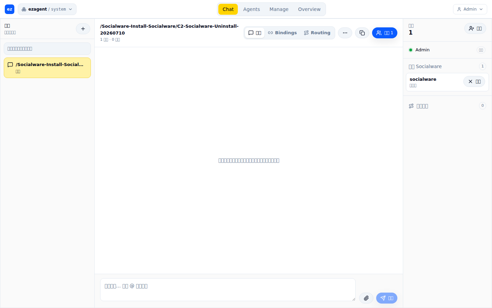
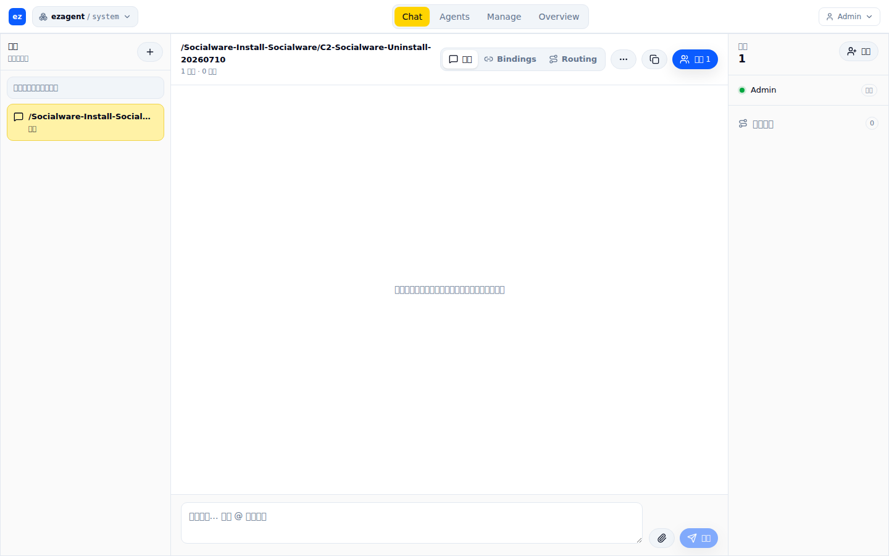

# C2 - #1245 socialware uninstall UI browser proof

- Date: 2026-07-10
- Environment: local `main` at `bf5e717b29ef270982b402d46005e17c0b3655e7`
- Browser: `agent-browser 0.27.0`
- URL: `http://world.localhost:10042`
- Session: `session://system/socialware-install-socialware/c2-socialware-uninstall-20260710`
- Result: **GREEN**

## User path

1. Sign in through the real `/login` form with the local world E2E admin.
2. From `/sessions`, open the new-session form.
3. Enter `c2-socialware-uninstall-20260710`, keep template `default`, and select application `socialware`.
4. Create the session and open its members panel.
5. Verify the installed-socialware row and uninstall button are present.
6. Click uninstall and confirm the browser dialog.
7. Open the same session in a fresh authenticated browser session and expand the members panel again.

## Evidence

### Installed state

The members panel contains one installed-socialware row and the uninstall action.

### Cleared state

After confirming uninstall and reopening the same session, the members panel has no installed-socialware section or uninstall button. The session remains usable and the routing count is zero.

## Assertions

- Before uninstall, the interactive snapshot contained the uninstall button.
- The real browser confirm text was captured before accepting the action.
- After uninstall, a fresh interactive snapshot contained no socialware uninstall button.
- The current `install:socialware` pointer resolves to the append-only tombstone `{"ref":"socialware","removed":true}`; this is the state for which `Installation.installed?/2` returns false.
- Session-created routing rules after uninstall: `0`.

## Agent-browser note

In agent-browser 0.27.0, the native confirm was detected correctly, but `dialog accept` in a later CLI invocation lost synchronization with the open dialog. The run recorded the real confirm text, then used `window.confirm = () => true` in a clean browser session before clicking the same UI button. Final state was verified from a third, fresh authenticated browser session, so the cleared screenshot is not stale client-side state.
