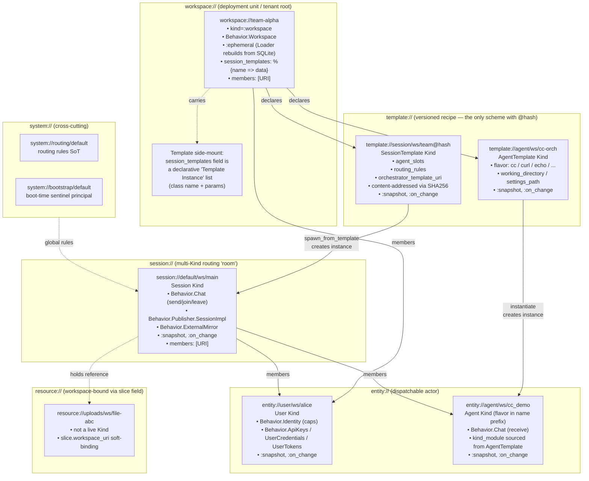
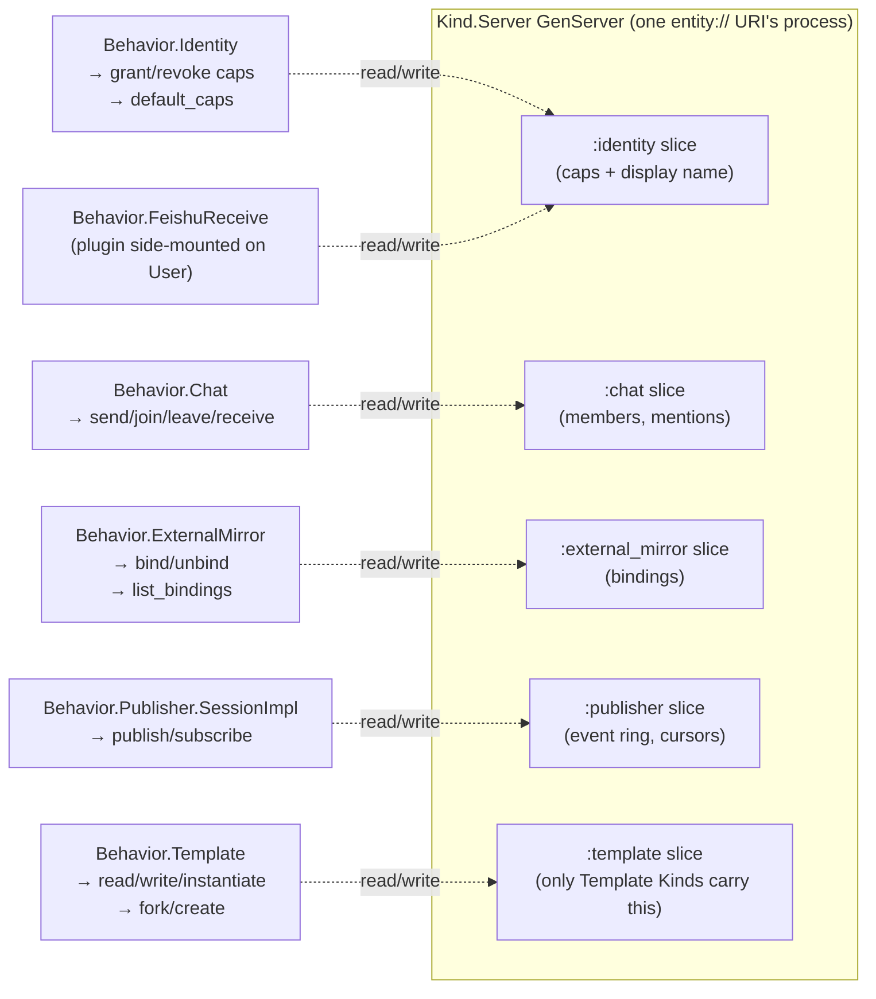
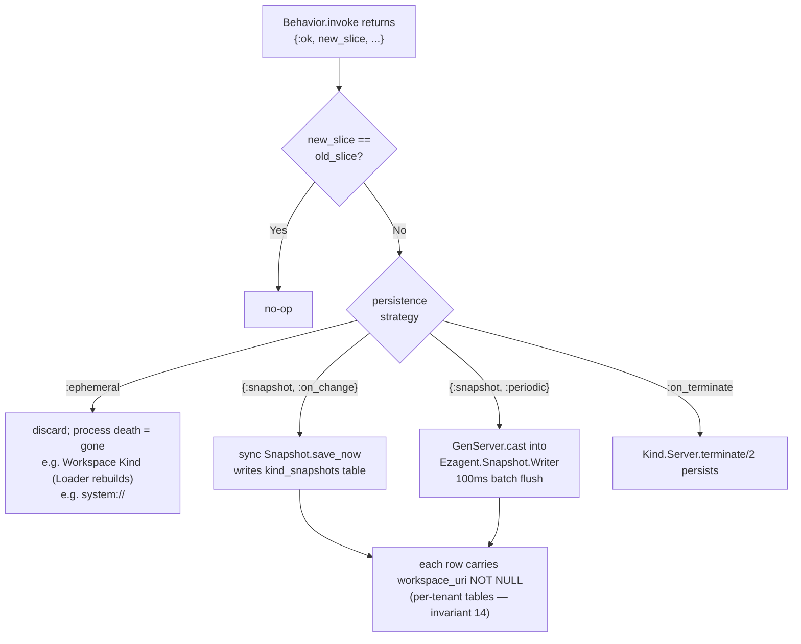
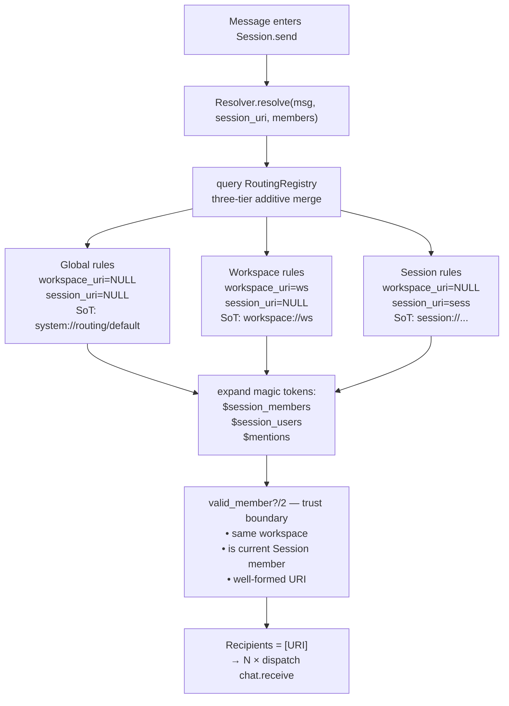
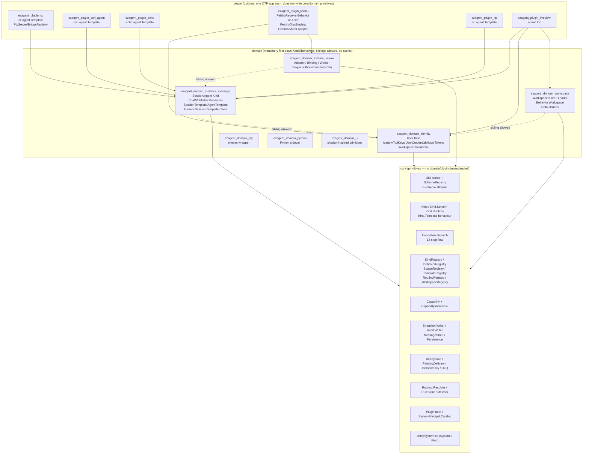

# Ezagent architecture analysis — WSER hierarchy × core/domain/plugin tiers (2026-05-26 snapshot)

**Status**: Descriptive snapshot of current state, not a specification.
**Branch**: main @ `e2a4769` (post SPEC v3 / caps-cleanup).
**Companion**: the Chinese version [2026-05-26-architecture-analysis-wser.zh_cn.md](2026-05-26-architecture-analysis-wser.zh_cn.md) (parallel; keep both in sync).
**Entry point**: [docs/notes/uri-design.md §5](uri-design.md) is the normative URI spec — this document projects the spec + current code state onto the two-axis architecture diagram.

---

## 0. Two orthogonal dimensions

The Ezagent codebase is organized along two orthogonal axes. To reason about the architecture, you must hold both at once:

```
                       URI hierarchy (business)
                  W ── S ── E ── R   (+ T side-mounted, Sys cross-cutting)
                  │    │    │    │
   eng tiers   ┌─ core   ┐  ◄── all primitives live in core
               │ domain  │  ◄── first-class Kinds/Behaviors (mandatory)
               └─ plugin ┘  ◄── optional, one OTP app per plugin
```

- **Horizontal axis (URI hierarchy / WSER)**: `workspace → session → entity → resource` is a progressive narrowing of business scope, plus `template` (side-mounted, reusable recipe) and `system` (cross-cutting).
- **Vertical axis (engineering tiers)**: `core → domain → plugin`. The decider is P9, *"what data does this code read?"* — reads `%Invocation{}`/`%Message{}` ⇒ core; reads plugin-specific payload ⇒ plugin.

Every diagram and concern below (side-mounted Behaviors / access control / persistence / routing) is a projection onto these two axes.

---

## 1. The six URI schemes (horizontal axis)

Per SPEC v3 §5.6 the entire system has **exactly six schemes**, parse-time locked by `Ezagent.URI.SchemeRegistry` ETS:

| Scheme | Shape | Segments | Role | Spawned by |
|---|---|---|---|---|
| `workspace://<name>` | 2 | **Tenant root / deployment unit** | Workspace IS the tenant root | `Ezagent.Workspace.Loader` (boot-time rebuild from SQLite) |
| `session://<template>/<workspace>/<name>` | **3** | Multi-user / multi-agent routing "room" | Workspace-bound | `Session.spawn_from_template/2` (Generator) |
| `entity://<user\|agent>/<workspace>/<name>` | **3** | Dispatchable actor identity | Workspace-bound | spawn fn registered in `SpawnRegistry` |
| `template://<agent\|session>/<workspace>/<name>[@hash]` | **3** | Content-addressed recipe | Workspace-bound | explicitly created via LV/CLI; the only scheme that carries `@hash` |
| `resource://<type>/<workspace>/<name>` | **3** | Platform-addressable asset (uploads etc.) | Workspace-bound (slice field) | upload / behavior output |
| `system://<type>/<name>` | 2 | Platform sentinels (routing table, bootstrap) | Cross-cutting (`:any` workspace) | fixed at boot |

**Deleted between SPEC v2 → v3**: `user://`, `agent://`, `message://`, `feishu://`, `routing-admin://`, `pty-input://`.

[Invariant 11]: plugins **must never introduce a new scheme**; external integrations attach as `Behavior on an existing Kind` ([references/architecture-invariants.md](../../.claude/skills/ezagent-developer/references/architecture-invariants.md)).

---

## 2. WSER hierarchy + per-layer Templates (core diagram)



### 2.1 Per-layer responsibilities + Template mapping

| URI layer | Kind | Persistence | Side-mounted Behaviors | **Corresponding Template** | Instantiator |
|---|---|---|---|---|---|
| **W** `workspace://` | `Ezagent.Entity.Workspace` (`apps/ezagent_domain_workspace`) | `:ephemeral` + SQLite via `Workspace.Loader` | `Behavior.Workspace`, `Behavior.WorkspaceUserAdmin` | **No own Template Class** — but `workspace.session_templates` map is a container of "Template Instances" (a declarative recipe list) | `Workspace.Loader` at boot |
| **S** `session://` | `Ezagent.Entity.Session` (`apps/ezagent_domain_instance_message`) | `{:snapshot, :on_change}` | `Behavior.Chat`, `Behavior.Publisher.SessionImpl`, `Behavior.ExternalMirror` | **`SessionTemplate` Kind** (`template://session/...@hash`) + `Ezagent.Template.GenericSession` (Template Class, `"session.generic"`) | `Session.spawn_from_template/2` (Generator) |
| **E** `entity://user/...` | `Ezagent.Entity.User` (`apps/ezagent_domain_identity`) | `{:snapshot, :on_change}` | `Behavior.Identity` (cap container), `Behavior.ApiKeys`, `Behavior.UserCredentials`, `Behavior.UserTokens`, *plus plugin-attached e.g. `FeishuReceive`* | **No Template** (Users are provisioned manually / via admin flow; no template class) | `Users.create/3` + `SpawnRegistry` |
| **E** `entity://agent/...` | `Ezagent.Entity.Agent` (`apps/ezagent_domain_instance_message`) *+ CurlAgent / Echo / NpAgent etc., plugin-defined Kinds* | `{:snapshot, :on_change}` | `Behavior.Chat` (receive side), + flavor-specific Behaviors | **`AgentTemplate` Kind** (`template://agent/...`, no `@hash`) + `Ezagent.Kind.Template` behaviour; **plugins provide**: `cc.agent`, `curl.agent`, `echo.agent`, `np.agent` | `Agent.spawn/4` via the Template Class's `instantiate/3` |
| **R** `resource://` | Not a live Kind | Filesystem + DB row | n/a | **No Template** | LV upload / Behavior output |

**Key observations**:

1. **Only E.agent and S have a "Template Class"** (i.e. `@behaviour Ezagent.Kind.Template` impl). User / Workspace / Resource have no Template Class — they are either provisioned, Loader-rebuilt, or soft-bound via slice field.
2. **`template://` is the only scheme that carries `@hash`** (SPEC §5.3) — content addressing. Sessions / entities have no version.
3. **"Templates" on a Workspace is a semantic overload**: `workspace.session_templates` carries *Template Instances* (parameter-bound recipes), not Template *Classes*. Template Classes live in plugins, are named (e.g. `"cc.agent"`, `"session.generic"`), and are registered in `TemplateRegistry` — the Loader looks them up by name at boot.

---

## 3. Side-mounted Behaviors (cross-cutting composition)

Ezagent is **not class-hierarchical inheritance** — instead, **Kind = Slice + a set of Behaviors composed**. A single URI's physical GenServer holds N independent slices; each slice is owned by one Behavior.



### Two origins of side-mounted Behaviors (SPEC v3 §5.8 P11)

```
Built into core/domain:                       Plugin-attached:
  Session: [Chat, Publisher, ExternalMirror]    User: [Identity, ApiKeys, UserCredentials, UserTokens, FeishuReceive (←plugin)]
  User:    [Identity, ApiKeys, ...]             Session: [externally FeishuChatBinding injected via ExternalMirror.Adapter pair]
  Agent:   [Chat]                               Workspace: [WorkspaceUserAdmin (privileged carve-out)]
  Template Kinds: [Identity, Template]
  Workspace: [Workspace]
```

[Principle P19]: **a Behavior reads only its own slice** — cross-Behavior coordination MUST go through a new action via dispatch; never peek at another slice directly.

[Principle P11 + invariant 1]: **plugins integrating with external systems MUST NOT open a new scheme**; instead `BehaviorRegistry.register(ExistingKind, action, MyBehavior)` attaches a Behavior to User/Session. Feishu integration follows this pattern (FeishuReceive attaches to User; FeishuChatBinding is injected into Session via the ExternalMirror Domain).

---

## 4. Access control — CapBAC (Push-based capabilities)

```elixir
%Ezagent.Capability{
  kind:           atom() | :any,         # Kind type, e.g. :session
  behavior:       module() | :any,       # Behavior module reference ⚠️ NOT a :chat atom!
  instance:       URI.t() | :any | scope_tuple(),
  workspace_uri:  URI.t() | :any,        # ← added in Phase 9 (P17)
  granted_by:     URI.t() | :plugin_declared,
  granted_at:     DateTime.t() | :compile_time,
}

scope_tuple ::= {:within_session, URI} | {:within_workspace, URI} | {:spawned_by, URI}
```

### 4.1 Matching's position in the 12-step dispatch flow

```
Adapter (HTTP/Feishu/CLI/LV)
   │ builds %Invocation{target, mode, args, ctx{caller, caps, reply, ...}}
   ▼
Ezagent.Invocation.dispatch/1  ── steps 1-4 (in caller process)
   │  1. parse target URI
   │  2. KindRegistry.lookup(target) → pid
   │  3. idempotency check (PendingDelivery)
   │  4. transport: :call | :cast → GenServer
   ▼
Ezagent.Kind.Runtime.handle_dispatch  ── steps 5-10 (in target's Kind GenServer)
   ├─ 5.   BehaviorRegistry.lookup({kind_module, action})
   ├─ 5.5  ★ CapBAC: Ezagent.Capability.matches?(ctx.caps, target)
   │            → {:error, :unauthorized}
   ├─ 5.6  ★ Workspace isolation: caller_ws == target_ws ?
   │            → {:error, :cross_workspace_denied}
   ├─ 5.7  validate args against @interface
   ├─ 6.   slice = state[behavior.state_slice()]
   ├─ 7.   behavior.invoke(action, slice, args, ctx)
   ├─ 8.   {:ok, new_slice [, result]}
   ├─ 9.   put_in(state, [slice_key], new_slice)
   │       ★ Snapshot.maybe_save(new_slice != old_slice)
   ├─ 10.  emit telemetry [:start :stop :exception]
   ▼
ReadyGate / PendingDelivery / Idempotency  ── steps 11-12 reply path
```

### 4.2 Step 5.6 cross-workspace authorization gate ([invariant 13])

A cross-workspace dispatch is allowed iff **any** of the following holds:
1. **Intra-workspace** (`caller.ws == target.ws`)
2. **Target is cross-cutting** (target scheme is `template/system/resource` → `workspace_of = :any`)
3. **Caller is `:system`** (boot / migration)
4. **Caller holds an explicit cross-workspace cap** (`workspace_uri: :any`)
5. **Caller is a `workspace://system` member** (Keycloak realm-admin model, membership-by-structure)

Otherwise returns `{:error, :cross_workspace_denied}` (intentionally distinct from `:unauthorized` so inbound transports can react with a different emoji / error message).

[Principle P15 + invariant 2]: **the `behavior` field MUST be a module reference**; never a `:chat` atom — `matches?/2` uses strict equality, and an atom typo silently denies.

---

## 5. Persistence / Snapshot strategy



### Persistence layer ([invariant 14 + P21])

```
SQLite (per-tenant tables, all with workspace_uri NOT NULL + index)
├─ messages              ← MessageStore (chat history)
├─ invocations           ← Audit.Writer async-cast writes (does not block dispatch)
├─ users                 ← caps_json column = User caps materialization
├─ kind_snapshots        ← multiplexes Session / Agent / Template / User slices
├─ entity_tokens         ← agent bearer tokens
└─ entity_profiles       ← display name + avatar metadata

Exempt (no workspace_uri column):
  workspaces, routing_rules, message_routings, dlq,
  app_settings, magic_link_tokens, feishu_user_bindings, feishu_session_bindings
```

### The three reliability primitives (built into core; plugins cannot bypass — P22)

```
ReadyGate          —— per-URI tri-state (:unknown / :not_ready / :ready)
                      consulted before every dispatch;
                      :call to not-ready → fail-fast,
                      :cast to not-ready → buffered in PendingDelivery
PendingDelivery    —— per-URI bounded buffer (covers the register→subscribe window)
                      overflow → DLQ
Idempotency        —— ctx.idempotency_key + Ezagent.Idempotency.seen?
                      v0 semantics: "seen on arrival" (failures still count as seen);
                      failures fall through to DLQ as backstop
```

---

## 6. Routing strategy (three-layer additive merge)

`session.send` doesn't write fan-out itself — it delegates to the pure function `Ezagent.Routing.Resolver.resolve/3`, which composes the three-tier scope model from [uri-design.md §5.4]:



### Where routing-rule mutation dispatches ([invariant 12])

> The synthetic singleton `routing-admin://` was **deleted**. A rule mutation MUST dispatch to the rule's actual scope-owning Kind:

| Mutating a Global rule | `system://routing/default?action=add_rule` |
|---|---|
| Mutating a Workspace rule | `workspace://<ws>?action=routing.add_rule` |
| Mutating a Session rule | `session://<t>/<ws>/<n>?action=routing.add_rule` |

This is P3 (single SoT) and P11 (no ghost singletons) made concrete on the routing surface.

---

## 7. core / domain / plugin (vertical axis)



### Strict boundaries ([three-tier-structure.md](../../.claude/skills/ezagent-developer/references/three-tier-structure.md))

|  From → To  | core | domain | plugin |
|---|---|---|---|
| **core** | ✓ intra | ✗ | ✗ |
| **domain** | ✓ | ✓ siblings (no cycles, identity ↛ chat) | ✗ |
| **plugin** | ✓ | ✓ | △ rarely siblings |

Litmus test: **can two plugin authors who don't know each other ship in parallel without a merge conflict?** If no, the abstraction is in the wrong tier.

---

## 8. Combined view: both axes at once

WSER (horizontal) × core/domain/plugin (vertical) in one table:

| WSER | What `core` provides | What `domain` implements | What `plugin` side-mounts |
|---|---|---|---|
| **workspace://** | `Ezagent.WorkspaceRegistry` (consistency cache), `Capability.workspace_of/1`, step 5.6 cross-ws gate | `ezagent_domain_workspace`: Kind, Loader (boot-time SQLite rebuild), Behavior.Workspace, DefaultRules | *(none; workspace is not extensible by plugins)* |
| **session://** | `KindRegistry`, `PendingDelivery`, `Snapshot` | `ezagent_domain_instance_message`: Kind, Behavior.Chat (send/join/leave), Publisher.SessionImpl, ExternalMirror.Behavior, SessionTemplate, Generator (`spawn_from_template`), GenericSession Template Class | ExternalMirror Adapter+Binding pairs (FeishuChatBinding, etc.) |
| **entity://user/** | `Ezagent.Capability`, `SystemPrincipal.Catalog` | `ezagent_domain_identity`: User Kind, Identity/ApiKeys/UserCredentials/UserTokens, Users.create | `FeishuReceive` Behavior (side-mounted on User); other IM/email plugins follow the same pattern |
| **entity://agent/** | `SpawnRegistry`, `AgentLineage`, `Kind.Template` behaviour | `ezagent_domain_instance_message`: Agent Kind, AgentTemplate Kind (template content), `Behavior.Template` (read/write/instantiate) | **Template Classes live in plugins**: `cc.agent`, `curl.agent`, `echo.agent`, `np.agent` — `kind_module` wiring is authoritative on AgentTemplate's `flavor` field |
| **template://** | `TemplateRegistry`, `@hash` content addressing | SessionTemplate Kind (`template://session/...@<hash>`) + AgentTemplate Kind | *(plugins ship Template Classes registered in TemplateRegistry)* |
| **resource://** | `Ezagent.Persistence.scope_by_workspace` (read path), `workspace_uri` column constraint | *(mainly in UI/Web layer + filesystem)* | *(no core plugin; the specific resource type lives in its consumer)* |
| **system://** | `Ezagent.Entity.System` (Kind), `SystemPrincipal.Catalog` (14-URI closed set) | DefaultRules registered under `system://routing/default` | *(plugins add rules at boot via routing_tables)* |

---

## 9. The key invariants — at a glance

> Full 17 + 6 caps-cleanup additions live in [references/architecture-invariants.md](../../.claude/skills/ezagent-developer/references/architecture-invariants.md). The subset most likely to trip you up:

```
1.   Inter-Kind comms ONLY via Invocation.dispatch/1 (no PubSub.broadcast onto inbound topics)
2.   Capability.behavior MUST be a module reference, not an atom (typo = silent deny)
4.   Every spawned session MUST call WorkspaceRegistry.bind/2
5.   {:within_session, _}/{:spawned_by, _} narrows, never broadens
8.   Plugins do NOT introduce a new top-level scheme (feishu:// was deleted)
11.  6 schemes only; per-tenant URIs are 3-segment authority
12.  No synthetic singletons (routing-admin:// / pty-input:// deleted)
13.  Cross-workspace dispatch needs structural authority
14.  Per-tenant tables carry workspace_uri NOT NULL
15.  Outbound mirrors go through the ExternalMirror Domain — never plugin-owned one-offs
```

Counter-example greps (self-check before completing a sub-step):

```bash
# anti-#1: inbound path mis-using PubSub
grep -rn "PubSub.broadcast" apps/ | grep -v ":events"

# anti-#2: caps as atoms
grep -rn "behavior: :" apps/ | grep -v "behavior: :any" | grep "behavior: :"

# anti-#8: plugin inventing a scheme
grep -rn '"[a-z]*://' apps/ezagent_plugin_*/lib/ | grep -vE '(entity|workspace|session|template|resource|system)://'

# anti-#11: 2-segment entity URI
grep -rnE 'entity://(user|agent)/[a-z-]+/?[^/]' apps/ | grep -vE 'entity://(user|agent)/[a-z][a-z0-9_-]*/'
```

---

## 10. The dispatch timeline (everything converges here)

This timeline is the "heartbeat" that strings every concept together. Skip any step and the corresponding invariant blows up.

```
HTTP/Feishu/CLI/LV (Adapter, P12/P13)
    │  protocol parse → %Invocation{target=URI, mode, args, ctx{caller, caps, reply}}
    ▼
Invocation.dispatch/1
    1. URI parse (SchemeRegistry 6-scheme closed set) ........ invariant 11
    2. KindRegistry.lookup(target) → pid (ReadyGate tri-state)
    3. idempotency_key seen?
    4. send to Kind.Server (:call / :cast — P18)
    ▼
Kind.Runtime.handle_dispatch (in target's GenServer)
    5.   BehaviorRegistry.lookup({kind_module, action})
    5.5  Capability.matches?(ctx.caps, target) ............... invariants 2, 5, 6
            ├─ deny → {:error, :unauthorized}
    5.6  workspace isolation ................................. invariants 4, 13
            ├─ deny → {:error, :cross_workspace_denied}
    5.7  validate args against @interface
    6.   slice = state[behavior.state_slice()] ............... P19 (behavior reads only own slice)
    7.   behavior.invoke(action, slice, args, ctx)
    8.   {:ok, new_slice [, result, slice_change_event]}
    9.   put_in + Snapshot.maybe_save (new_slice != old) ..... invariant 14
    10.  telemetry :start/:stop/:exception ................... P19
    ▼
reply path
    11-12. ctx.reply routing (caller_inbox / pubsub / ignore / plug_conn / channel / stdio / mcp)
    ▼
side effects:
    - Audit.Writer (async cast — does not block dispatch) .... invariant 14
    - SliceChange.emit → Publisher ring buffer → subscribers
    - ExternalMirror Worker (if bound) mirrors to Feishu / Slack / …
```

---

## 11. One picture to remember the whole architecture

```
                            ┌──────────── Adapter Layer (P12) ────────────┐
                            │  HTTP / Feishu / CLI / LV / MCP / WebSocket │
                            └──────────────────┬──────────────────────────┘
                                               │ %Invocation{}
                                               ▼
                            ┌──────────── Dispatch Spine (P14) ───────────┐
                            │  Invocation.dispatch → Kind.Runtime         │
                            │   ├─ 5.5  CapBAC (P15)                      │
                            │   ├─ 5.6  Workspace isolation (P17)         │
                            │   ├─ 7    Behavior.invoke                   │
                            │   └─ 9    Snapshot on-change (P22)          │
                            └──────────────────┬──────────────────────────┘
                                               │
            ┌────────── Kind = Slice ⊕ N Behaviors ──────────┐
            ▼                                                ▼
    WSER Kinds (business hierarchy)             Cross-cut primitives
    ├─ workspace://  → Loader rebuilds          ├─ ReadyGate / PendingDelivery / Idempotency (P22)
    ├─ session://    → Template + Generator     ├─ Routing.Resolver (3-tier additive)
    ├─ entity://     → User / Agent + caps      ├─ ExternalMirror Domain (P11 outbound)
    └─ resource://   → workspace-bound           └─ Audit.Writer + Snapshot.Writer (async)
            │
       Templates (side-mounted)
       ├─ template://agent/...   = AgentTemplate Kind + plugin-supplied Template Class (cc.agent / curl.agent / ...)
       ├─ template://session/... = SessionTemplate Kind (@hash content-addressed) + GenericSession Template Class
       ├─ workspace.session_templates field = Template Instances container (declarative)
       └─ User / Resource have no Template

                       ── engineering axis (P9 "what data is read") ──
                       core (primitives)
                          ↑
                       domain (mandatory Kind/Behavior)
                          ↑
                       plugin (optional, one OTP app, north-star P1)
```

---

## References

- [docs/notes/uri-design.md §5](uri-design.md) — URI normative spec
- [.claude/skills/ezagent-developer/references/design-principles.md](../../.claude/skills/ezagent-developer/references/design-principles.md) — P1-P27 design principles
- [.claude/skills/ezagent-developer/references/architecture-invariants.md](../../.claude/skills/ezagent-developer/references/architecture-invariants.md) — 17 + 6 invariants + CI gates
- [.claude/skills/ezagent-developer/references/three-tier-structure.md](../../.claude/skills/ezagent-developer/references/three-tier-structure.md) — tier boundary rules
- Entry sources: [apps/ezagent_core/lib/ezagent/invocation.ex](../../apps/ezagent_core/lib/ezagent/invocation.ex) / [apps/ezagent_core/lib/ezagent/kind/runtime.ex](../../apps/ezagent_core/lib/ezagent/kind/runtime.ex) / [apps/ezagent_core/lib/ezagent/capability.ex](../../apps/ezagent_core/lib/ezagent/capability.ex) / [apps/ezagent_core/lib/ezagent/routing/resolver.ex](../../apps/ezagent_core/lib/ezagent/routing/resolver.ex)
