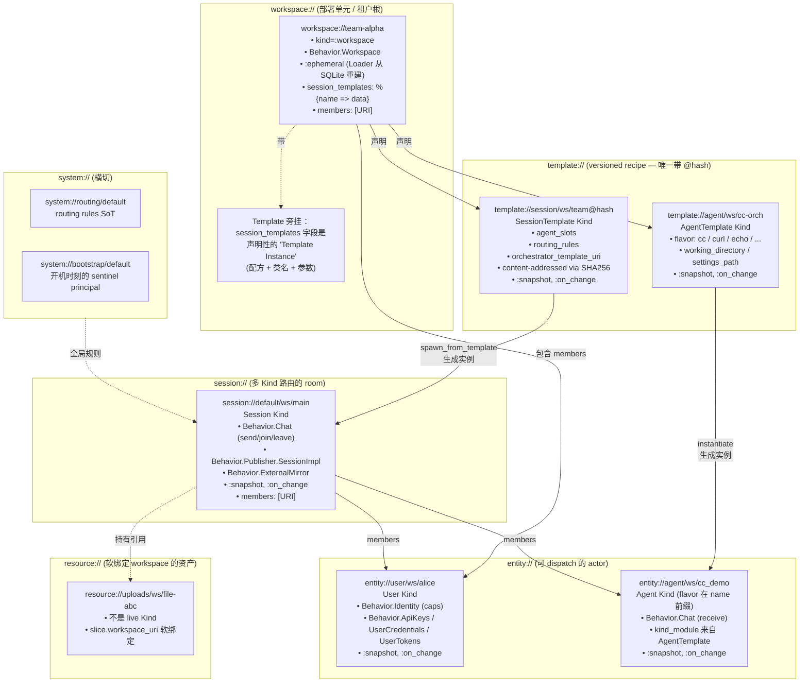
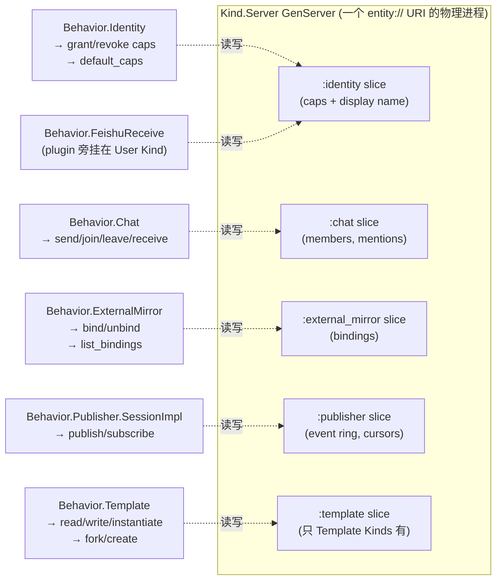
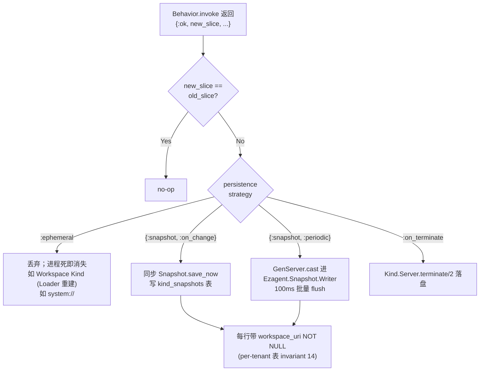
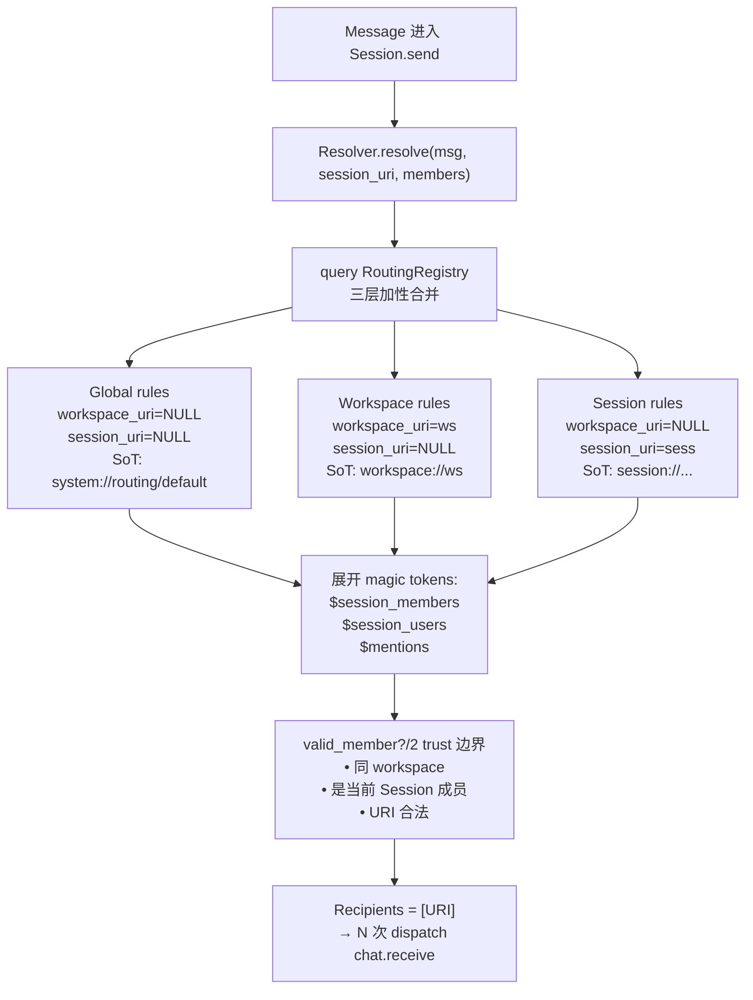
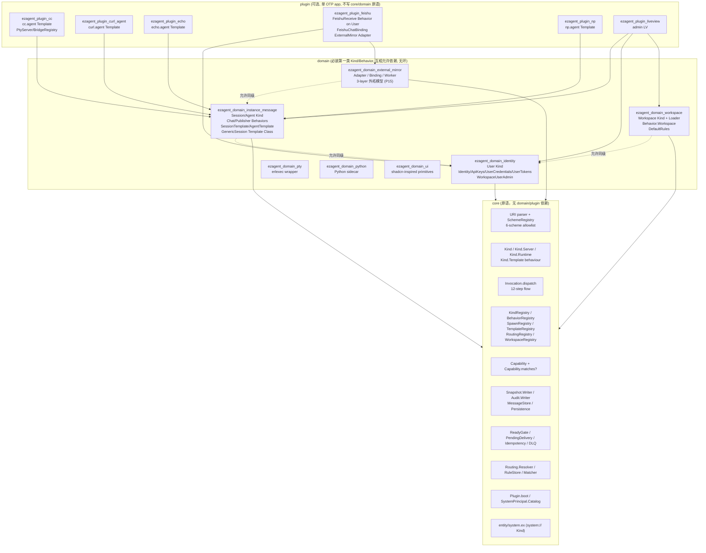

# Ezagent 架构分析 — WSER 层级 × core/domain/plugin 横切（2026-05-26 快照）

**Status**: 现状快照（descriptive snapshot），不是规范。
**Branch**: main @ `e2a4769`（SPEC v3 / caps-cleanup 后）
**对应**: 入口走 [docs/notes/uri-design.md §5](uri-design.md) 规范；本文件是把规范+代码现状投影到两轴架构图上的一份导读。

---

## 0. 两个正交维度

Ezagent 的代码组织有两个正交维度，理解架构必须同时握住两条线：

```
                       URI 层级（业务）
                  W ── S ── E ── R （+ T 旁挂、Sys 横切）
                  │    │    │    │
   工程分层 ┌─ core   ┐  ◄── 所有原语在 core 定义
            │ domain  │  ◄── 第一类 Kind/Behavior（必装）
            └─ plugin ┘  ◄── 可选扩展、单 OTP app
```

- **横轴（URI 层级 / WSER）**：`workspace → session → entity → resource` 是业务范围的递进收敛，外加 `template`（旁挂、复用单元）和 `system`（横切）。
- **纵轴（工程分层）**：`core → domain → plugin`。判定规则是 P9 "读什么数据" — 读 `%Invocation{}`/`%Message{}` 进 core；读插件特定 payload 进 plugin。

下面所有图、所有关注点（旁路 Behavior / 访问控制 / 存储 / 路由）都是这两条轴上的具体投影。

---

## 1. URI 6 SCHEME 全景（横轴）

按 SPEC v3 §5.6，全系统**只有 6 个 scheme**，由 `Ezagent.URI.SchemeRegistry` ETS 在 parse 时锁定：

| Scheme | Shape | 段数 | 角色 | 谁能 spawn |
|---|---|---|---|---|
| `workspace://<name>` | 2 段 | **租户根 / 部署单元** | 自身就是 tenant root | `Ezagent.Workspace.Loader`（boot 时从 SQLite 重建） |
| `session://<template>/<workspace>/<name>` | **3 段** | 多人/多 agent 路由 room | 绑 workspace | `Session.spawn_from_template/2` (Generator) |
| `entity://<user\|agent>/<workspace>/<name>` | **3 段** | 可被 dispatch 的 actor 身份 | 绑 workspace | `SpawnRegistry` 注册的 spawn fn |
| `template://<agent\|session>/<workspace>/<name>[@hash]` | **3 段** | 内容寻址的"配方" | 绑 workspace | LV/CLI 显式创建；唯一带 `@hash` 的 scheme |
| `resource://<type>/<workspace>/<name>` | **3 段** | 平台可寻址资产（上传等） | 绑 workspace（slice 字段） | 上传/作业产物 |
| `system://<type>/<name>` | 2 段 | 平台 sentinel（路由表、bootstrap） | 跨切（`:any` workspace） | boot 时固定 |

**已删除（SPEC v2 -> v3 期间）**：`user://`、`agent://`、`message://`、`feishu://`、`routing-admin://`、`pty-input://`。

[架构不变式 invariant 11]：plugin **永远不许引入新 scheme**；外部集成是 `Behavior on existing Kind`（见 [.claude/skills/ezagent-developer/references/architecture-invariants.md](../../.claude/skills/ezagent-developer/references/architecture-invariants.md)）。

---

## 2. WSER 层级 + 每层 Template（核心图）



### 2.1 WSER 各层职责 + Template 对应表

| URI 层 | Kind | 持久化 | 旁挂 Behaviors | **对应 Template** | 实例化函数 |
|---|---|---|---|---|---|
| **W** `workspace://` | `Ezagent.Entity.Workspace` (`apps/ezagent_domain_workspace`) | `:ephemeral` + SQLite via `Workspace.Loader` | `Behavior.Workspace`、`Behavior.WorkspaceUserAdmin` | **没有自己的 Template Class**——但 `workspace.session_templates` map 是"Template Instances"的容器（一种 declarative 配方清单） | `Workspace.Loader` boot 时 |
| **S** `session://` | `Ezagent.Entity.Session` (`apps/ezagent_domain_instance_message`) | `{:snapshot, :on_change}` | `Behavior.Chat`、`Behavior.Publisher.SessionImpl`、`Behavior.ExternalMirror` | **`SessionTemplate` Kind**（`template://session/...@hash`）+ `Ezagent.Template.GenericSession`（Template Class，`"session.generic"`） | `Session.spawn_from_template/2` (Generator) |
| **E** `entity://user/...` | `Ezagent.Entity.User` (`apps/ezagent_domain_identity`) | `{:snapshot, :on_change}` | `Behavior.Identity`（caps 容器）、`Behavior.ApiKeys`、`Behavior.UserCredentials`、`Behavior.UserTokens`、`+ 插件可挂 FeishuReceive 等` | **没有 Template**（User 是手工/管理面 provision，无 template class） | `Users.create/3` + `SpawnRegistry` |
| **E** `entity://agent/...` | `Ezagent.Entity.Agent` (`apps/ezagent_domain_instance_message`) `+ CurlAgent / Echo / NpAgent` 等 plugin Kind | `{:snapshot, :on_change}` | `Behavior.Chat`(receive 端)、+ flavor 特定 Behavior | **`AgentTemplate` Kind**（`template://agent/...`，无 @hash）+ `Ezagent.Kind.Template` 行为类，**插件提供**：`cc.agent`、`curl.agent`、`echo.agent`、`np.agent` | `Agent.spawn/4` 经由 Template Class `instantiate/3` |
| **R** `resource://` | 不是 live Kind | 文件系统 + DB row | n/a | **没有 Template** | LV 上传 / Behavior 产出 |

**关键观察**：

1. **只有 E.agent 和 S 有 "Template Class"**（即 `@behaviour Ezagent.Kind.Template` 实现）。User / Workspace / Resource 没有 Template Class — 它们或是 provision 出的，或是 Loader 重建的，或是 slice-field 软绑定。
2. **唯一带 @hash 的是 template://**（SPEC §5.3），它是内容寻址。session/entity 都没有版本。
3. **Workspace 的"templates"是个语义重载**：`workspace.session_templates` 字段里装的是 "Template Instances"（已绑定参数的配方），不是 Template Class 本身。Template Class 在 plugin 里实现，名字（如 `"cc.agent"`、`"session.generic"`）通过 `TemplateRegistry` 注册，由 Loader 在 boot 时 lookup。

---

## 3. 旁路 Behavior（横切组合）

Ezagent **不是面向类的层级继承**，而是 **Kind = Slice + 一组 Behaviors 的组合**。同一个 URI 的物理 GenServer 持有 N 个独立 slice，每个 slice 由一个 Behavior 负责。



### 旁路 Behavior 的两种来源（SPEC v3 §5.8 P11）

```
core/domain 内置:                           plugin 旁挂:
  Session: [Chat, Publisher, ExternalMirror]    User: [Identity, ApiKeys, UserCredentials, UserTokens, FeishuReceive (←plugin)]
  User:    [Identity, ApiKeys, ...]             Session: [外挂 FeishuChatBinding 由 ExternalMirror.Adapter pair 注入]
  Agent:   [Chat]                               Workspace: [WorkspaceUserAdmin (privileged carve-out)]
  Template Kinds: [Identity, Template]
  Workspace: [Workspace]
```

[设计原则 P19]：**Behavior 只读自己的 slice**——跨 Behavior 协调只能通过新的 action 走 dispatch，不能直接窥视别人的 slice。

[设计原则 P11 + invariant 1]：**插件做外部集成绝不开新 scheme**，而是 `BehaviorRegistry.register(ExistingKind, action, MyBehavior)` 旁挂到 User/Session 上。Feishu 接入就是这个模式（FeishuReceive 旁挂 User，FeishuChatBinding 由 ExternalMirror Domain 注入 Session）。

---

## 4. 访问控制 — CapBAC（Push-based capabilities）

```elixir
%Ezagent.Capability{
  kind:           atom() | :any,         # Kind type，如 :session
  behavior:       module() | :any,       # Behavior 模块引用 ⚠️ 不是 :chat 原子!
  instance:       URI.t() | :any | scope_tuple(),
  workspace_uri:  URI.t() | :any,        # ← Phase 9 新增 (P17)
  granted_by:     URI.t() | :plugin_declared,
  granted_at:     DateTime.t() | :compile_time,
}

scope_tuple ::= {:within_session, URI} | {:within_workspace, URI} | {:spawned_by, URI}
```

### 4.1 匹配在 Dispatch 12 步流中的位置

```
Adapter (HTTP/Feishu/CLI/LV)
   │ build %Invocation{target, mode, args, ctx{caller, caps, reply, ...}}
   ▼
Ezagent.Invocation.dispatch/1  ── 步骤 1-4 (在调用方进程)
   │  1. parse target URI
   │  2. KindRegistry.lookup(target) → pid
   │  3. idempotency check (PendingDelivery)
   │  4. transport: :call | :cast → GenServer
   ▼
Ezagent.Kind.Runtime.handle_dispatch  ── 步骤 5-10 (Kind GenServer 进程)
   ├─ 5.   BehaviorRegistry.lookup({kind_module, action})
   ├─ 5.5  ★ CapBAC: Ezagent.Capability.matches?(ctx.caps, target)
   │            → {:error, :unauthorized}
   ├─ 5.6  ★ Workspace 隔离: caller_ws == target_ws ?
   │            → {:error, :cross_workspace_denied}
   ├─ 5.7  validate args 对照 @interface
   ├─ 6.   slice = state[behavior.state_slice()]
   ├─ 7.   behavior.invoke(action, slice, args, ctx)
   ├─ 8.   {:ok, new_slice [, result]}
   ├─ 9.   put_in(state, [slice_key], new_slice)
   │       ★ Snapshot.maybe_save(new_slice != old_slice)
   ├─ 10.  emit telemetry [:start :stop :exception]
   ▼
ReadyGate / PendingDelivery / Idempotency  ── 步骤 11-12 reply path
```

### 4.2 5.6 跨 workspace 授权门（[invariant 13]）

下列任一为真，就允许跨 workspace dispatch：
1. **同 workspace**（caller.ws == target.ws）
2. **target 跨切**（target scheme 是 `template/system/resource` → `workspace_of = :any`）
3. **caller 是 :system**（boot/migration）
4. **caller 持有显式跨 workspace cap**（`workspace_uri: :any`）
5. **caller 是 `workspace://system` 成员**（Keycloak realm-admin 模型，membership-by-structure）

否则返回 `{:error, :cross_workspace_denied}`（特意区别于 `:unauthorized`，便于 inbound transport 用不同 emoji 反馈）。

[设计原则 P15 + invariant 2]：**`behavior` 字段必须是模块引用**，不许写 `:chat` 原子——`matches?/2` 严格按等于，原子拼错就是静默拒绝。

---

## 5. 存储 / Snapshot 策略



### 持久化层（[invariant 14 + P21]）

```
SQLite (per-tenant 表，全部带 workspace_uri NOT NULL + index)
├─ messages              ← MessageStore (chat 历史)
├─ invocations           ← Audit.Writer 异步 cast 写入（不阻塞 dispatch）
├─ users                 ← caps_json 列 = User caps 的物化
├─ kind_snapshots        ← Session / Agent / Template / User slice 多路复用
├─ entity_tokens         ← agent bearer token
└─ entity_profiles       ← 显示名 + 头像 metadata

豁免（无 workspace_uri 列）：
  workspaces, routing_rules, message_routings, dlq,
  app_settings, magic_link_tokens, feishu_user_bindings, feishu_session_bindings
```

### Reliability 三剑客（core 内置，plugin 不能 bypass — P22）

```
ReadyGate          —— per-URI 三态 (:unknown / :not_ready / :ready)
                      dispatch 前必查；:call 不-ready 立即 fail-fast，
                      :cast 不-ready 进 PendingDelivery 缓冲
PendingDelivery    —— per-URI bounded buffer (cast 在 register→subscribe 窗口)
                      溢出 → DLQ
Idempotency        —— ctx.idempotency_key + Ezagent.Idempotency.seen?
                      "收到即记"（失败也算 seen），失败走 DLQ 兜底
```

---

## 6. 路由策略（三层叠加）

`session.send` 内部不写 fan-out，而是把决策交给纯函数 `Ezagent.Routing.Resolver.resolve/3`，它对应 [uri-design.md §5.4] 的三层 scope：



### 路由规则修改的 dispatch 目标（[invariant 12]）

> synthetic singleton `routing-admin://` **已删除**。规则修改必须 dispatch 到规则真正的 scope-owning Kind：

| 修改 Global 规则 | `system://routing/default?action=add_rule` |
|---|---|
| 修改 Workspace 规则 | `workspace://<ws>?action=routing.add_rule` |
| 修改 Session 规则 | `session://<t>/<ws>/<n>?action=routing.add_rule` |

这是 P3（单 SoT）和 P11（无幽灵 singleton）在路由面的具象化。

---

## 7. core / domain / plugin 横切（纵轴）



### 严格边界（[three-tier-structure.md](../../.claude/skills/ezagent-developer/references/three-tier-structure.md)）

|  From → To  | core | domain | plugin |
|---|---|---|---|
| **core** | ✓ 内部 | ✗ | ✗ |
| **domain** | ✓ | ✓ 同级（无环，identity ↛ chat） | ✗ |
| **plugin** | ✓ | ✓ | △ 同级少见 |

试金石：**两个互不相识的 plugin 作者能不能并行交付而不撞 merge conflict**？若不能，则抽象在错的层。

---

## 8. 综合大图：两轴交叉

把 WSER（横）和 core/domain/plugin（纵）放在同一张表里：

| WSER | core 内提供什么 | domain 实现什么 | plugin 旁挂什么 |
|---|---|---|---|
| **workspace://** | `Ezagent.WorkspaceRegistry` (consistency cache)、`Capability.workspace_of/1`、5.6 跨 ws 门 | `ezagent_domain_workspace`：Kind、Loader（boot 时从 SQLite 重建）、Behavior.Workspace、DefaultRules | （无；workspace 不留给 plugin 定义） |
| **session://** | `KindRegistry`、`PendingDelivery`、`Snapshot` | `ezagent_domain_instance_message`：Kind、Behavior.Chat（send/join/leave）、Publisher.SessionImpl、ExternalMirror.Behavior、SessionTemplate、Generator (`spawn_from_template`)、GenericSession Template Class | ExternalMirror Adapter+Binding 对（FeishuChatBinding 等） |
| **entity://user/** | `Ezagent.Capability`、SystemPrincipal.Catalog | `ezagent_domain_identity`：User Kind、Identity/ApiKeys/UserCredentials/UserTokens、Users.create | `FeishuReceive` Behavior（旁挂 User），其它 IM/邮件 plugin 同模式 |
| **entity://agent/** | `SpawnRegistry`、`AgentLineage`、`Kind.Template` behaviour | `ezagent_domain_instance_message`：Agent Kind、AgentTemplate Kind（template 内容）、`Behavior.Template` (read/write/instantiate) | **Template Class 在 plugin**：`cc.agent`、`curl.agent`、`echo.agent`、`np.agent` — kind_module 通过 AgentTemplate 的 flavor 字段授权 |
| **template://** | `TemplateRegistry`、`@hash` 内容寻址 | SessionTemplate Kind（`template://session/...@<hash>`）+ AgentTemplate Kind | （插件提供 Template Class 注册到 TemplateRegistry） |
| **resource://** | `Ezagent.Persistence.scope_by_workspace`（read 路径）、`workspace_uri` 列约束 | （主要在 UI/Web 层与文件系统） | （无核心 plugin；具体 resource type 在使用方定义） |
| **system://** | `Ezagent.Entity.System`（Kind）、`SystemPrincipal.Catalog` (14-URI 闭集) | DefaultRules 在 system://routing/default 注册 | （插件 boot 时往 routing_tables 加 rule） |

---

## 9. 关键不变式 — 一眼看完

> 完整 17 条 + 6 条 caps-cleanup 补充见 [.claude/skills/ezagent-developer/references/architecture-invariants.md](../../.claude/skills/ezagent-developer/references/architecture-invariants.md)。下面是最常踩雷的子集：

```
1.   Kind 间通信 ONLY 走 Invocation.dispatch/1（禁 PubSub.broadcast 进 inbound）
2.   Capability.behavior = 模块引用，不是原子（写错就 silent deny）
4.   每个 spawned session 必须 WorkspaceRegistry.bind/2
5.   {:within_session, _}/{:spawned_by, _} 是窄化，不能放宽
8.   plugin 不引入新 top-level scheme（feishu:// 已删）
11.  6 schemes only，per-tenant 3-segment authority
12.  无 synthetic singleton（routing-admin:// / pty-input:// 已删）
13.  跨 workspace dispatch 必须有结构性 authority
14.  per-tenant 表都带 workspace_uri NOT NULL
15.  外发 mirror ONLY 走 ExternalMirror Domain
```

对应反例 grep（每个 sub-step 完成前自查）：

```bash
# 反例 1：inbound 路径误用 PubSub
grep -rn "PubSub.broadcast" apps/ | grep -v ":events"

# 反例 2：cap 写成原子
grep -rn "behavior: :" apps/ | grep -v "behavior: :any" | grep "behavior: :"

# 反例 8：plugin 自创 scheme
grep -rn '"[a-z]*://' apps/ezagent_plugin_*/lib/ | grep -vE '(entity|workspace|session|template|resource|system)://'

# 反例 11：2-segment 的 entity URI
grep -rnE 'entity://(user|agent)/[a-z-]+/?[^/]' apps/ | grep -vE 'entity://(user|agent)/[a-z][a-z0-9_-]*/'
```

---

## 10. 关键 dispatch 时序（一切汇于此）

下面这条时序是把所有概念串起来的"心跳"。任何一个步骤被绕过，对应不变式就会爆。

```
HTTP/Feishu/CLI/LV (Adapter, P12/P13)
    │  解析协议 → %Invocation{target=URI, mode, args, ctx{caller, caps, reply}}
    ▼
Invocation.dispatch/1
    1. URI parse (SchemeRegistry 6-scheme 闭集) ............. invariant 11
    2. KindRegistry.lookup(target) → pid (ReadyGate 三态)
    3. idempotency_key seen?
    4. send to Kind.Server (:call / :cast — P18)
    ▼
Kind.Runtime.handle_dispatch (in target's GenServer)
    5.   BehaviorRegistry.lookup({kind_module, action})
    5.5  Capability.matches?(ctx.caps, target) ............. invariant 2, 5, 6
            ├─ 否 → {:error, :unauthorized}
    5.6  workspace 隔离 ................................... invariant 4, 13
            ├─ 否 → {:error, :cross_workspace_denied}
    5.7  validate args 对照 @interface
    6.   slice = state[behavior.state_slice()] ............. P19 (Behavior 只读自己 slice)
    7.   behavior.invoke(action, slice, args, ctx)
    8.   {:ok, new_slice [, result, slice_change_event]}
    9.   put_in + Snapshot.maybe_save (new_slice != old) ... invariant 14
    10.  telemetry :start/:stop/:exception ................. P19
    ▼
reply path
    11-12. ctx.reply 路由 (caller_inbox / pubsub / ignore / plug_conn / channel / stdio / mcp)
    ▼
副作用：
    - Audit.Writer (异步 cast，不阻 dispatch) .............. invariant 14
    - SliceChange.emit → Publisher 环形缓冲 → 订阅者
    - ExternalMirror Worker (如有 binding) 镜像到 Feishu / Slack /…
```

---

## 11. 一张图记住整个架构

```
                            ┌──────────── Adapter Layer (P12) ────────────┐
                            │  HTTP / Feishu / CLI / LV / MCP / WebSocket │
                            └──────────────────┬──────────────────────────┘
                                               │ %Invocation{}
                                               ▼
                            ┌──────────── Dispatch Spine (P14) ───────────┐
                            │  Invocation.dispatch → Kind.Runtime         │
                            │   ├─ 5.5  CapBAC (P15)                      │
                            │   ├─ 5.6  Workspace isolation (P17)         │
                            │   ├─ 7    Behavior.invoke                   │
                            │   └─ 9    Snapshot on-change (P22)          │
                            └──────────────────┬──────────────────────────┘
                                               │
            ┌────────── Kind = Slice ⊕ N Behaviors ──────────┐
            ▼                                                ▼
    WSER Kinds (业务层级)                       Cross-cut primitives (横切)
    ├─ workspace://  → Loader 重建              ├─ ReadyGate / PendingDelivery / Idempotency (P22)
    ├─ session://    → Template + Generator     ├─ Routing.Resolver (3 scope 加性)
    ├─ entity://     → User / Agent + caps      ├─ ExternalMirror Domain (P11 外发)
    └─ resource://   → 软绑定 workspace          └─ Audit.Writer + Snapshot.Writer (异步)
            │
       Templates (旁挂)
       ├─ template://agent/...   = AgentTemplate Kind + plugin 提供 Template Class (cc.agent / curl.agent / ...)
       ├─ template://session/... = SessionTemplate Kind (@hash 内容寻址) + GenericSession Template Class
       ├─ workspace.session_templates 字段 = Template Instances 容器（声明性）
       └─ User / Resource 无 Template

                       ── 工程纵轴 (P9 "读什么数据") ──
                       core (原语)
                          ↑
                       domain (必装 Kind/Behavior)
                          ↑
                       plugin (可选, 单 OTP app, 北极星 P1)
```

---

## 参考

- [docs/notes/uri-design.md §5](uri-design.md) — URI 规范（normative）
- [.claude/skills/ezagent-developer/references/design-principles.md](../../.claude/skills/ezagent-developer/references/design-principles.md) — P1-P27 设计原则
- [.claude/skills/ezagent-developer/references/architecture-invariants.md](../../.claude/skills/ezagent-developer/references/architecture-invariants.md) — 17 + 6 不变式 + CI gate
- [.claude/skills/ezagent-developer/references/three-tier-structure.md](../../.claude/skills/ezagent-developer/references/three-tier-structure.md) — 三层边界
- 入口源：[apps/ezagent_core/lib/ezagent/invocation.ex](../../apps/ezagent_core/lib/ezagent/invocation.ex) / [apps/ezagent_core/lib/ezagent/kind/runtime.ex](../../apps/ezagent_core/lib/ezagent/kind/runtime.ex) / [apps/ezagent_core/lib/ezagent/capability.ex](../../apps/ezagent_core/lib/ezagent/capability.ex) / [apps/ezagent_core/lib/ezagent/routing/resolver.ex](../../apps/ezagent_core/lib/ezagent/routing/resolver.ex)
