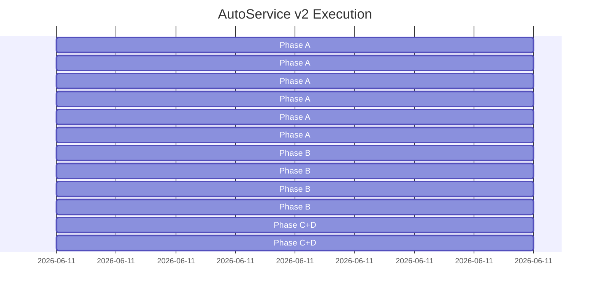

# AutoService v2 — Execution Plan

Generated: 2026-06-11

## Summary

- 12 batches across 3 milestones
- Estimated: 6 days, 1 developer
- Critical path: 11 tasks

## Gantt Chart

## Milestones

### M0: Content + CR Plugin
- Target: Day 3
- Batches: batch-1, batch-2, batch-3, batch-4, batch-5, batch-6
- Gates: content plugin compiles; CR engine passes lifecycle test; cinnox migration successful

### M1: Assembly + Turn
- Target: Day 5
- Batches: batch-7, batch-8, batch-9, batch-10
- Gates: Turn lifecycle E2E; operator takeover works; CustomerFeed :pull verified

### M2: Admin UI + FillerLoop
- Target: Day 7
- Batches: batch-11, batch-12
- Gates: admin can create tenant; tenant can edit soul/skill/KB; CR publish works

## Batches

### batch-1: Phase A: Content + CR Plugin — Batch 1
- Schedule: Day 1, 4 hours
- Gate: mix test green
| ID | Name | Type |
|---|---|---|
| T0A.1 | ezagent_plugin_content 基础骨架 | 🟢 |

### batch-2: Phase A: Content + CR Plugin — Batch 2
- Schedule: Day 1, 4 hours
- Gate: mix test green
| ID | Name | Type |
|---|---|---|
| T0A.2 | Soul CRUD | 🟢 |
| T0A.3 | Skill CRUD | 🟢 |
| T0A.4 | KB CRUD | 🟢 |

### batch-3: Phase A: Content + CR Plugin — Batch 3
- Schedule: Day 2, 4 hours
- Gate: mix test green
| ID | Name | Type |
|---|---|---|
| T0A.5 | Tenant 管理 | 🟢 |

### batch-4: Phase A: Content + CR Plugin — Batch 4
- Schedule: Day 2, 4 hours
- Gate: mix test green
| ID | Name | Type |
|---|---|---|
| T0A.6 | ezagent_plugin_cr CR 引擎 | 🟢 |

### batch-5: Phase A: Content + CR Plugin — Batch 5
- Schedule: Day 3, 4 hours
- Gate: mix test green
| ID | Name | Type |
|---|---|---|
| T0A.7 | CinnoxAssets/Runtime 重构 | 🟡 |

### batch-6: Phase A: Content + CR Plugin — Batch 6
- Schedule: Day 3, 4 hours
- Gate: mix test green
| ID | Name | Type |
|---|---|---|
| T0A.8 | cinnox 数据迁移 | 🟡 |
| T0A.9 | Integration: content plugin → CR plugin pipeline | 🟢 |

### batch-7: Phase B: Assembly + Turn — Batch 7
- Schedule: Day 4, 4 hours
- Gate: E2E flow works
| ID | Name | Type |
|---|---|---|
| T1A.1 | autoservice_assembly.ex | 🟢 |

### batch-8: Phase B: Assembly + Turn — Batch 8
- Schedule: Day 4, 4 hours
- Gate: E2E flow works
| ID | Name | Type |
|---|---|---|
| T1A.2 | Turn 接入 Customer 路径 | 🟢 |

### batch-9: Phase B: Assembly + Turn — Batch 9
- Schedule: Day 5, 4 hours
- Gate: E2E flow works
| ID | Name | Type |
|---|---|---|
| T1A.3 | Operator 接管完善 | 🟢 |

### batch-10: Phase B: Assembly + Turn — Batch 10
- Schedule: Day 5, 4 hours
- Gate: E2E flow works
| ID | Name | Type |
|---|---|---|
| T1A.4 | CustomerFeed 接入 | 🟢 |

### batch-11: Phase C+D: Admin UI + FillerLoop — Batch 11
- Schedule: Day 6, 4 hours
- Gate: Admin UI complete
| ID | Name | Type |
|---|---|---|
| T2A.1 | Master Admin 页面 | 🟢 |
| T2A.3 | FillerLoop + 优化 | 🟢 |

### batch-12: Phase C+D: Admin UI + FillerLoop — Batch 12
- Schedule: Day 6, 4 hours
- Gate: Admin UI complete
| ID | Name | Type |
|---|---|---|
| T2A.2 | Tenant Admin 页面 | 🟢 |
