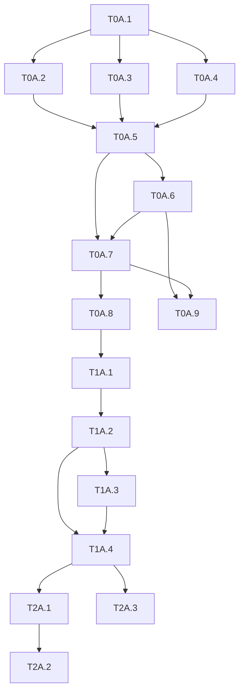

# AutoService v2 — Task List

Generated: 2026-06-11

## Summary

| Metric | Count |
|---|---|
| Total | 16 |
| Green | 14 |
| Yellow | 2 |
| P0 | 9 |
| P1 | 4 |
| P2 | 3 |
| Critical Path | 11 |

## Phase P0

| ID | Name | Type | Depends On | Verification |
|---|---|---|---|---|
| T0A.1 | ezagent_plugin_content 基础骨架 | 🟢 | — | mix compile — content plugin 编译通过 |
| T0A.2 | Soul CRUD | 🟢 | T0A.1 | mix test — soul CRUD 全部绿 |
| T0A.3 | Skill CRUD | 🟢 | T0A.1 | mix test — skill CRUD+index 全部绿 |
| T0A.4 | KB CRUD | 🟢 | T0A.1 | mix test — KB CRUD+rebuild+MCP config 全部绿 |
| T0A.5 | Tenant 管理 | 🟢 | T0A.2, T0A.3, T0A.4 | mix test — provision 创建租户,文件就位,kb.db可用 |
| T0A.6 | ezagent_plugin_cr CR 引擎 | 🟢 | T0A.5 | mix test — CR lifecycle 绿 |
| T0A.7 | CinnoxAssets/Runtime 重构 | 🟡 | T0A.5, T0A.6 | 现有autoservice test绿, 参数化验证 |
| T0A.8 | cinnox 数据迁移 | 🟡 | T0A.7 | 迁移后agent provision可用cinnox租户 |
| T0A.9 | Integration: content plugin → CR plugin pipeline | 🟢 | T0A.6, T0A.7 | full publish pipeline works end-to-end |

## Phase P1

| ID | Name | Type | Depends On | Verification |
|---|---|---|---|---|
| T1A.1 | autoservice_assembly.ex | 🟢 | T0A.8 | assembly 调用链正确 |
| T1A.2 | Turn 接入 Customer 路径 | 🟢 | T1A.1 | Turn lifecycle 绿 |
| T1A.3 | Operator 接管完善 | 🟢 | T1A.2 | 接管流程完整绿 |
| T1A.4 | CustomerFeed 接入 | 🟢 | T1A.2, T1A.3 | customer只收settled消息 |

## Phase P2

| ID | Name | Type | Depends On | Verification |
|---|---|---|---|---|
| T2A.1 | Master Admin 页面 | 🟢 | T1A.4 | master admin可创建租户,编辑平台模板 |
| T2A.2 | Tenant Admin 页面 | 🟢 | T2A.1 | tenant admin可完整管理soul/skill/KB/CR/operator |
| T2A.3 | FillerLoop + 优化 | 🟢 | T1A.4 | filler在cc慢时出现,快时不出现 |

## Dependency Graph

