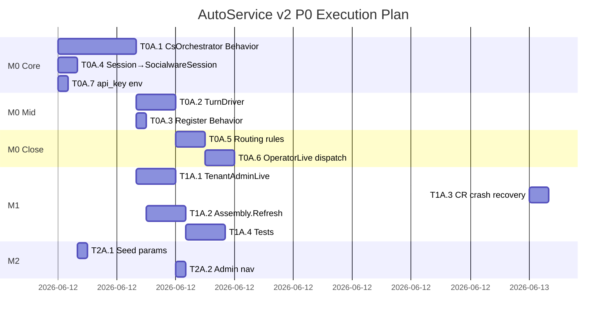
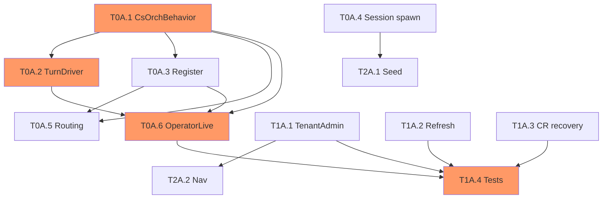

# AutoService v2 — P0 执行计划

> 生成: 2026-06-12 | 分支: `feat/autoservice-v2-merge-v2` | 团队: solo

## 总览

| | |
|---|---|
| 总任务 | 13 (P0=7, P1=4, P2=2) |
| 批次 | 6 batches |
| 里程碑 | M0/M1/M2 |
| 关键路径 | T0A.1 → T0A.2 → T0A.6 → T1A.4 (4 tasks) |
| 预估工时 | ~17h (~3 days solo, +20% buffer = ~4 days) |

## Gantt 图

## 依赖图

## 批次详情

### batch-0: P0 基础 (Day 1 AM, ~4h)
| ID | Name | Effort | Deps |
|----|------|--------|------|
| T0A.1 | CsOrchestrator Behavior | large (3h) | — |
| T0A.4 | Session→SocialwareSession | small (0.5h) | — |
| T0A.7 | api_key from env | small (0.5h) | — |

### batch-1: P0 中间 (Day 1 PM, ~2h)
| ID | Name | Effort | Deps |
|----|------|--------|------|
| T0A.2 | TurnDriver | medium (1.5h) | T0A.1 |
| T0A.3 | Register Behavior | small (0.5h) | T0A.1 |

### batch-2: P0 收尾 (Day 2 AM, ~3h)
| ID | Name | Effort | Deps |
|----|------|--------|------|
| T0A.5 | Routing + Agent reply | medium (1.5h) | T0A.1, T0A.3 |
| T0A.6 | OperatorLive dispatch | medium (1.5h) | T0A.1, T0A.2, T0A.3 |

### batch-3: P1 独立 (Day 2 PM, ~3h)
| ID | Name | Effort | Deps |
|----|------|--------|------|
| T1A.1 | TenantAdminLive | medium (2h) | T0A.1 |
| T1A.3 | CR crash recovery | medium (1h) | — |

### batch-4: P1 测试 (Day 3 AM, ~4h)
| ID | Name | Effort | Deps |
|----|------|--------|------|
| T1A.2 | Assembly.Refresh | medium (1.5h) | T0A.1, T0A.3 |
| T1A.4 | Tests | large (2.5h) | T0A.1-6, T1A.1-3 |

### batch-5: P2 收尾 (Day 3 PM, ~1h)
| ID | Name | Effort | Deps |
|----|------|--------|------|
| T2A.1 | Seed params | small (0.5h) | T0A.4 |
| T2A.2 | Admin nav | small (0.5h) | T1A.1 |
