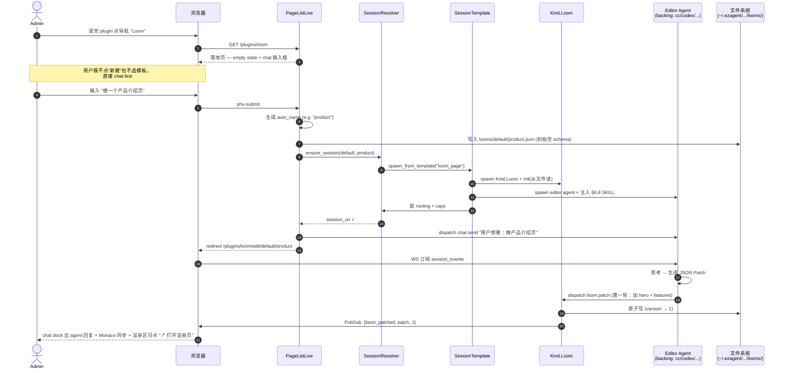
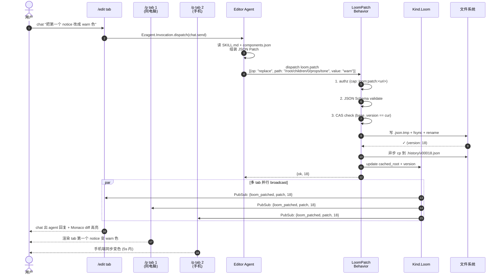
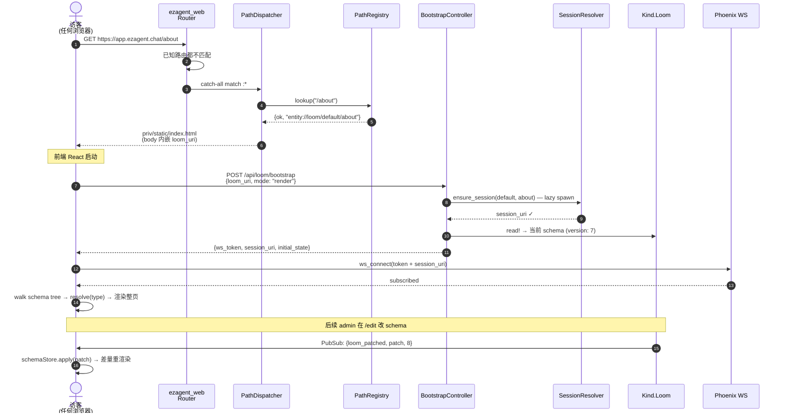
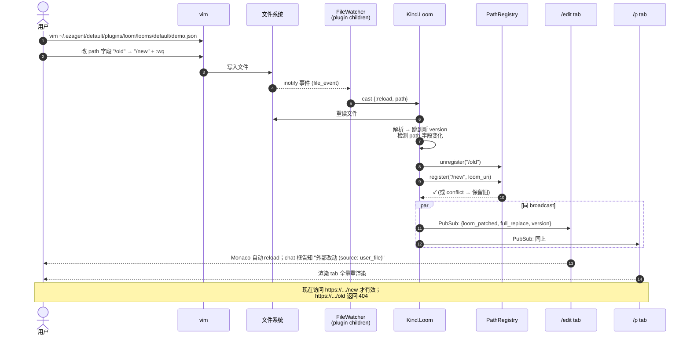

# Plugin: `ezagent_plugin_loom` — schema-driven 页面引擎

> 状态：Draft v0.1
> 日期：2026-05-28
> 作者：Allen / Claude
> 关联：
> - 契约：`apps/ezagent_core/lib/ezagent/plugin.ex`、`docs/superpowers/specs/2026-05-22-plugin-authoring-contract.md`
> - 必读：`ARCHITECTURE.md` §1.2（router vs req/resp）、`GLOSSARY.md`（template / kind / behavior 三义消歧）

---

## 1. 一句话

**Loom 是一个 schema-driven page builder plugin**：plugin 安装 → 在 ezagent 里物化一套 template/agent/workspace + 初始 `schema.json` → 浏览器拿到 schema → 引擎按 schema 引用本 plugin 自带的 41 个预制组件（22 atom + 9 molecule + 10 organism）渲染整页 → 用户跟 AI 聊天 → AI 输出 JSON Patch 改 schema → 所有打开的渲染 tab 差量重渲染。

## 2. 这是什么 / 不是什么

**是**：
- 一个**通用 page builder runtime**——schema 是数据、组件是预制、方法是预制
- 一个**对称编辑模型**——agent dispatch 改 schema = 用户在编辑器里改 schema，走同一条 mutation 路径
- 一个**plugin**——遵循 `Ezagent.Plugin` 契约，install 一次，开箱即用

**不是**：
- 不是无代码低代码平台（schema 的能力上限由 plugin 内置的组件 + 方法 + sandbox 决定，不允许任意运行时 npm install）
- 不是 React Server Components / Next.js SSR——前端是纯 SPA，schema 在客户端解释

## 3. 预制组件库（41 个，三层）

Loom 自带一套 React 组件库，**全部 plugin 拥有，schema 只引用不定义**（详见 §6.4.1）。三层：

| 层 | 数量 | 例子 | 渲染策略 |
|---|---|---|---|
| **Atom** | 22 | `button` / `pill` / `badge` / `avatar` / `spinner` / `tag` / `progress` / `input` / `textarea` / `toggle` / `checkbox` / `radio` / `select` ... | 裸渲染（仅入场动画，无卡片外框） |
| **Molecule** | 9 | `alert` / `panel` / `readout` / `field` / `segmented` / `tabs` / `menu` / `search-results` / `codeblock` | 卡片外框 + 旁白 + actions |
| **Organism** | 10 | `text` / `notice` / `services` / `detail` / `companies` / `steps` / `form` / `choices` / `application` / `intent` | 同 molecule |

组件源码落 `priv/frontend/src/{atoms,molecules,organisms}/*.jsx`，运行时通过 `priv/frontend/src/registry.js` 暴露名字 → 组件映射；schema 节点的 `type` 字段按字符串寻址（如 `{"type": "services", "props": {...}}`）。

加新组件 = 写一个 React 组件 + 在 `registry.js` register 一行 + 重 build。**业务皮 = 改 schema + 改 agent prompt**，不改组件库。

## 4. End-to-end 用户流程

四个核心 flow 覆盖所有典型使用场景。Mermaid sequence 图——任何支持 mermaid 的 markdown 渲染器（GitHub / VS Code mermaid 插件 / [mermaid.live](https://mermaid.live)）可视化。

### 4.0 流程总览

```
┌────────────────────────────────────────────────────────────────────┐
│                                                                    │
│   admin 装完 plugin                                                 │
│         │                                                          │
│         ▼                                                          │
│   ┌──────────────────────────────────────────┐                    │
│   │ Flow A: 首次 admin chat-first onboarding │                    │
│   │   /plugins/loom (empty state)            │                    │
│   │     → 输入 "做一个产品页"                  │                    │
│   │     → 自动建 loom + spawn session         │                    │
│   │     → 跳 /edit + agent 跑第一轮 patch    │                    │
│   └──────────────────────────────────────────┘                    │
│         │                                                          │
│         ▼ (后续每次进入)                                            │
│   ┌──────────────────────────────────────────┐                    │
│   │ Flow B: 编辑回路 (chat → patch → 多 tab 同步) │                │
│   │   /edit chat dock 主区                    │                    │
│   │     → 任意 N 个 /p tab 同步刷新           │                    │
│   └──────────────────────────────────────────┘                    │
│         │                                                          │
│         ▼ (分享给访客)                                              │
│   ┌──────────────────────────────────────────┐                    │
│   │ Flow C: 访客访问公开 URL                  │                    │
│   │   https://.../<custom-path>              │                    │
│   │     → PathDispatcher → render            │                    │
│   └──────────────────────────────────────────┘                    │
│         │                                                          │
│         ▼ (高级用户)                                                │
│   ┌──────────────────────────────────────────┐                    │
│   │ Flow D: vim 文件直改                       │                    │
│   │   FileWatcher → Kind reload → broadcast   │                    │
│   └──────────────────────────────────────────┘                    │
│                                                                    │
└────────────────────────────────────────────────────────────────────┘
```

### 4.1 Flow A — 首次 admin chat-first onboarding

**触发场景**：admin 装完 plugin，第一次点导航 "Loom"。



**关键看点**：
- 第 7 步：lazy spawn——plugin install 时**没**起 session，第一次访问才 spawn
- 第 11 步：editor agent 一接到 chat.send 就跑第一轮 patch，**不等用户再说**
- 第 13 步：redirect 在 patch 完成前就走，浏览器在新 URL 上等 WS 推帧——chat 历史连续

### 4.2 Flow B — 编辑回路 (chat → patch → 多 tab 同步)

**触发场景**：已建好的 loom，用户继续 chat 调整。



**关键看点**：
- 第 5-7 步：三道闸门（authz / validate / CAS），任一失败 reject 整个 patch
- 第 8-10 步：原子写盘 + 异步落历史（最坏丢历史，绝不丢主数据）
- 第 13-15 步：并行广播——所有 tab 一帧到位，**无 polling**

### 4.3 Flow C — 访客访问公开 URL

**触发场景**：admin 把 `https://app.ezagent.chat/about` 发给客户。



**关键看点**：
- 第 4-6 步：PathRegistry 是 ETS，O(1)；未命中走第 7 步 404
- 第 8 步：自定义 path 不暴露 plugin / workspace 内部
- 第 11 步：访客**首次访问**也会触发 lazy session spawn（如果该 loom 第一次被人打开）
- 第 17-19 步：访客的渲染页是 builder 改动的实时镜像（无需刷新）

### 4.4 Flow D — vim 文件直改

**触发场景**：高级用户/运维直接在文件系统改 loom JSON。



**关键看点**：
- 第 4 步：FileSystem lib 提供 inotify（Linux）/ FSEvents（Mac）/ ReadDirectoryChangesW（Windows）跨平台
- 第 6-9 步：reload 路径不走 LoomPatch（没 CAS 检查），用文件 version 当真相；telemetry 标 `:concurrent_external_write` 警告
- 第 10-12 步：path 改了 → PathRegistry 自动同步；冲突时**保留旧 path 注册**+ 写日志（避免 reload 把站搞 404）
- 第 17 步：渲染页 chat 区显式提示"外部改动"，跟 agent 改动区分

## 5. ezagent 侧物化产物（plugin install 干了什么）

| 产物 | URI / 位置 | 由谁创建 | 数据所有者 |
|---|---|---|---|
| **Kind: Loom**（薄壳） | `entity://loom/<ws>/<name>` | plugin install | 本 plugin（新 Kind，**state 仅是文件指针 + 缓存**） |
| **Loom 文件**（真相，每文件 = 一个 loom 实例） | `Ezagent.Home.path(:plugins)/loom/looms/<ws>/<name>.json`<br/>= `$EZAGENT_HOME/$EZAGENT_PROFILE/plugins/loom/looms/<ws>/<name>.json`<br/>默认 `~/.ezagent/default/plugins/loom/looms/<ws>/<name>.json` | install / patch | **文件系统**（见 §5.5） |
| **Agent: loom editor** | `entity://agent/<ws>/<name>_editor` | plugin install（flavor=loom_editor） | 复用 `Ezagent.Entity.Agent`（domain_chat） |
| **SessionTemplate** | `template://loom_page/<ver>` | plugin boot（`template_classes/0`） | 本 plugin |
| **Session**（编辑会话） | `session://loom_page/<ws>/<name>` | install 调 `SessionTemplate.spawn_from_template`（domain_chat） | domain_chat |
| **Behaviors** | `schema.patch` / `schema.read` / `schema.snapshot` | plugin boot（`behaviors/0`） | 本 plugin |
| **Caps** | `loom:patch:<schema_uri>` / `loom:read:<schema_uri>` / `loom:raw_html:<schema_uri>` | install 时种到 admin + editor agent + session creator | CapabilityRegistry（core） |
| **初始 schema 文件** | 同上路径 | plugin install 的 after_boot | 文件系统 |

### 5.1 Kind.Loom 的 state shape（文件 = 真相，Kind = 缓存）

```elixir
%Kind.Loom.State{
  uri: "entity://loom/default/demo",
  # 路径一律走 SSOT —— 跟着 EZAGENT_PROFILE 切换零代码改动
  file_path: Path.join([
    Ezagent.Home.path(:plugins),   # ~/.ezagent/<profile>/plugins
    "loom",                        # 本 plugin 子树
    "looms",                       # 每个 .json = 一个 loom 实例
    "default",                     # workspace slug
    "demo.json"
  ]),
  version: 17,                       # 跟文件内 version 严格一致；CAS 用
  cached_root: %{...},               # in-memory，启动从文件加载
  loaded_at: ~U[2026-05-28 ...]
}
```

**callbacks**（`use Ezagent.Kind`，遵守 P22 reliability primitives，但 snapshot 落盘而非 ETS）：

- `init/1`：从 `file_path` 读 → 解析 → 缓存；文件不存在则按 install 时 seed 写入空 schema
- `handle_action("read", _, state)`：返回 `{cached_root, version}`（O(1)，不碰盘）
- `handle_action("patch", %{patch: p, base_version: v}, state)`：
  1. CAS：`v == state.version` 否则 `{:error, :version_mismatch}`
  2. apply patch 到 `cached_root` → 得新树
  3. JSON Schema validate（schema-of-schema）失败 → reject
  4. **原子写盘**：写 `<name>.json.tmp` → fsync → rename → 更新 `state.version + 1`
  5. 同步追加 `<name>.history/v00xx.json`（异步落盘，best-effort，失败仅 telemetry）
  6. PubSub 推 `{:schema_patched, patch, new_version}` 到 session_events
  7. async audit
- `handle_action("snapshot", _, state)`：列出 `<name>.history/` 下所有版本 + 当前；用于 undo / 时间机器

**不变式**：
- 不订阅 inbound topic、只接 dispatch（守 P14）
- 所有写盘走 `Behavior.LoomPatch`，**不允许直接调 `File.write/2`**（CI grep gate）
- 文件写失败 → 不更新 `state.version`、不 broadcast、回退 `cached_root`（保持原子语义）

### 5.5 存储布局（落在 `Ezagent.Home.path(:plugins)` 之下）

**对齐既有 SSOT**：`Ezagent.Home` 模块（`apps/ezagent_core/lib/ezagent/home.ex`）已经定义了官方持久化根 `$EZAGENT_HOME/$EZAGENT_PROFILE/`，其 `skeleton_dirs/0` 已经把 `:plugins` 列为官方子目录之一。本 plugin **直接落到那**——不发明新路径，不直接读 `EZAGENT_HOME` env。

```
$EZAGENT_HOME/$EZAGENT_PROFILE/                  ← Ezagent.Home.profile_dir()
├── credentials/                                  ← 已有
├── db/                                           ← 已有
├── snapshots/                                    ← 已有
├── logs/                                         ← 已有
└── plugins/                                      ← Ezagent.Home.path(:plugins)（已有）
    └── loom/                                     ← 本 plugin 拥有的子树
        ├── config.json                           # plugin 级配置（editor agent flavor 等）
        └── looms/                                # 每个 .json 文件 = 一个 loom 实例
            └── <workspace_slug>/
                ├── <name>.json                   # active（version=N）
                ├── <name>.json.tmp               # 写入过程中（rename 后消失）
                └── <name>.history/
                    ├── v00001.json
                    ├── v00002.json
                    └── ...                       # 最近 100 版（环形覆盖）
```

**展开示例**（默认 profile）：

```
~/.ezagent/default/plugins/loom/looms/default/demo.json
```

**约定**：

- **路径解析永远走 SSOT**：`Ezagent.Home.path(:plugins)` → 拼上 `loom/looms/<ws>/<name>.json`。**禁止**任何代码直接读 `System.get_env("EZAGENT_HOME")`（已有 invariant test `apps/ezagent_core/test/invariants/` 检 home 直读，本 plugin 沿用同一 gate）
- **profile 切换自动跟随**：admin 切到 `EZAGENT_PROFILE=staging`，本 plugin 的 schema 跟着切到 `~/.ezagent/staging/plugins/loom/...`，零代码改动
- **install 时确保根存在**：`after_boot/0` 调 `Ezagent.Home.initialized?` 检查；未初始化则告警让 admin 跑 `mix ezagent.home.init`（不自动建——遵守 home.ex §10 "library code never creates state on a sleeping operator's machine"）
- **workspace slug 一层做隔离**：`<workspace_slug>/` 不含 `/`，跨 workspace 文件系统层面隔离（守 `cross_workspace_isolation_test` 不变式）
- **文件内容**：§6 描述的 schema JSON，含 `version` 字段，跟 Kind state 严格一致
- **`<name>.json` 是 active**：用户/管理员可**直接 `vim` 改**；`FileWatcher` 监到改动 → Kind reload + broadcast（§8.2 文件直改路径）。无需 pause/lock—— CAS + telemetry 会标 `:concurrent_external_write`
- **多机部署**：v1 假设单机（同 ezagent_core 当前限定）；v2 用 NFS / S3-FUSE 或换 storage 后端（Kind state 屏蔽了上层差异）

**为什么不放 DB / Kind ETS state**：
- 用户希望"可手动改" → 文件系统比 SQL row 友好 10 倍（`vim`、`git diff`、`scp` 都直接能用）
- 已有 file-based 装载先例：`Ezagent.Workspace.Loader.load_all/0`、`apps/ezagent_plugin_cc/lib/ezagent/plugin_cc/mcp_config_writer.ex`（`@default_dir Path.expand("~/.ezagent")`）
- snapshot-on-change 自然由"原子写盘 + 版本目录"满足，不需要再叠 ETS 层
- profile 系统（default / staging / personal）开箱即用——schema 跟着 profile 走

### 5.6 Session 绑定模型 — loom ↔ session 1:1（核心架构）

> 这是 ezagent 集成的关键——loom 不是孤立的数据，**每个 loom 必须挂在一个 session 里**才能跟 agent / 用户 / 事件流打通。本节定义这个绑定。

#### 5.6.1 1:1 URI 映射（确定性，不查表）

**每个 loom 1:1 对应一个 session**，URI 后缀完全一致：

```
entity://loom/<ws>/<name>          ←─→  session://loom_page/<ws>/<name>
        ↑                                            ↑
   loom 数据 Kind                            它的编辑/消费 session
```

后缀 `<ws>/<name>` 一致，省一次 lookup——LiveView / bootstrap 都能 O(1) 从 URL 反推。

#### 5.6.2 一个 session 里有哪些 member

```
session://loom_page/default/demo
  ├─ entity://loom/default/demo            ← 被编辑/消费的 Kind
  ├─ entity://agent/default/demo_editor    ← editor agent（flavor=loom_editor）
  ├─ entity://user/default/tmp_<id>        ← 当前浏览器用户（或持久 user）
  │   ⚠ 多 tab 同时打开 = 多个 tmp_user 共存，都是 member
  └─ routing rules（见 §5.6.3）
```

**编辑 agent 是 session 的常驻 member**，不是按需 spawn——session 活着它就活着，chat 历史在它身上累积。

#### 5.6.3 Session 内的 routing 规则

```
inbound（user → ?）
  tmp_user.chat.send       →  demo_editor   # 用户聊天 → editor agent
  tmp_user.loom.dispatch   →  demo_editor   # 渲染页按钮点击 → 同上（v1）

agent 内部（editor → ?）
  demo_editor.loom.patch   →  loom (Kind)   # editor 改 schema
  demo_editor.loom.read    →  loom (Kind)   # editor 读 schema
  demo_editor.chat.reply   →  tmp_user      # editor 回复用户

events（broadcast）
  loom.patched 事件        →  session_events_topic（所有 member 收）
```

**P14 守门**：所有 inbound 走 `Ezagent.Invocation.dispatch`，不许 LiveView 直接 `PubSub.broadcast` 进 inbound topic。

#### 5.6.4 Session 生命周期（lazy spawn + 持久）

**lazy spawn**：session 在 **第一次 `/edit` 或 `/p` 访问时**自动 spawn，不在 plugin install 时 spawn。

```elixir
# LiveView mount 时
def ensure_session(ws, name) do
  session_uri = "session://loom_page/#{ws}/#{name}"

  case Ezagent.SessionRegistry.lookup(session_uri) do
    {:ok, _pid} ->
      {:ok, session_uri}

    :error ->
      # 从 SessionTemplate 装配
      Ezagent.Template.spawn_from_template(
        "loom_page",
        ws: ws,
        name: name,
        backing_agent_flavor: read_loom_config(ws, name).agent  # cc / codex / curl_agent
      )
  end
end
```

**为什么 lazy**：

- install 时 spawn N 个 session = 资源浪费（用户可能从未访问过）
- lazy spawn 跟 ezagent ZombieReaper 兼容——长时间无 inbound 的 session 可被回收，下次访问再唤醒
- 跟 demo / staging 环境友好（不需要清理）

**唤醒后状态恢复**：

- Loom Kind init 从文件读 schema → 内存状态 100% 复原
- editor agent init 从持久存储（cc/codex/np 各有自己的 history store）读对话历史
- session_events 历史从 0 重来（不补帧，本来就只是 events 通道）

#### 5.6.5 Bootstrap 流程（浏览器 → session）

两条路径（`/edit` LiveView 和 `/p` SPA），形态不同但终点同一个 session。

**`/edit` LiveView mount**（chat 主路径）：

```
1. URL  /plugins/loom/edit/default/demo
2. LiveView extract ws=default, name=demo
3. ensure_loom_exists(ws, name)        否则 404
4. ensure_session(ws, name)             lazy spawn 若不存在
5. ensure_member(session, current_user) 把当前 LV 进程绑成 session member
6. socket = assign(socket, %{
     loom_uri: "entity://loom/default/demo",
     session_uri: "session://loom_page/default/demo",
     editor_agent_uri: "entity://agent/default/demo_editor",
     loom_state: Loom.read!(loom_uri),
     loom_version: ...
   })
7. subscribe_to_session_events(session_uri)
8. render: chat dock（绑到 session_uri）+ Monaco（绑到 loom_state）
```

**`/p` 或自定义 path 渲染页 bootstrap**（render 路径，HTTP POST + WS 二段式）：

```
浏览器 GET /<custom-path>     ← 例：/about
       或 /p/<ws>/<name>      ← 例：/p/default/demo
  → PathDispatcher 反查 PathRegistry → 命中 loom_uri
  → 返回 priv/static/index.html （body 内嵌 loom_uri 给前端）
  → 前端 JS bootstrap:

POST /api/loom/bootstrap
Body: {loom_uri: "entity://loom/default/demo", mode: "render"}
      ← 前端从 index.html 的 <script id="__loom_uri__"> 读到
Response: {
  session_uri:  "session://loom_page/default/demo",
  loom_uri:     "entity://loom/default/demo",
  loom_state:   {root, version, ...},        // 初次渲染用，省一次 read
  user_uri:     "entity://user/default/tmp_xxx",
  ws_url:       "wss://.../session/ws",
  ws_token:     "eyJ..."                     // 绑死 session_uri + caps loom:read:<uri>
}

WS connect: wss://.../session/ws?token=<ws_token>&session=<session_uri>
First frame (client→server): {type: "subscribe", session_uri, ws_token}
Server stream (server→client):
  {type: "loom_patched", patch: [...], version: 18}   ← 来一帧 apply 一帧
  {type: "chat_message", sender: "...", body: "..."}  ← 渲染页默认 filter 掉 chat 帧
```

**两条路径 invariant**：都终结在同一个 `session://loom_page/...`，**不开第二条 session**。

#### 5.6.6 caps 流动

```
admin
  ├─ 装 plugin → 默认拿全套：loom:read:* / loom:patch:* / loom:raw_html:*
  └─ 通过 mix 或 UI 把 cap 委派给具体 user

User Alice
  ├─ loom:read:entity://loom/default/demo
  └─ loom:patch:entity://loom/default/demo   ← 可选；不给 = 只能看不能改

Editor Agent (demo_editor)
  ├─ loom:read:<uri>     ← SessionTemplate spawn 时种入
  ├─ loom:patch:<uri>    ← 同上；agent patch 走 cap 检查
  └─ chat.reply 给 session 所有 user

/edit 浏览器（Alice 登录态）
  → 拿 ws_token，里面 encode 了 Alice 的 cap subset
  → 可以 chat.send（routing 到 editor agent）
  → editor agent 用自己的 cap 调 loom.patch（不是浏览器的 cap）

/p 浏览器（匿名访客）
  → bootstrap 拿匿名 ws_token，只 encode loom:read:<uri>
  → 可以 subscribe，不能 chat.send 改 loom
  → 按钮点击触发 dispatch：v1 路由到 editor agent（演示用）；v2 看
    业务流（可能要新 agent 接 inbound，见 §5.6.8）
```

#### 5.6.7 编辑会话 vs 消费会话（v1 复用，v2 分离）

| | v1（本 plugin 首版） | v2 演化方向 |
|---|---|---|
| **builder 在 /edit 编辑** | 用 `session://loom_page/<ws>/<name>` | 同 |
| **建好后 end-user 在 /p 消费** | **复用同一 session**（v1 简化） | 单独 `session://loom_consume/<ws>/<name>/<visit_id>`，per-visit 短期 session |
| 优点 | 实现简单，build/preview/consume 共用 routing | end-user 互不串数据；编辑历史不泄露给消费者 |
| 缺点 | 消费者能看到编辑 chat（前端 filter，但 server 端不隔离） | 装配 / 回收成本高 |

**v1 决策**：复用同一 session；`/p` 前端**过滤掉 `chat_message` 帧**（只渲染 `loom_patched`）；server 端不做 chat 信息隔离。出 demo 够用，正式发布上线时再走 v2。

#### 5.6.8 SessionTemplate `loom_page` 装配规则

`Template.PageSession`（`lib/.../template/page_session.ex`）：

```elixir
defmodule Ezagent.PluginLoom.Template.PageSession do
  use Ezagent.Kind.Template

  @impl true
  def assemble(params) do
    %{ws: ws, name: name, backing_agent_flavor: flavor} = params

    [
      # 1. ensure loom kind alive
      {Ezagent.PluginLoom.Kind.Loom, uri: "entity://loom/#{ws}/#{name}"},

      # 2. ensure editor agent alive
      {Ezagent.Entity.Agent,
       uri: "entity://agent/#{ws}/#{name}_editor",
       flavor: "loom_editor",
       backing_flavor: flavor,                   # cc / codex / curl_agent
       system_prompt: Ezagent.PluginLoom.Template.EditorAgent.assemble_system_prompt(name)
      },

      # 3. routing 规则（§5.6.3）
      {:routing, [
        {{:user, :_}, {:chat, :send}, {:agent, "#{name}_editor"}},
        {{:user, :_}, {:loom, :dispatch}, {:agent, "#{name}_editor"}},
        {{:agent, "#{name}_editor"}, {:loom, :patch},
                                     {:loom, "entity://loom/#{ws}/#{name}"}},
        {{:agent, "#{name}_editor"}, {:loom, :read},
                                     {:loom, "entity://loom/#{ws}/#{name}"}}
      ]},

      # 4. caps（grant 给 editor agent）
      {:caps, [
        {editor_agent_uri, "loom:read:entity://loom/#{ws}/#{name}"},
        {editor_agent_uri, "loom:patch:entity://loom/#{ws}/#{name}"}
      ]}
    ]
  end
end
```

**`backing_flavor` 是关键**：editor agent 本身是 façade，底下真正干活的是 cc / codex / curl_agent。这就是 §13.1 Q4 决定的 "(B) plugin 不绑模型 + ship operating manual" 落地——backing_flavor 由 install 时 `--agent` 参数选定，写到 `~/.ezagent/<profile>/plugins/loom/config.json` 里持久；下次 lazy spawn 直接读。

#### 5.6.9 一张图看穿

```
                   ┌─ Browser /edit/default/demo (LV) ─┐
                   │     chat dock ──┐                   │
                   │     Monaco ─────┤                   │
                   └─────────────────┼──────────────────┘
                                     │ LV pid joined as session member
                                     │
                   ┌─ Browser /p/default/demo (React) ──┐
                   │   subscribe loom_patched          │
                   │   render schema                   │
                   └─────────────────┬──────────────────┘
                                     │ ws_token + WS
                                     │
                                     ▼
       ╔═════════════════════════════════════════════════════════╗
       ║  session://loom_page/default/demo                       ║
       ║                                                         ║
       ║   members:                                              ║
       ║    • entity://loom/default/demo  ──→ file               ║
       ║    • entity://agent/default/demo_editor                 ║
       ║         backing_flavor: cc                              ║
       ║         system_prompt: §6.6 manual                     ║
       ║    • entity://user/default/tmp_xxx (× N tabs)           ║
       ║                                                         ║
       ║   routing:                                              ║
       ║    user.chat.send  →  editor agent                      ║
       ║    editor.loom.patch  →  loom Kind                      ║
       ║                                                         ║
       ║   events: loom_patched → session_events_topic           ║
       ╚═════════════════════════════════════════════════════════╝
                                     │
                                     ▼ atomic write
        ~/.ezagent/<profile>/plugins/loom/looms/default/demo.json
```

## 6. schema.json DSL + Editor Agent Operating Manual

### 6.0 写在前面

§6.1 ~ §6.5 是 schema 协议本身（供引擎实现）。§6.6 是**给 editor agent 的 operating manual**——install 时被注入 system prompt 的那份文档（Q4 决策的关键产物）。两部分共享同一份组件签名与方法签名，避免双源不一致。


### 6.1 顶层结构

```json
{
  "$schema": "https://ezagent/schemas/loom/v1.json",
  "version": 17,
  "title": "我的页面",
  "path": "/about-us",                          ← 可选，自定义公开 URL（§8.6.1）；
                                                  不写就 fallback 到 /p/<ws>/<name>
  "theme": {"primary": "#7c5cff", "font": "system"},
  "state": {"step": 1, "user_name": ""},
  "methods": {
    "submitInquiry": {
      "kind": "dispatch",
      "target": "chat.send",
      "args": {"text": "我想咨询：{{state.topic}}"}
    }
  },
  "root": {
    "type": "Page",
    "children": [
      {"type": "notice", "props": {"tone": "info", "title": "欢迎"}},
      {"type": "services", "props": {"items": [/*...*/]}, "bindings": {"items": "$.state.serviceList"}},
      {"type": "button", "props": {"text": "提交"}, "on": {"click": "submitInquiry"}},
      {"type": "Raw.Html", "html": "<custom-stuff/>", "css": "...", "sandbox": "iframe"}
    ]
  }
}
```

**`path` 字段规则**（详见 §8.6.4）：

- 可选；不写 → 公开 URL = `/p/<ws>/<name>`
- 字符限制：`a-z A-Z 0-9 - _ . / ~`，必须 `/` 开头，长度 ≤ 200，深度 ≤ 10
- 禁用前缀：`/plugins/*`、`/admin/*`、`/api/*`、`/p/*`、`/live`、`/assets/*`、`/favicon.ico` 等（§8.6.4）
- 全局唯一：跨 workspace 冲突 → `LoomPatch` reject + 编辑器报 "该路径已被 X 占用"
- 路径改动是 patch 的合法操作：`{"op": "replace", "path": "/path", "value": "/new-url"}` → `PathRegistry` unregister 旧 + register 新（原子）

### 6.1.1 单文件 vs 多文件 — v1 决策

**v1：一个 loom = 一个文件，不分片**。理由：

| 维度 | 单文件 | 多文件 / 引用 |
|---|---|---|
| 实际页面尺寸 | landing 30-80KB / dashboard 200-400KB，**§9.3 256KB 硬上限够用** | 优化未存在的问题 |
| 原子写盘 | rename trick 简单 | 要事务、要回滚 |
| vim 友好 | 直接改 | 多文件交叉跳 |
| 历史 100 版 | 25MB / loom，可接受 | manifest + 子树独立历史，复杂 |
| 多页场景 | **多 loom**（`/edit/<ws>/home` + `/edit/<ws>/about`） | 单 loom 内多页（路由复杂） |

**多页 = 多 loom**，每个 loom 独立 URL、独立 CAS、独立历史。心智简单。

**v2 escape hatch**（真有需要时再加）：

- **跨 loom 引用**：`{"$ref": "loom://default/shared/header"}` 引用同 plugin 其它 loom（footer/header 复用）
- **页内 partials**：schema 顶层 `"definitions": {"MyCard": {...}}` + 树里 `{"type": "Ref", "name": "MyCard"}`
- **自动分片**：单 loom 超 256KB 时按子树拆 + manifest

v1 都不做——256KB cap + 多 loom 模型覆盖 90% 场景。真触底再升级。

### 6.2 节点类型四档

| 档位 | type 前缀 | 来源 | 安全 |
|---|---|---|---|
| **Atom** | `button` / `pill` / ... | `registry.js` ATOMS（22 个） | ✅ 内置安全 |
| **Molecule** | `alert` / `panel` / ... | MOLECULES（9 个） | ✅ |
| **Organism** | `services` / `companies` / ... | ORGANISMS（10 个） | ✅ |
| **Layout** | `Page` / `Layout.Row` / `Layout.Grid` / `Layout.Stack` | 本 plugin 新增（薄壳） | ✅ |
| **Escape** | `Raw.Html` / `Raw.Markdown` / `Raw.Script` | 本 plugin 新增 | ⚠ 见 §9 |

### 6.3 数据绑定

- `props`：静态值，引擎直接传递
- `bindings`：JSONPath / 简单表达式 → 引擎从 `state` 求值后注入 props（每次 state 变化重算）
- `on`：事件 → 方法名映射；方法定义在 `methods`，调用结果可改 `state` 或 dispatch

### 6.4 mutation = JSON Patch

只接受 RFC 6902 (`add` / `remove` / `replace` / `move` / `copy` / `test`)。**不允许整树 PUT** —— 强制走 patch 的目的：

1. agent 输出 patch 是结构化的，比"再吐一遍整棵树"短 10×
2. CAS（`base_version`）防并发覆盖
3. 浏览器侧 diff 渲染廉价
4. 审计 / 回滚天然成立

### 6.4.1 组件定义不在 schema 里（关键架构边界）

Schema **只携带"引用 + 实例数据"**，**不携带"定义"**：

```json
{
  "type": "services",                   // ← 引用（按 type 字符串寻址）
  "props": {                            // ← 实例数据（这张 services 卡的具体内容）
    "items": [{"name": "...", "desc": "..."}]
  }
}
```

**组件定义 = plugin 拥有，三个层面**：

| 层面 | 位置 | 谁用 |
|---|---|---|
| **实现** | `priv/frontend/src/{atoms,molecules,organisms}/*.jsx` | 浏览器（真正画 UI 的 React 代码） |
| **运行时映射** | `priv/frontend/src/registry.js` | 浏览器（`resolve("services") → 组件`，引擎 walker 用） |
| **AI 元数据** | `priv/agent_skill/components.json`（codegen 产出） | editor agent（知道每个 type 的 props 形状、视觉描述、用法范例） |

**为什么不放 schema**：

- "预制"的含义就是 **plugin 拥有 & 全局共享**——放 schema 等于每个 loom 复制一份组件签名，几十 KB 包袱
- 组件升级（修 bug / 加 prop）应**所有 loom 自动跟**，不是逐个 loom 改
- AI 看 `components.json` 拼到 3-5K tokens 就够；看 41 个 JSX 源码要 30K+，太贵
- 跟 React component library 行业惯例一致（Material UI / Ant Design 都不在用户数据里塞组件源）

**用户/AI 想要自定义组件呢**：

- **v1 不支持**——用 `Raw.Html`（§9.2 sandbox）作为 escape hatch
- **v2 选项**：schema 内 `definitions` 块 + `{type: "Ref", name: "X"}` 引用（同 §6.1.1 v2 escape）

### 6.5 schema 自身有 JSON Schema 校验

`priv/schemas/loom_v1.json` 是 schema-of-schema。`Behavior.LoomPatch` apply 前先模拟 patch、再用 JSON Schema 验，**任一失败 → reject，不写**。

### 6.6 Editor Agent Operating Manual（给模型的 skill 文档）

**这是 Q4 决定的关键产物。** plugin 不绑模型，但**必须** ship 一份"操作手册"，让任何被 admin 选中的 agent flavor（cc / codex / curl_agent / …）拿到就能上岗。

#### 文件位置

```
apps/ezagent_plugin_loom/priv/agent_skill/
├── SKILL.md                       # 主文档（注入到 system prompt 顶部）
├── components.json                # 41 组件签名（自动从前端 registry.js 同步）
├── methods.json                   # 4 种 method 类型签名
├── patches.examples.jsonl         # 20+ few-shot patch 范例（input → output 对）
├── error_recipes.md               # 常见失败模式 + 修复 patch 范式
└── glossary.md                    # 术语（schema / patch / version / cap）
```

#### SKILL.md 大纲（注入 system prompt 的内容）

```markdown
# Loom Schema Editor — Operating Manual

## 你是什么
你是一个 schema editor agent。用户跟你聊天 = 编辑一个 JSON 树（schema），
浏览器实时渲染该 schema 成可见页面。你不直接绘图、不输出 HTML——
你只输出 **JSON Patch (RFC 6902)** 调用 `schema.patch` 工具。

## 工作循环
1. 收到用户消息
2. 用 `schema.read` tool 拿当前 schema + version
3. 思考：用户想改什么节点、改成什么样
4. 用 `schema.patch` tool 提交 patch，base_version 必须等于步 2 拿到的 version
5. 如果 patch 失败（version mismatch / validation error），重读、重做、不要重试同一 patch

## 可用 tools（plugin 注入）
- `schema.read`   → {root, version}
- `schema.patch`  → {ok, new_version} | {error, reason}
- `schema.snapshot` → 版本历史（实现 undo 时用）

## 节点类型（41 个预制组件，从 components.json 自动同步）
（components.json 列每个组件的 type / props schema / 视觉描述 / 典型用法）

例:
- `button`: {text, variant: primary|secondary|ghost, on: {click: <method_name>}}
- `services`: {items: [{name, desc, openTo}]}
- `Layout.Row`: {gap, align, children: [...]}
- `Raw.Html`: ⚠ 需要 cap loom:raw_html:<uri>；默认不允许使用

## Methods（4 种）
（methods.json 列每种 method 的 schema）

- `dispatch`: 调 ezagent Behavior
- `setState`: 改 schema.state
- `navigate`: 同域跳路由
- `openExternal`: 新 tab 打开 URL（需匹配 plugin origin allowlist）

## Patch 范式（few-shot，从 patches.examples.jsonl 抽 5 条）

例 1：
  user: "把第一个 notice 换成 warn 色"
  你应输出:
    schema.patch({
      base_version: <从 read 拿>,
      patch: [{op: "replace", path: "/root/children/0/props/tone", value: "warn"}]
    })

例 2：
  user: "在底部加个'提交'按钮，点了发'/submit'"
  你应输出:
    schema.patch({
      base_version: <从 read 拿>,
      patch: [
        {op: "add", path: "/methods/submitForm", value: {kind: "dispatch", target: "chat.send", args: {text: "/submit"}}},
        {op: "add", path: "/root/children/-", value: {type: "button", props: {text: "提交", variant: "primary"}, on: {click: "submitForm"}}}
      ]
    })

## 硬规则
- **永远先 read，再 patch**——不许猜 version
- **patch 必须最小**——只改必要节点，不重写整棵 children
- **未知 type 禁用**——只用 components.json 列出的；想要不存在的组件 → 用 `notice` 告诉用户"这个组件不存在，可改用 X"
- **Raw.Html 默认 deny**——除非用户明说要 raw HTML 且 cap 允许
- **size/depth 上限**：单 patch 不超 10 个 op；schema 总 size ≤ 256KB；深度 ≤ 50
- **冲突处理**：version mismatch → 重读、重算、重发；不要 retry loop
- **失败可见**：patch 失败时**回复用户解释原因**，不要静默吞错
```

#### 注入机制

`Template.EditorAgent` 在 spawn 时：

1. 读 `priv/agent_skill/SKILL.md` + `components.json` + `methods.json` + `patches.examples.jsonl`
2. 拼装成单个 system prompt 字符串（约 3-5K tokens）
3. 通过 flavor 的 spawn 参数（`agent_flavors/0` decl 里的 `template_class`）注入到 backing flavor 的 prompt 字段

各 flavor 的注入路径不同：
- **cc**：写到 `~/.claude/CLAUDE.md` 的会话级 override，或通过 `--append-system-prompt`
- **codex**：写到 codex 的 system prompt 字段
- **curl_agent**：作为 OpenAI `system` role 第一条消息

具体注入点由 `bridge_adapter` 决定，本 plugin 提供 hook：`EditorAgent.assemble_system_prompt/1` 返回拼装好的字符串，flavor adapter 接住即可。

#### components.json 自动同步

构建时跑一段 codegen：扫 `priv/frontend/src/atoms/*.jsx` + `molecules/*.jsx` + `organisms/*.jsx`，提取 PropTypes / TypeScript signature → 生成 `components.json`。**前端组件改了，agent skill 自动跟上**，不会双源漂移。CI 加测：`components.json` 不是手写、必须由 codegen 产出。

#### 为什么不让模型直接看前端代码

- 前端代码有大量样式/事件细节，对模型是噪音
- JSON signature 才是它该看的"接口契约"
- 节省 token：3K manual vs 30K 源码

## 7. 渲染引擎（前端）

Vite + React 19 + Tailwind v4 SPA，落 `priv/frontend/`。核心模块：

| 文件 | 职责 |
|---|---|
| `src/registry.js` | §3 组件名 → React 组件映射，包含 41 预制件 + 新增 `Layout.*` / `Raw.*` |
| `src/engine/walker.jsx` | 递归 walk schema tree，遇 node → `resolve(type)` → 渲染 |
| `src/engine/bindings.js` | JSONPath 求值 + state 变化 reactive |
| `src/engine/methods.js` | 方法 invoker（dispatch / setState / navigate / 内置 noop） |
| `src/engine/schemaStore.js` | 本地持有 schema + version；接 WS `loom_patched` 帧 apply |
| `src/session.js` | bootstrap + WS 连接 + 重连指数退避 |
| `src/App.jsx` | 应用骨架：schema renderer + 顶栏 "↗ 打开渲染页" |
| `src/sandbox/RawHtml.jsx` | `<iframe sandbox srcdoc>` + CSP（见 §9） |
| `index.css` | Tailwind v4 入口 + UnoCSS runtime preset（§9.1） |
| `src/atoms/*.jsx`、`src/molecules/*.jsx`、`src/organisms/*.jsx` | §3 列出的 41 预制组件 |

build 入口 `vite build`，产物 `dist/` → CI 拷贝到 `apps/ezagent_plugin_loom/priv/static/`。

## 8. 编辑路径（对称设计）

### 8.1 AI 路径（chat）

```
用户文本 → chat.send → editor agent
editor agent prompt 内置：
  - 当前 schema.json（read tool）
  - JSON Schema 约束
  - 41 组件签名 + 方法签名（自动 inject）
  - 一组 few-shot patch 例子
agent 输出：tool_call schema.patch + JSON Patch 数组
Behavior.LoomPatch apply
```

### 8.2 用户手动路径（两种粒度）

| 粒度 | 入口 | 形态 |
|---|---|---|
| **应用内编辑（推荐）** | `/plugins/loom/edit/<ws>/<name>` | builder 页：**主区是 chat dock**（跟 editor agent 对话），**副区是 Monaco**（折叠/标签切换；高级用户才打开）；顶栏 "↗ 在新页签打开渲染页" 按钮 |
| **文件直改** | `vim ~/.ezagent/<profile>/plugins/loom/looms/<ws>/<name>.json` | 任何文本编辑器；保存后通过 file watcher 触发 Kind reload + broadcast |

**应用内编辑路径**：

- **普通用户**：全程在 chat dock 跟 editor agent 聊（"加一个按钮"/"换成蓝色"/"删掉第三个 card"），agent 调 `loom.patch` 改 schema。**不需要打开 Monaco**
- **高级用户**：展开 Monaco 直接改 JSON。LiveView 算 diff → `Ezagent.Invocation.dispatch` 调 `loom.patch`（同 §8.1 终点）
- Auth：cap `loom:patch:<loom_uri>`
- 编辑器**不内嵌 preview iframe**——按 §8.4 决定在新页签打开渲染页

**为什么 chat 是主区、Monaco 是副**：

- chat 是产品差异化的核心（AI + 协作），Monaco 只是兜底
- 普通用户不该被 raw JSON 吓到——他们要的是"跟 AI 一起做页面"
- 高级用户偶尔需要精修一个嵌套深处的 prop，Monaco 这时才出场
- 这跟 ezagent 全平台的 chat-first 心智模型一致（cc / codex / np 全是 chat 入口）

**文件直改路径**：

- plugin `children/0` 内挂一个 `FileWatcher`（`FileSystem` lib）监 `~/.ezagent/plugins/loom/looms/`
- 文件变化 → `Kind.Loom` 收 `:reload` → 重读文件 + 比对 version → 跳到新 version + broadcast
- **CAS 仍生效**：若文件内的 version 不连续（用户自己跳了版本号），plugin 把"文件 version"当真相、bump 内存 version，但记 telemetry 警告
- **冲突 window**：用户改文件的同时 agent 也在 patch — 后写赢；后写方 telemetry 报 `:concurrent_external_write`，编辑器 UI 弹"刚才被另一处覆盖，要不要 reload?"

### 8.3 两条路径的 invariant

1. **同终点**：必须都终结于 `Kind.Loom` 的 `:patch` 或 `:reload`，不允许 LiveView 直接调 `File.write/2`（守 P14 + P22 audit）
2. **同 cap 模型**：admin 给用户的 cap = 给 editor agent 的 cap，没有"用户后门"。文件直改路径暂不走 cap（操作系统权限兜底，OS 用户 = 平台 trust 边界）
3. **同 telemetry**：`[:ezagent, :schema, :patched]` 事件带 `source: :agent | :user_lv | :user_file`，可观测

CI 加 invariant test：grep 任何 `File.write` 直写 schema 文件的地方，除 `Kind.Loom` 外一律 fail。

### 8.4 渲染页 = 独立新页面（关键 UX 决策）

**渲染输出和编辑器永远不在同一个浏览器 tab**。完整 URL 设计见 §8.6；本节只锁"分 tab"的 UX：

- 编辑面（`/plugins/loom/edit/...`）：chat dock 主区 + Monaco 副区
- 渲染面（`/p/...` 或自定义 path）：纯渲染、新 tab、`target="_blank"`
- 嵌入模式：`?embed=1` 任何渲染面 URL 加 query 即可

**为什么严格分 tab**：
- 编辑动作（Monaco / chat / 文件改）的 reload 不应触发编辑器自己被刷掉
- 渲染页代表"用户最终消费形态"，独立 tab = 真实使用体验，不被编辑 chrome 干扰
- 多 tab 并存：1 个 edit + N 个 p（不同设备/不同 viewport）同时打开，所有 p 通过 WS 订阅同一 session_uri，patch 落地后所有 tab 收到 `loom_patched` 帧自动差量重渲染

### 8.5 落地页 `/plugins/loom` — admin 第一眼看到什么

admin 装完 plugin、点导航 "Loom" → 落到 `/plugins/loom`（plugin 的 `config_surface.path`）。**这不能是空白**，否则 UX 断头。落地页设计：

```
┌──────────────────────────────────────────────────────┐
│   Loom — schema-driven page builder                   │
│                                                      │
│   你的 looms (workspace: default)                     │
│   ┌──────────────────────────────────────────────┐   │
│   │ • home       path: /             v17  ✏ ▶  🔗 │   │
│   │ • about      path: /about        v3   ✏ ▶  🔗 │   │
│   │ • widget     path: /products/x   v8   ✏ ▶  🔗 │   │
│   │ • old-form   path: (default)     v42  ✏ ▶  🔗 │   │
│   └──────────────────────────────────────────────┘   │
│   [ + 从模板新建 ]  [ + 空白新建 ]                    │
│   ─────────────────────────────────────                │
│   💬 或者直接告诉我你想做什么：                          │
│   ┌──────────────────────────────────────────────┐   │
│   │ "做一个产品介绍页，含联系表单..."               │   │
│   └──────────────────────────────────────────────┘ → │
└──────────────────────────────────────────────────────┘

按钮含义： ✏ 编辑   ▶ 新页签打开渲染面   🔗 复制公开 URL
```

**三种 onboarding 路径**：

1. **chat-first（推荐新用户）**：底部输入框直接说要做什么 → 后台 ① 生成默认 name ② init 一个空 loom ③ editor agent 收到 "用户想要 X" 跑第一轮 patch ④ 重定向到 `/edit/<ws>/<auto_name>`，chat 历史接续
2. **模板新建**：弹模板 gallery（blank / landing / form / dashboard），选一个 → 复制模板初始 schema → 跳 `/edit`
3. **打开已有**：✏ 进 `/edit`、▶ 在新页签开 `/p`

**LiveView 实现**：`PageListLive` 模块（`lib/.../live/page_list_live.ex`）。

**Empty state**（用户一个 loom 都没有）：去掉列表，把 chat 输入框放主位 + 模板入口放副位，引导新用户。

**入口分级**：见 §8.6 完整 URL 表。落地页入口固定在 `/plugins/loom`（plugin 的 `config_surface.path`）。

**两条入口的 invariant**：
1. **同终点**：必须都终结于 `Ezagent.PluginLoom.Behavior.LoomPatch.handle/2`，不允许 LiveView 直接写 Kind state（守 P14 + P22 audit）
2. **同 cap 模型**：admin 给用户的 cap = 给 editor agent 的 cap，没有"用户后门"
3. **同 telemetry**：`[:ezagent, :loom, :patched]` 事件带 `source: :agent | :user_lv | :user_file`，可观测

CI 加 invariant test：grep `Loom.state` 直接写的地方，除 Behavior 外一律 fail。

### 8.6 URL 设计 — 公开面 / 编辑面 / 自定义 path（关键 UX）

URL 分两个面，**严格区分**：

| 面 | 谁看 | 命名空间 | 暴露内部细节？ |
|---|---|---|---|
| **公开渲染面** | end-user、客户、访客 | 短路径（`/p/...` 或自定义） | ❌ 不暴露 plugin / workspace 内部命名 |
| **编辑面（admin）** | builder、admin | `/plugins/loom/...` | ✅ 暴露（这是 admin 内部） |
| **API** | 前端 bootstrap | `/api/loom/...` | ✅ 暴露（开发者契约） |

#### 8.6.1 公开渲染面（三档优先级）

**优先级 1：自定义 path（CMS 风格，新增）**

每个 loom 文件的 schema 顶层可以加一个 `path` 字段：

```json
{
  "version": 17,
  "title": "关于我们",
  "path": "/about-us",        ← 自定义路径；不写就 fallback 到默认
  "root": {...}
}
```

最终 URL：

```
https://app.ezagent.chat/about-us
https://app.ezagent.chat/products/widget-x
https://app.ezagent.chat/contact
```

**优先级 2：默认短路径（不写 path 时的 fallback）**

```
https://app.ezagent.chat/p/<ws>/<name>            ← 显式 workspace（跨租户最稳）
https://app.ezagent.chat/p/<name>                 ← 省略 ws，等同 /p/<current-user-ws>/<name>
```

**优先级 3：embed 模式（任一上面 URL 加 `?embed=1`）**

```
https://app.ezagent.chat/about-us?embed=1
https://app.ezagent.chat/p/default/demo?embed=1
```

去掉外壳（无 ezagent 顶栏、无 padding），可被外部页面 `<iframe>` 嵌入。

#### 8.6.2 编辑面 / API（plugin 自留命名空间）

```
GET  /plugins/loom                              落地页（PageListLive）
GET  /plugins/loom/edit/<ws>/<name>             builder（EditorLive）
POST /api/loom/bootstrap                        前端拿 ws_token（§5.6.5）
GET  /api/loom/lookup?path=<path>               URL → loom_uri 反查（前端 client-side router 用）
```

#### 8.6.3 PathRegistry — 自定义 path 的运行时注册

新增模块 `Ezagent.PluginLoom.PathRegistry`（ETS-backed）：

```elixir
%PathRegistry{
  # key: 完整 path（含前导 /）
  # val: {loom_uri, registered_at}
  "/about-us"            => {"entity://loom/default/about", ~U[...]},
  "/products/widget-x"   => {"entity://loom/default/widget_x", ~U[...]},
  "/contact"             => {"entity://loom/acme/contact_form", ~U[...]}
}
```

**注册时机**：

| 时机 | 触发 | 动作 |
|---|---|---|
| plugin boot | `after_boot/0` 调 `LoomLoader.scan_disk()` | 扫所有 loom 文件，对每个有 `path` 字段的 → `PathRegistry.register/2` |
| loom create | `LoomPatch` 写入第一次 | 若 root 含 `path` → register |
| loom path 改 | `LoomPatch` 检测到 path 字段 add/replace/remove | unregister 旧 + register 新（原子） |
| loom 删除 | `Loom.delete` Behavior | unregister 所有该 loom 的 path |

#### 8.6.4 冲突防护（v2 必做）

**禁用前缀**（PathRegistry.register/2 reject）：

| 禁用 | 原因 |
|---|---|
| `/plugins/*` | ezagent 内部命名空间 |
| `/admin/*` | ezagent admin 区 |
| `/api/*` | ezagent + plugin API |
| `/p/*` | loom 自身的默认 fallback 前缀 |
| `/live`、`/cc_socket`、`/agent_bridge`、`/orchestrator_socket` | WebSocket |
| `/assets/*`、`/favicon.ico`、`/robots.txt` | 静态资源 |
| `/dev/*`、`/phoenix/*` | dev tooling |

**路径格式校验**：

- 必须 `/` 开头
- 允许字符：`a-z A-Z 0-9 - _ . / ~`（URL-safe）
- 禁止 `..`（路径穿越）
- 禁止连续 `//`
- 自动剥尾部 `/`（canonicalize）
- 长度 ≤ 200 字符
- segments 数 ≤ 10

**唯一性**：

- 全局唯一（v2 不分 workspace）。若 A workspace 的 loom 注册了 `/about`，B workspace 不能再注册 `/about`，必须用 `/about-b` 之类
- 注册冲突 → `LoomPatch` reject + 返回 error 给 agent / 用户（编辑器 UI 提示"`/about-us` 已被 `entity://loom/acme/about` 占用，换一个吧"）

#### 8.6.5 Router 接入（一次性 ezagent_web 改动）

`ezagent_web/lib/ezagent_web/router.ex` **末尾**加一个 catch-all：

```elixir
scope "/", EzagentWeb do
  pipe_through :browser

  # ... 所有已知路由 ...

  # === LAST ROUTE，必须在所有具体路由之后 ===
  # 接住所有未匹配的 GET，交给 LoomDispatcher 查 PathRegistry
  # 未命中 → 标准 404
  match :*, "/*path", Ezagent.PluginLoom.PathDispatcher, :dispatch
end
```

`PathDispatcher` 逻辑：

```elixir
def dispatch(conn, _params) do
  path = "/" <> Enum.join(conn.path_info, "/")

  case Ezagent.PluginLoom.PathRegistry.lookup(path) do
    {:ok, loom_uri} ->
      # 命中 → 返回渲染页 HTML（同 /p/<ws>/<name> 的行为）
      conn
      |> assign(:loom_uri, loom_uri)
      |> assign(:embed?, conn.query_params["embed"] == "1")
      |> render_index_html()
      |> halt()

    :error ->
      # 未命中 → 标准 404，不要静默
      conn
      |> put_status(404)
      |> render(EzagentWeb.ErrorView, "404.html")
      |> halt()
  end
end
```

**这是 v2 唯一需要改动 ezagent_web 的地方**——其余 plugin 自治。改动小（一行 router + 一个 Plug），但**位置敏感**：必须在所有具体路由之后；CI 测确保排序（grep `match :*, "/*path"` 是 router.ex 倒数第二行）。

#### 8.6.6 例子 — 一个公司用 loom 建官网

假设 acme 公司的 admin 在 ezagent 上装了 loom plugin，建了 5 个页面。loom 文件结构：

```
~/.ezagent/<profile>/plugins/loom/looms/acme/
├── home.json              # path: "/"
├── about.json             # path: "/about"
├── product_widget.json    # path: "/products/widget"
├── product_gadget.json    # path: "/products/gadget"
└── contact.json           # path: "/contact"
```

最终 URL：

```
访客视角                                              ← 全部走自定义 path
https://app.ezagent.chat/                            home loom
https://app.ezagent.chat/about                       about loom
https://app.ezagent.chat/products/widget             widget loom
https://app.ezagent.chat/products/gadget             gadget loom
https://app.ezagent.chat/contact                     contact loom

admin 视角                                           ← 编辑面
https://app.ezagent.chat/plugins/loom                落地页（看到 5 个 loom 列表）
https://app.ezagent.chat/plugins/loom/edit/acme/home 编辑 home

降级 fallback（没 path 字段时）                       ← 默认短路径
https://app.ezagent.chat/p/acme/home                 等同 /
```

**注意**：`/` 也可以被 loom 接管（home loom 注册 path: "/"），实质上是把整个 ezagent root 让给一个 loom。这是合法用法（一个公司用 ezagent 做官网时），但 CI 测要确认 home loom 注册 `/` 时 ezagent 自己的 admin route 仍可访问（`/plugins/loom` 等不会被遮蔽，因为它们是具体路由、catch-all 在后）。

## 9. 安全约束

### 9.1 Tailwind 子集

不打全量 Tailwind（~3MB）。两种做法：

- **方案 A**：build 时 Tailwind v4 JIT 扫 `src/` + `priv/schemas/component_class_allowlist.json`，产出 utility 子集。Schema 里出现的 class 必须在 allowlist 内，否则渲染时降级为 `class=""` + console.warn。
- **方案 B（推荐）**：用 **UnoCSS runtime**（~30KB），运行时按需生成 utility class。Schema 想用什么写什么，引擎用 UnoCSS 实时生成。Tailwind preset 跟 atom/molecule 的视觉对齐。

选 B。

### 9.2 `Raw.Html` / `Raw.Script` 的逃生舱

**默认 deny**：plugin 配置 `allow_raw_html: false`（per-schema 粒度），schema 出现 `Raw.*` 节点时引擎当作未知 type 走 Fallback。

**开启时**（admin 显式打开 cap `loom:raw_html:<schema_uri>`）：

| 限制 | 实现 |
|---|---|
| 隔离上下文 | `<iframe sandbox="allow-scripts" srcdoc={...}>`，不带 `allow-same-origin` → 拿不到父页 cookie / localStorage / ws_token |
| 限网 | `<meta http-equiv="Content-Security-Policy" content="default-src 'none'; style-src 'unsafe-inline'; script-src 'unsafe-inline';">` 默认全 deny；要打外网得显式 connect-src 允许（per-schema 配置） |
| 与父页通信 | 仅 `postMessage` 单向上传到父，父侧白名单方法名（同 §6.3 methods 子集）才执行 |
| 不能 dispatch | iframe 里**不能直接** chat.send；要 dispatch 必须 postMessage → 父侧再走 `Behavior` → 走正常 cap 检查 |

CI 加测：`Raw.Html` 节点出现时 `iframe.sandbox` 不能含 `allow-same-origin`。

### 9.3 schema 本身的 size / depth

- Schema JSON 上限 256KB（reject patch if exceeded）
- 树深度 ≤ 50
- 子节点数 ≤ 1000

防 agent / 用户输出"页面炸弹"。

### 9.4 method 白名单

`methods` 里的 `kind` 只允许：

- `dispatch`（call ezagent Behavior，receiver 必须在 schema 所属 session 的 routing 表里）
- `setState`（改本地 state）
- `navigate`（同 origin 路由）
- `openExternal`（新 tab 打开 URL，URL 需匹配 plugin 配置的 origin 白名单）

不允许：`eval` / `fetch any URL` / `localStorage write` / `cookie write`。

## 10. Plugin 契约映射

```elixir
defmodule EzagentPluginLoom.Application do
  use Application
  use Ezagent.Plugin

  def start(_, _), do: Ezagent.Plugin.boot(__MODULE__)

  def plugin_info, do: %{
    slug: "loom",
    name: "Loom",
    description: "schema-driven page renderer with chat-edit",
    version: "0.1.0"
  }

  def kinds, do: [Ezagent.PluginLoom.Kind.Loom]

  def behaviors, do: [
    {Ezagent.PluginLoom.Kind.Loom, :read, Ezagent.PluginLoom.Behavior.LoomRead},
    {Ezagent.PluginLoom.Kind.Loom, :patch, Ezagent.PluginLoom.Behavior.LoomPatch},
    {Ezagent.PluginLoom.Kind.Loom, :snapshot, Ezagent.PluginLoom.Behavior.LoomSnapshot}
  ]

  def template_classes, do: [Ezagent.PluginLoom.Template.PageSession]

  def agent_flavors, do: [
    %{flavor: "loom_editor",
      kind: Ezagent.Entity.Agent,
      template_class: Ezagent.PluginLoom.Template.EditorAgent,
      bridge_adapter: nil}
  ]

  # —— 编辑面（admin 内部）——
  # /plugins/loom                  → PageListLive 落地页（§8.5）
  # /plugins/loom/edit/<ws>/<name> → EditorLive（chat dock 主 + Monaco 副）
  #
  # —— API ——
  # POST /api/loom/bootstrap        → 为 /p 或自定义 path 前端 mint ws_token (§5.6.5)
  # GET  /api/loom/lookup?path=...  → URL → loom_uri 反查（前端 client-side router）
  #
  # —— 公开渲染面 ——
  # /p/<ws>/<name>          → 默认短路径（无 path 字段时 fallback）
  # /p/<name>               → 省略 ws，等同 /p/<current-ws>/<name>
  # <custom-path>           → 自定义 path（PathRegistry → PathDispatcher catch-all，§8.6.5）
  # <any>?embed=1           → 嵌入模式
  def config_surface, do: %{kind: :route, path: "/plugins/loom", label: "Loom"}

  def children, do: [
    # JSON Schema 编译缓存（启动时加载 priv/schemas/*.json）
    Ezagent.PluginLoom.SchemaValidator,
    # 文件 watcher（监听 ~/.ezagent/<profile>/plugins/loom/looms/，触发 Kind reload）
    Ezagent.PluginLoom.FileWatcher,
    # ETS-backed path → loom_uri 注册表（§8.6.3）
    Ezagent.PluginLoom.PathRegistry
  ]

  def after_boot do
    # 1. 仅扫盘登记 loom 文件存在性 → 让后续 LiveView mount 时能直接 lazy spawn session
    #    不在 boot 时 spawn 任何 session（§5.6.4 lazy spawn 决策）
    # 2. 扫每个 loom 的 path 字段 → 注入 PathRegistry（§8.6.3）
    Ezagent.PluginLoom.LoomLoader.scan_disk_and_register_paths()
  end
end
```

**⚠ ezagent_web 接入**（§8.6.5，**一次性手动改动**）：

`apps/ezagent_web/lib/ezagent_web/router.ex` **末尾**加 catch-all route：

```elixir
# === MUST be the LAST route — 拦未匹配 GET 给 LoomDispatcher 查自定义 path
match :*, "/*path", Ezagent.PluginLoom.PathDispatcher, :dispatch
```

CI 加 invariant：`router.ex` 倒数第二行必须是这条 match catch-all；否则 fail。

`spawns/0` 不实现（默认 `[]`，被 plugin gate 强制）；`adapters/0` 不实现（不接 ExternalMirror，这是 demo / 内部 UI）。

## 11. 目录结构

```
apps/ezagent_plugin_loom/
├── mix.exs                                     # compilers: [..., :ezagent_plugin_check]
├── README.md
├── DESIGN.md                                   # ← 软链 / 复制本文件
├── lib/
│   ├── ezagent_plugin_loom/
│   │   ├── application.ex                      # use Ezagent.Plugin
│   │   ├── router.ex                           # Phoenix.Router; /edit/.. /p/.. /schema/..
│   │   ├── static_plug.ex                      # Plug.Static {:..., "priv/static"}
│   │   ├── kind/loom.ex                        # use Ezagent.Kind; state = 文件指针 + 缓存
│   │   ├── storage/file_store.ex               # 原子写盘、版本目录、读盘
│   │   ├── storage/loom_loader.ex              # boot 时扫 ~/.ezagent/.../looms/ 加载
│   │   ├── storage/file_watcher.ex             # 文件外部改动 → reload
│   │   ├── behavior/loom_read.ex
│   │   ├── behavior/loom_patch.ex              # core: validate → CAS → file write → broadcast
│   │   ├── behavior/loom_snapshot.ex
│   │   ├── session/session_resolver.ex         # §5.6 lazy spawn + 1:1 URI 映射
│   │   ├── session/bootstrap_controller.ex     # POST /api/loom/bootstrap (for /p + custom path)
│   │   ├── routing/path_registry.ex            # §8.6.3 ETS 注册表 path → loom_uri
│   │   ├── routing/path_dispatcher.ex          # §8.6.5 catch-all Plug；router 末尾装载
│   │   ├── routing/path_validator.ex           # §8.6.4 字符 / 前缀 / 唯一性校验
│   │   ├── template/page_session.ex            # SessionTemplate 装配 (§5.6.8)
│   │   ├── template/editor_agent.ex            # editor agent 模板 + assemble_system_prompt/1
│   │   ├── schema_validator.ex                 # JSON Schema 校验（ExJsonSchema）
│   │   ├── live/page_list_live.ex              # /plugins/loom 落地页（§8.5）
│   │   └── live/editor_live.ex                 # /plugins/loom/edit/<ws>/<name>
│   └── ezagent/template/loom_page.ex           # SessionTemplate 注册入口
├── priv/
│   ├── static/                                 # vite build 产物（CI 写）
│   │   ├── index.html                          # 渲染页入口 /p/<ws>/<name> 用
│   │   └── assets/...
│   ├── schemas/
│   │   └── loom_v1.json               # schema-of-schema（不是用户 schema）
│   ├── seed/
│   │   └── empty_page.json                     # install 时的初始 schema 模板
│   ├── agent_skill/                            # §6.6 — 给 editor agent 的 operating manual
│   │   ├── SKILL.md                            # 主文档（注入 system prompt）
│   │   ├── components.json                     # 41 组件签名（codegen 产出）
│   │   ├── methods.json                        # 4 种 method 签名
│   │   ├── patches.examples.jsonl              # few-shot 范例
│   │   ├── error_recipes.md                    # 常见失败的修复 patch
│   │   └── glossary.md
│   └── frontend/                               # 源码（git 跟踪；CI 在这里 build）
│       ├── package.json                        # Vite + React 19 + Tailwind v4
│       ├── vite.config.js
│       ├── src/                                # 41 预制组件 + 引擎模块（§7）
│       │   ├── atoms/*.jsx                     # §3 22 个 atom
│       │   ├── molecules/*.jsx                 # §3 9 个 molecule
│       │   ├── organisms/*.jsx                 # §3 10 个 organism
│       │   ├── engine/*                        # walker / bindings / methods / schemaStore
│       │   ├── sandbox/RawHtml.jsx
│       │   ├── registry.js / session.js / App.jsx / main.jsx / index.css
│       └── ...
└── test/
    ├── kind/loom_test.exs                      # P22 reliability + 文件读写
    ├── storage/file_store_test.exs             # 原子写、CAS、并发写
    ├── storage/file_watcher_test.exs           # 外部改动触发 reload
    ├── behavior/loom_patch_test.exs            # patch CAS / size / depth
    ├── routing/path_registry_test.exs          # 注册 / 冲突 / 禁用前缀
    ├── session/session_resolver_test.exs       # lazy spawn + 1:1 URI
    ├── live/editor_live_test.exs
    ├── live/page_list_live_test.exs
    └── e2e/install_then_render_test.exs        # 全链路：install → /p/ 渲染 → chat 改 → 重渲染
```

`.gitignore`：`priv/static/`（CI 重生）、`priv/frontend/node_modules/`、`priv/frontend/dist/`。

## 12. 开发计划（5 个 milestone）

### M0 — 骨架 + 静态产物（≈ 2 天）

- [ ] 起 `apps/ezagent_plugin_loom/`，最小 plugin（仅 `plugin_info`）
- [ ] `priv/frontend/` 初始化（Vite + React 19 + Tailwind v4 + 41 个预制组件 + registry.js + 一个 hello-world App.jsx）
- [ ] CI: `cd priv/frontend && pnpm i && pnpm build && cp -r dist/* ../static/`
- [ ] `Plug.Static` + 内部 router forward；浏览器开 `/plugins/loom` 看到 hello-world 页面
- [ ] `ezagent_web/mix.exs` 加 `{:ezagent_plugin_loom, in_umbrella: true}` + `all_plugin_apps_wired_to_web_test` 通过

**Gate**：浏览器开 `/plugins/loom` 看到 hello-world 页面（41 个组件 stub 全部加载，但还不连 schema 引擎）。

### M1 — Loom Kind + read/patch Behavior（≈ 3 天）

- [ ] `Kind.Loom` + `init/1` 写空 loom（schema 默认为空 Page） + snapshot-on-change
- [ ] `Behavior.LoomRead` / `LoomPatch`：JSON Patch + JSON Schema validate + CAS + broadcast
- [ ] `SchemaValidator` 启动时加载 `priv/schemas/loom_v1.json`（loom 的 schema-of-schema 验证文件）
- [ ] 单测 + invariant：grep "Loom.state ="（非 Behavior）= fail
- [ ] Telemetry `[:ezagent, :loom, :patched]`

**Gate**：iex 里手动 dispatch patch → broadcast 到 session_events PubSub。

### M2 — 渲染引擎（≈ 4 天）

- [ ] `engine/schemaStore.js` 接 WS 帧 + apply patch
- [ ] `engine/walker.jsx` 递归渲染 + `registry.js` resolve
- [ ] `engine/bindings.js` JSONPath 求值
- [ ] `engine/methods.js` 4 种方法（dispatch / setState / navigate / openExternal）
- [ ] `App.jsx` 重写为 schema renderer + 底部 chat dock
- [ ] e2e 测：mock ezagent 推 patch → 浏览器渲染对应组件

**Gate**：手写一份 schema.json，引擎渲出 5 种组件 + 1 个 button on click → 触发 chat.send。

### M3 — Session 绑定 + URL 路由 + Editor agent skill + LiveView 三件套（≈ 7 天）

**URL 路由 + PathRegistry**（§8.6，**v2 自定义 path 关键**）：

- [ ] `PathRegistry` ETS-backed 模块（register / unregister / lookup / list）
- [ ] `PathValidator` — 字符 / 前缀 / 唯一性 / 长度 / 深度（§8.6.4）
- [ ] `PathDispatcher` Plug — catch-all 反查 + render index.html 或 404
- [ ] `LoomPatch` 集成：检测 patch 是否改 path 字段 → 原子 unregister 旧 + register 新；冲突 → reject patch + error
- [ ] `LoomLoader.scan_disk_and_register_paths` — boot 时把所有 loom 的 path 注入 registry
- [ ] **`ezagent_web/router.ex` 末尾加 catch-all match**（一次性手动改动）
- [ ] CI invariant：`router.ex` 倒数第二行是 `match :*, "/*path"`
- [ ] CI invariant：grep `PathRegistry.register/2` 调用，必须只在 `LoomPatch` / `LoomLoader` / `Loom.delete` 三处
- [ ] e2e 测：建 loom + 设 path "/about" → 访问 `https://...:.../about` 渲染 ✓
- [ ] e2e 测：两个 loom 抢同一 path → 后写 reject
- [ ] e2e 测：删 loom → path 自动释放，下一个能用
- [ ] e2e 测：禁用前缀（如 `/plugins/x`）→ `LoomPatch` reject

**Session 绑定**（§5.6，**M2 / M3 之间最关键的工作**）：

- [ ] `Template.PageSession` SessionTemplate 装配（loom + editor agent + routing + caps）
- [ ] `SessionResolver`：URL → loom_uri → session_uri 的 1:1 推导 + lazy spawn
- [ ] `BootstrapController`：`POST /api/loom/bootstrap` → ws_token + session_uri + initial loom state（§5.6.5）
- [ ] LiveView mount 时调 SessionResolver 拿 session_uri，绑 LV pid 为 session member
- [ ] e2e 测：第一次 `/edit` 访问 → SessionTemplate 自动 spawn → editor agent 上线
- [ ] e2e 测：ZombieReaper 回收 session 后再次 `/edit` 访问 → 重新 lazy spawn，loom 状态从文件 restore，chat 历史从 backing agent restore

**LiveView 三件套**（§8.5）：

- [ ] **`PageListLive`** (`/plugins/loom`) — 落地页：loom 列表 + chat 入口 + 模板 gallery + empty state
- [ ] **`EditorLive`** (`/plugins/loom/edit/<ws>/<name>`) — builder：chat dock 主区（绑 session_uri）+ Monaco 副区（绑 loom_state）+ "↗ 新页签打开渲染页" 按钮
- [ ] 渲染页 `/p/<ws>/<name>` 路由（返回 `priv/static/index.html`，前端 bootstrap 走 `BootstrapController`）

**Agent skill 资产**（§6.6）：

- [ ] **`priv/agent_skill/` 全套**（SKILL.md / components.json codegen / methods.json / patches.examples.jsonl / error_recipes.md）
- [ ] `Template.EditorAgent.assemble_system_prompt/1` 工具函数
- [ ] `Template.EditorAgent` 在 SessionTemplate 装配时注入 system prompt 到 backing flavor

**Install / e2e**：

- [ ] Install Mix task `mix loom.install --ws <ws> --name <name> --agent cc|codex|curl_agent`
  - 创建 loom 文件 + 写 `~/.ezagent/<profile>/plugins/loom/config.json` 记录 backing flavor
  - **不** spawn session（lazy）
- [ ] 模板 gallery 初版（blank / landing / form / dashboard 4 个种子模板，落 `priv/seed/templates/`）
- [ ] e2e 测：用 3 个 flavor（cc / codex / curl_agent）跑同一个 chat 指令 → 都能正确产 patch
- [ ] e2e 测：从 `/plugins/loom` chat-first onboarding → 自动建 loom + spawn session → 跳 `/edit` → chat 接续；不掉历史
- [ ] e2e 测：chat 指令 → loom 变 → 同一 session 下的 `/p` tab 自动 patch 重渲染（同 session 验证）
- [ ] e2e 测：vim 手改文件 → FileWatcher → Kind reload → broadcast 到 session_events → 所有 tab 同步

**Gate**：三个 flavor + LiveView chat + LiveView Monaco + vim 共**五条编辑入口**同时跑，最终一致。落地页 chat-first onboarding 跑通。**session 1:1 绑定 invariant test 通过**（任一 LV mount 都能从 URL 反推唯一 session_uri；session restart 后状态完整恢复）。

### M4 — Sandbox / Raw.Html（≈ 2 天）

- [ ] `RawHtml.jsx` iframe sandbox + CSP
- [ ] `methods.js` postMessage 白名单
- [ ] Cap `loom:raw_html:*` 默认 deny
- [ ] CI invariant：`Raw.Html` 节点 → `iframe.sandbox` 不含 `allow-same-origin`
- [ ] 安全测：尝试在 Raw.Html 里 fetch / 读 cookie → 全 fail

**Gate**：内部 demo 一个含 Raw.Html 的 schema，验证沙箱有效。

### M5 — Docs + Demo + Memory（≈ 1 天）

- [ ] `README.md` / `QUICKSTART.md`
- [ ] `docs/notes/` 写 memory（install 路径、坑、决策）
- [ ] 1 个 demo schema（"小燕"业务皮 schema 化版本）
- [ ] 录屏 / GIF

---

## 13. Open Questions

| # | 问题 | 状态 / 决策 |
|---|---|---|
| Q1 | schema 持久化位置 | **✅ 已定（2026-05-28）**：走 `Ezagent.Home.path(:plugins)/loom/looms/<ws>/<name>.json` SSOT（= `$EZAGENT_HOME/$EZAGENT_PROFILE/plugins/...`，默认 `~/.ezagent/default/plugins/...`）；Kind state 仅做指针 + 缓存；详见 §5.1 + §5.5 |
| Q2 | 一个 session 能否持多个 schema（多页）？ | **✅ 已定（2026-05-28）**：1 session = 1 loom（§5.6.1）；多页 = 多 loom；每个 loom 走自己 1:1 session；自定义 path（§8.6）让多 loom 拼成一个站（如 `/`、`/about`、`/products/widget`） |
| Q3 | 用户的"草稿"和"发布"双态？ | v1 单态；v2 加 `published_version` 字段 |
| Q4 | editor agent 用什么底模 + 是否走 AgentBridge？ | **✅ 已定（2026-05-28）**：plugin 不绑模型（B 方案）；install 时 admin 选 flavor（`--agent cc\|codex\|curl_agent`），默认 cc。**plugin 必须 ship 一份"editor agent operating manual"**（§6.6），任何被选中的 flavor 把它注入 system prompt 即可上岗 |
| Q5 | schema 编辑历史（undo）？ | **✅ 已定（2026-05-28）**：靠 `<name>.history/v00xx.json` 目录里的版本历史；引擎侧加"回到 version N"按钮 |
| Q6 | i18n？ | v1 中文 hardcode；schema 内文本走 `{{i18n.greeting}}` 绑定预留位 |
| Q7 | 引擎要不要支持 React component lazy load？ | 41 个组件全打进 bundle ~ 200KB，不需要 lazy |

### 13.1 Q4 关键落地 — editor agent 底模

**决策**：plugin **不绑模型**，install 时 admin 选 flavor，default 是 `cc`：

```bash
mix loom.install --ws default --name demo --agent cc       # 默认
mix loom.install --ws default --name demo --agent codex
mix loom.install --ws default --name demo --agent curl_agent
```

但**只挑 flavor 不够**——每个 flavor 跟 loom 的 schema 协议是陌生的。所以 plugin 必须 ship 一份"operating manual"（§6.6），install 时注入 editor agent 的 system prompt。任何符合 cc/codex/curl_agent 接口的 flavor 拿到这份 manual 就能上岗。

**editor agent 必须能做的事**：

1. 读当前 schema（结构化 JSON，可能几 KB～几十 KB）
2. 理解 41 个组件签名 + 4 种 method 类型 + JSON Patch
3. 输出**合法的** JSON Patch 数组（语法 + 语义双正确）
4. 多轮对话（"换个色" → "再加个 button" → "撤销"）
5. tool calling（必须能 call `loom.patch` Behavior，不能只输出文本让人手抄）

**flavor 适配度**：

| 候选 | tool calling | JSON 输出质量 | 适用度 |
|---|---|---|---|
| **cc**（Claude Code） | ⭐⭐⭐⭐⭐ 顶级 | ⭐⭐⭐⭐⭐ | default ✅ |
| **codex** | ⭐⭐⭐⭐ 强 | ⭐⭐⭐⭐ | 可选 |
| **curl_agent** | ⭐⭐ 看 backend | 看 backend | 适合接 OpenAI / DeepSeek 等自有 key 用户 |
| **np**（Python NPC） | ⭐ 弱 | ⭐⭐ | 不推荐用于 schema 编辑 |

---

## 14. 验收 checklist（M5 完成时）

- [ ] **零 loom 入口**：装完 plugin 后导航到 `/plugins/loom` → 看到 empty state + chat 输入框；敲一句 "做一个产品介绍页" → 5-10s 内自动建 loom + 跳 `/edit` + chat 接续
- [ ] **list 入口**：建过一个 loom 后再回 `/plugins/loom` → 看到列表（含每个 loom 的 path 列）+ chat 框 + 模板 gallery
- [ ] **builder 主区**：`/plugins/loom/edit/default/demo` 打开后 chat dock 占主区，可全程聊天编辑；Monaco 默认折叠
- [ ] **公开 URL — 默认路径**：建 loom 不设 path → 访问 `https://app.ezagent.chat/p/default/demo` 渲染成功
- [ ] **公开 URL — 自定义 path**：chat "把这个页面的 URL 改成 /about" → patch 落地 → 访问 `https://app.ezagent.chat/about` 渲染成功；同时 `/p/default/demo` 仍能访问（保留 fallback）
- [ ] **公开 URL — 嵌入**：访问 `https://app.ezagent.chat/about?embed=1` → 无 ezagent 顶栏
- [ ] **公开 URL — 冲突**：建第二个 loom 也想用 path "/about" → editor 报 "已被占用"
- [ ] **公开 URL — 禁用前缀**：尝试 path "/plugins/foo" → 立即 reject
- [ ] **公开 URL — 删除回收**：删第一个 loom → 路径释放 → 第二个 loom 可改用 "/about"
- [ ] **session 1:1 绑定**（§5.6）：grep `Ezagent.SessionRegistry.lookup` 调用，loom URL 对应的 session_uri 推导 100% 一致；invariant test 通过
- [ ] **lazy spawn**：plugin boot 后 `:observer.start` 看，**没有任何** `session://loom_page/...` 进程在跑；首次访问 `/edit/default/demo` → SessionTemplate 触发 → 进程出现
- [ ] **session 复活**：手动 kill `session://loom_page/default/demo` 进程 → 再访问 `/edit/...` → 自动 spawn，loom state 从磁盘 restore，chat 历史从 backing agent 继续
- [ ] **渲染独立 tab**：edit 页顶栏点 "↗ 在新页签打开渲染页" → 新 tab 弹出 `/about`（自定义）或 `/p/default/demo`（默认）；订阅同一 session
- [ ] **同步**：chat "把第一个 notice 改成 warn 色" → 5s 内所有打开的渲染 tab 同步变色
- [ ] **文件直改**：`vim ~/.ezagent/default/plugins/loom/looms/default/demo.json` 手改 → FileWatcher 触发 reload → 渲染 tab 同步；改 path 字段也会同步更新 PathRegistry
- [ ] 路径 SSOT 校验：grep 全 plugin 源码，无任何 `System.get_env("EZAGENT_HOME")` 直读，全走 `Ezagent.Home.path/1`
- [ ] `priv/agent_skill/components.json` 由 codegen 产出（CI 测：手 diff 它 → fail）
- [ ] 不变式 grep 全过：P14（无 PubSub.broadcast 到 inbound）/ P22（Loom Kind 有 snapshot）/ no direct `File.write/2` 到 loom 文件外 Behavior
- [ ] `mix test` 全绿；`apps/ezagent_core/test/invariants/all_plugin_apps_wired_to_web_test.exs` 含本 plugin
- [ ] release 体积增量 < 5MB（bundle + UnoCSS + schema validator + agent skill）

---

## 15. End

Loom 是一个 schema-driven page builder plugin：**用户跟 AI 聊天就能搭出一个可对外发布的页面**。
- **41 个预制组件**（22 atom + 9 molecule + 10 organism）覆盖典型 UI 需求
- **复用 ezagent 既有 chat/dispatch 通路**——loom 跟 session 1:1 绑定，editor agent 走 SessionTemplate 装配
- **遵守 ezagent plugin 契约 + 8 条硬不变式**——P14 dispatch-only / P22 reliability / 文件原子写 / lazy spawn / SSOT 路径
- **四档能力可控可扩**：组件（预制）+ 方法（预制 dispatch/setState/navigate/openExternal）+ Tailwind utility（UnoCSS runtime）+ Raw.Html（沙箱逃生舱）
- **chat 主、Monaco 副、vim 兜底**：三种编辑入口同终点 (`LoomPatch` Behavior)，多 tab 实时同步
