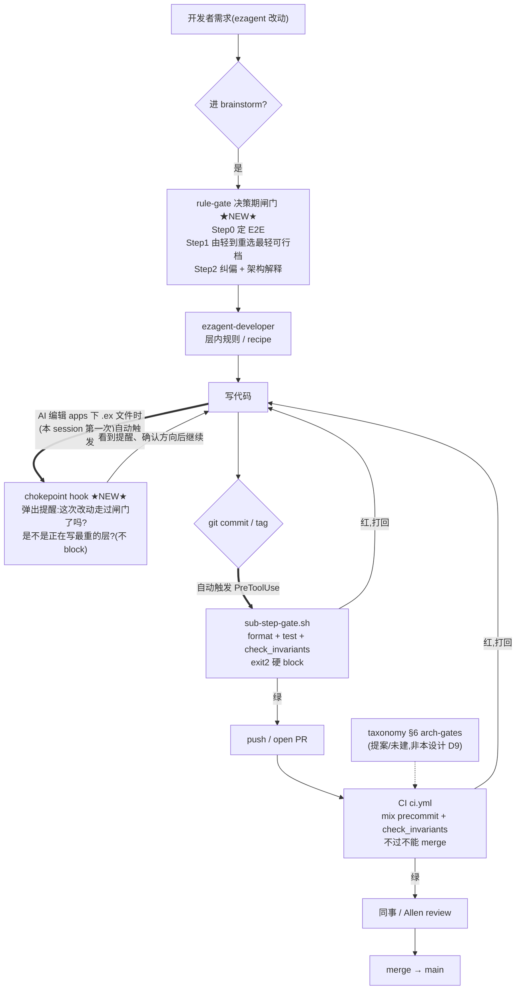

# Ezagent Rule-Gate(层级升级闸门)设计

- **日期**:2026-06-29
- **版本**:v3(重排为"概览先行、技术后置";v1/v2 见 git 历史)
- **状态**:设计待 review(用户 review spec 后再出实施计划)
- **载体决策**:方案 B —— 两层拆分(薄「路由闸门 skill」+ 厚「规则库 skill `ezagent-developer`」)
- **目标仓**:ezagent42/ezagent(Elixir/Phoenix 平台仓)
- **base commit**:`755b2a9b`(= 设计期 `origin/main`)

> **怎么读这份文档**:
> - **第一部分(§1–§7)= 设计概览**:不熟代码的人只读这部分就能懂"我们在做什么、为什么、怎么运转"。
> - **第二部分(§8–§9)= 为什么这么设计**:诊断 + 拍板的决策。
> - **第三部分(§10–§17 + 附录)= 技术细节与实施约束**:实施者 / reviewer 深读。

---

# 第一部分 · 设计概览(先读这部分就懂)

## 1. 背景与真实痛点

症状:实施方向错误频发,本质是「在比需求更重的层去改动」。两类高频错误:
- **错误①**:本该加个 plugin 就满足的,最后改到了 core / domain。
- **错误②**:本该改 config、或在 session 里用 orchestrator 运行时就能完成(甚至只需 seed 一条数据)的,最后却做成了一个 plugin。

面向人群:**不熟整体架构、用 AI 改码的新开发者**——核心防"乱改 / 改错层";同时把"解释 + 纠偏"做完整。

> **一句话目标**:拿到需求,**先判断"满足它的最轻的层是哪一层"再动手**;动手后用对人友好的话讲清"做了什么、为什么落这层、挡下了什么"。

## 2. 设计目标(对照用户六条)

1. AI 容易发现的「统一入口」。
2. 进入后有条理、够快地定位规则——尤其前置一个「决策/路由」闸门:先判断最轻的层再动手。
3. 规则整合成唯一实时来源(skill 成权威导航,旧文件逐步瘦身;**只引不抄**已落地 taxonomy)。
4. 核心开发者(人)方便维护、修改。
5. 人性化:面向 AI,但收尾总结用对人友好的语言讲清「做了什么、为什么(架构视角)、挡下了哪些违规」。
6. 未来 ezagent 再迭代可持续复用。

## 3. 核心模型:层级升级闸门(挂在 brainstorm 时机)

### 3.1 闸门三步

- **Step 0 — 先定 E2E 验收**:先问"什么 E2E flow 能证明它成了"。复用 `docs/phase-specs/*/VERIFICATION.md` / `e2e-parity/FLOWS.md` + dev-together 的 demonstrable-DoD。
- **Step 1 — 由轻到重升级阶梯,每档"被证伪"才准往上爬**:实验力度 = 混合(论证优先,可行则真跑;显然不可能则记一条书面理由即可升级)。
- **Step 2 — 两个面向人的输出**(详见 §7):实时纠偏 + 架构视角解释。

### 3.2 直觉阶梯 = 既有两轴词汇(不另立第三套 taxonomy)

给新人一条**直觉教学梯**,但**每一档都用既有词汇定义**,并标"今天能否零代码":

| 闸门档(直觉名) | = 既有权威词汇 | 今天能否零代码 | 典型需求 |
|---|---|---|---|
| **L0 config / deploy** | env + mix deps 开关 | 改配置,(可选)重启 | 端口/DB/SMTP、plugin 启停、默认 orchestrator |
| **L1 运行时 orchestrator** | 写 **carrier-L2 定义数据(ConfigObject)** + **carrier-L3 slice**,经 orchestrator 工具 | **零代码、不重启**(取决于 socialware P3–P5 落地度,见 §12) | 加会话成员、改路由规则(RuleStore)、改 Legend、(target)seed 一个 socialware-def / recipe |
| **L2 build-time data seed** | carrier-L2 数据,随发布 seed 脚本 | 数据,但要 deploy | 预置 recipe / socialware 定义 |
| **L3 plugin** | **carrier-L1 code**,plugin tier(新 generic 机制 / 新 shape Behavior / adapter) | 写代码、重编译 | 新 agent 风味、新外部集成、新 shape |
| **L4 domain** | carrier-L1 code,domain tier(新 Kind / load-bearing 词汇) | 同上,更重 + 可能 migration | 新 Kind 类型 |
| **L5 core** | carrier-L1 code,core(primitives) | 几乎只有 Allen | 新 Registry、dispatch、URI scheme、Capability 算法 |

> **命名提醒**:闸门档 **L0–L5** 是 effort/升级序;它**不等于** carrier-layer 编号(carrier-L1–L4)。文中两者并存时显式写「闸门档 Ln」或「carrier-L n」。

闸门的独有价值:已有的 taxonomy 判定图回答"artifact 落哪 carrier 层";**闸门回答正交的问题——给一个需求,选最轻 effort 档,且有没有用 E2E 证明更轻档走不通**。永真红线(今天已验证):业务语义→carrier-L2 数据,永不进 carrier-L1/core;加新 socialware 不得改 `ezagent_core`。

## 4. 开发工作流全景图 + 质量控制分析

### 全景流程图

> 图例:**★NEW★** = 本设计新增;无标注 = 已存在;虚线框 = 提案未建。
> **粗箭头(==>)= 自动触发的 hook / gate**(开发者不用手动调,到了那一步自动跑)。



**读图要点**:rule-gate 与 chokepoint hook(★NEW★)是**软**的——前者在动手前引导、后者在写代码瞬间提醒,都不挡死;sub-step-gate 与 CI 是**硬**的——不过不让前进。chokepoint hook 的触发是"AI 本 session 第一次编辑 `apps/` 下 `.ex` 文件时自动弹出",之后静默(不重复打扰)。

### 质量控制覆盖表

| 阶段 | 组件 | 时机 | 力度 | 抓什么 | 状态 |
|---|---|---|---|---|---|
| 决策 | **rule-gate** | brainstorm 时 | 软(advisory) | **选错层**(错误①②)+ E2E 缺失 | ★NEW★ |
| 写码瞬间 | **chokepoint hook** | 首次改 `.ex` | 软(reminder) | 忘走闸门 / 正写最重层 | ★NEW★ |
| 本地提交 | sub-step-gate.sh | commit/tag | 硬(exit2) | format / test / 8 条 grep 不变式 | 已存在 |
| 远程 | ci.yml | PR / push main | 硬(不能 merge) | precommit + check_invariants | 已存在 |
| 远程权限 | protect-dev-together-skill.yml | PR / push | 条件硬 | 越权改 dev-together skill | 已存在 |
| 评审 | 同事 / Allen | PR | 人 | 设计 / 方向 | 已存在 |
| (未建) | taxonomy §6 arch-gates | CI | 硬 | 业务语义入 core / 新 Kind / blob-inline | 提案,非本设计(D9) |

### 漏洞与冗余分析(诚实评估)

> **先讲清一个易误读点(现状 = 实施之后)**:"选错层的代码能通过全部**硬 gate**"这句话,**现状成立,本设计实施之后依然成立**——因为本设计**故意不加"层选择"的硬 gate**(D5:rule-gate 与 chokepoint 都是软的、从不挡死)。实施之后改变的**不是**"多一道硬 gate 事后逮住它",**而是**把干预**提前 + 变软**(决策期引导 + 写码瞬间提醒 + 收尾解释 + 让人 review 更易发现),从而**降低"产出错误层代码"的概率**。本设计的本质是**"把错误挡在发生之前的软引导",不是"逮在提交之时的硬拦截"**。

- **关键盲区 = 本设计存在的理由**:错误①/②产出的代码**能通过 format / test / check_invariants / CI 全部硬 gate**——因为"用了过重的层"本身**不违反任何不变式**(多写一个 plugin、或把本该 seed 的数据写进 domain,都是合法代码)。⟹ **现有(且实施后仍然)硬 enforcement 链对"选错层"这个失败模式是瞎的**。只有决策期 rule-gate(软)+ 提案中的 §6 gate(仅覆盖 business-semantics-in-core 一小块)能碰它。
- **为什么不干脆加硬 gate 逮它**:"选错层"一般情况下**无法机器判定**——机器看不出"这段合法代码本可以更轻"。只有特定子情形(如"业务语义写进 core")可硬 gate,那恰是提案 §6 的活,且 **D9 明确不揽**。
- **层选择质量控制是"有意做软"的,不是漏洞**:rule-gate + chokepoint 都不硬 block,因为合法的 core 改动确实存在,硬挡会逼人绕路(绕路比漏报更糟)。⟹ 层选择靠"发现 + 纠偏 + 解释 + 人 review";硬 enforcement 只在**不变式**层。这是设计权衡。
- **有意冗余(健康)**:sub-step-gate(本地)与 ci.yml(远程)跑同一批检查 = defense-in-depth(本地快反馈 + 远程防绕过本地 hook),非浪费。
- **已知未补缺口(非本设计,已被 §7/§6 追踪)**:§6 arch-gate 未建(business-semantics **内容级** grep、new-Kind defmodule、blob-inline migration);现有 NP-2 lint 只查**模块名**不查内容。
- **解释维度是全新的**:收尾的"为什么落这层(架构视角)"是现有链**完全没有**的——现有 gate 只回答"过 / 不过",从不解释架构理由。

## 5. 一次改动怎么走(数据流)

```
brainstorm 一个 ezagent 改动
  → load ezagent-rule-gate
  → Step0 定 E2E 验收
  → Step1 阶梯(论证优先;看着可行就真跑运行时实验,E2E 过才打住;查 landed/target)
  → 选出最轻可行档(若原指令更重 → 当场纠偏)
  → 交给 ezagent-developer 拿层内规则 / recipe 实施
  →(写代码时 chokepoint hook 在改 .ex 那一刻确定性兜底)
  → Step2 友好中文解释收尾
```

## 6. 三阶段不重叠的治理链

```
决策期     ezagent-rule-gate    →  「选对档」(本设计,process 闸门)
层内实施   ezagent-developer    →  「层内怎么写对」(规则库,按需查)
提交期     check_invariants/CI  →  「没写错 / 没违规」(强制 gate,已存在)
```

闸门还会顺手告诉你选定档适用的不变式 / CI gate,把决策期与提交期接上。

> **范围澄清(sub-step-gate 不在本设计构建范围)**:`scripts/hooks/sub-step-gate.sh` 是**已存在的提交期硬 enforcement**,方向与本设计的**决策期软路由**不同。本设计**不修改它**,只把它画进图里,并**复用它的 PreToolUse 手法**实现我们自己的 chokepoint hook(匹配 `Edit|Write`,与它匹配 `Bash` 不冲突)。

## 7. 两个面向人的输出

### 7.1 实时纠偏(动手前)
开发者一上来说"帮我在 core 里加…"时,闸门动手前拦住,走阶梯,若更轻档可行 → 掰回最轻可行档并说明理由。chokepoint hook 在"要写 core/domain"那一刻提供确定性的第二道纠偏。

### 7.2 架构视角解释(收尾,中文友好)
`references/explain-template.md` 固定结构,至少含:
1. **需求**:一句话复述。
2. **E2E 验收**:用什么 flow 证明成了。
3. **落在哪档 + 为什么**:整体架构视角(为什么不更轻 / 不必更重),引决策树分支 + 相关 red line。
4. **挡下了什么**:哪些更重档 / 哪些错误指令被拦,为什么。
5. **该档适用的 gate**:提交前会被哪些不变式 / CI 检查(链 `architecture-invariants.md`)。

---

# 第二部分 · 为什么这么设计

## 8. 诊断:三个根因

> 经只读测绘 + 深读 socialware/taxonomy 三件套后确认——仓里**已经有**分层定义,甚至有一张判定流程图;真痛点不是"没有规则",而是缺一个"给需求选最轻 effort"的可发现前门,且最轻两档(config/运行时)没被纳入。

**根因 1(最致命)—— 有"落哪层"的判定,但缺"给需求选最轻 effort"的前门,且漏了最轻两档。**
taxonomy SPEC §3 判定流程图回答的是「这个 **artifact** 物理落 carrier-L1/L2/L3/L4 哪层」——它假设你**已经决定要造什么 artifact**。它**不回答**:"给一个**需求**,能不能干脆**不写代码**(改 config / 运行时 seed 数据)就满足?"。具体:它没有 **config / 运行时-orchestrator** 这两个最轻档;没有 **E2E-first + 逐层证伪** 的纪律。这正是错误②成因:`runtime-capability-map`(运行时不写代码能改什么)从未被映射;AI 看不到这条路,默认往 plugin 跳。

**根因 2 —— 入口分裂 + 不可发现。** AI 第一跳是 `CLAUDE.md`(纯指针);taxonomy §3 流程图 + 6 red lines + 5 步作者指南**埋在 `docs/together/` 的 dated SPEC、且部分是 DESIGN 状态**,不在每-prompt 可发现路径;`three-tier-structure.md` 只 link 出去、不前置成"决策前门"。

**根因 3 —— 顶层指针过时 / 自相矛盾。** 实锤:`CLAUDE.md` 教 `use Ezagent.Behavior`(应为 `use Ezagent.Lifecycle`);指 `references/new-contract.md`(应指 `lifecycle.md`);"8 条硬不变式"(实为 P1-P27 + 20 条);`README.md` "Phase 0 complete"(现 phase7);且完全没提 Decision #155 / carrier-layer taxonomy。

## 9. 关键决策记录(已与用户拍板)

| # | 决策 | 取舍 |
|---|---|---|
| D1 | 载体走**方案 B**:薄路由 skill + 厚规则库 `ezagent-developer` | 命中"统一入口/前置路由/规则唯一源",轻量先行 |
| D2 | 诊断修正获认可 | 见 §8 |
| D3 | 闸门挂 **brainstorm 时机**;**不改 vendored brainstorming 本体**(v6.0.3) | 借力高频 skill,不 fork 上游 |
| D4 | 触发 = **薄 skill + 硬 hook 双保险** | 防 AI 漏触发 |
| D5 | 硬 hook = **PreToolUse chokepoint hook**(改 .ex 那刻、session 幂等、提醒不 block) | 默认安静、关键挡一下、从不挡死 |
| D6 | 实验力度 = **混合(论证优先,可行则真跑)** | 平衡严谨与成本 |
| D7 | **re-anchor 到已落地两轴 taxonomy**(轴 A 三 tier + 轴 B carrier layers + 概念轴);直觉阶梯保留作前门但用既有词汇定义;**只引不抄** | 不另立第三套 taxonomy(避免制造新的重叠矛盾) |
| D8 | 未落地 P3–P10 **不硬 block**;**大胆先写 spec+计划**,计划埋"实施前置检查门",并行等代码落地 | 见 §13 |
| D9 | **不揽** taxonomy §6 提案 arch-gate(硬 enforcement) | lead 的事;我们只做发现+纠偏 nudge |

---

# 第三部分 · 技术细节与实施约束

## 10. 组件构成(三件套:内容 / 在场 / 兜底)

```
ezagent-rule-gate skill      →  内容(决策树 + 运行时能力表 + 解释模板)
CLAUDE.md 一句 always-loaded  →  每个 prompt 都在场的 why/how 指针
PreToolUse chokepoint hook    →  改代码那一刻的确定性、安静的兜底 + 纠偏
```

### 10.A 新建薄 skill `ezagent-rule-gate`

- `SKILL.md`:触发 description = "**决定 ezagent 改动方向 / 选哪一层 / brainstorm 一个 ezagent 改动时**";正文 = §3 升级阶梯 + §7 两输出契约。**保持薄**,深内容下沉 references。
- `references/layer-decision.md`:**决策树**(§3.2 直觉阶梯,逐档 go/no-go 判定 + 10–20 个真实需求走查样例,覆盖错误①/②代表案例)。**只引不抄**:link 到 taxonomy §3 流程图、§5 6 red lines、socialware-concepts 5 步、Decision #155;**新增** = config/运行时两档 + effort 升级序 + E2E-first 纪律 + **landed/target 标注**。
- `references/runtime-capability-map.md`:**最高价值新产物**——"orchestrator 运行时不写代码能改哪些 carrier-L2/L3 数据,且**当前 main 真的通了的部分**"。从 `apps/ezagent_domain_session/lib/ezagent/orchestrator/tools/*.ex`、`behavior/orchestrator_admin.ex`、`Ezagent.Routing.RuleStore`、socialware `DefinitionRegistry` / `RecipeRegistry` 提炼。**每行标 landed / target(P3–P5)**。直接解错误②盲区。
- `references/explain-template.md`:§7.2 收尾解释的中文模板。

命名遵循项目约定(kebab-case、`ezagent-` 前缀)。

### 10.B CLAUDE.md 一句 always-loaded 硬指针

`CLAUDE.md` 必读区加一句 load-bearing:

> 任何 ezagent 代码改动,进 brainstorm 前先 load `ezagent-rule-gate` 走层级闸门(先定 E2E → 由轻到重选最轻可行档;业务语义优先 carrier-L2 数据,别进 core)。

### 10.C PreToolUse chokepoint hook(安静兜底 + 纠偏)

原则:**规范不指望纪律,指望结构;硬 gate 钉在"写代码"这个不可逆边界;默认安静、关键时刻挡一下、从不挡死。**

- **触发**:`PreToolUse` 匹配 `Edit|Write`,且 `tool_input.file_path` 落在 `apps/**/*.ex`。
- **行为**:本 session **首次**触碰代码时,注入"这次改动过层级闸门了吗?判定落哪档?";之后静默(session 级幂等,sentinel 文件)。对提问 / 文档 / 探索**零打扰**。
- **加料(纠偏)**:命中 `apps/ezagent_core/` 或 `apps/ezagent_domain_*/` 时提示更尖锐——"你正要写最重的 carrier-L1/core,闸门 sanction 过吗?业务语义是不是其实该进 carrier-L2 数据?"。
- **力度**:**提醒 / 追问,不硬 block**。硬 enforcement 留给已存在的 `check_invariants` / CI。
- **先例**:复用 `scripts/hooks/sub-step-gate.sh` 同款手法。新脚本如 `scripts/hooks/layer-gate-reminder.sh`,在 `.claude/settings.json` 注册。

## 11. 测绘结论:治理来源现状(只读盘点)

### 11.1 五类来源(按职能,非文件位置)

| 类 | 来源 | 性质 |
|---|---|---|
| ① 真·权威源(规则定义处) | `.claude/skills/ezagent-developer/`:SKILL.md(导航)+ 12 references(~2146 行):`design-principles.md`(P1-P27)、`architecture-invariants.md`(20 条 + CI gate)、`capbac.md`/`lifecycle.md`/`three-tier-structure.md`/`anti-patterns.md`/`how-to-recipes.md` 等 | **已高度集中** |
| ② 权威 rationale + 决策档案 | `ARCHITECTURE.md`(3359 行,Allen 维护、只读)+ `GLOSSARY.md`(Decision Log **#1–#155** + 术语表 + 消歧) | 教学论证 + 历史 |
| ②b **分层/载体 taxonomy(测绘首轮漏看)** | `docs/socialware-concepts.md`(**已落地**:base/socialware/fixture/recipe/responsibility + 5 步作者指南)、`docs/together/2026-06-28/specs/ezagent-taxonomy-boundaries.md`(**DESIGN**:4 carrier layers + **§3 判定流程图** + 6 red lines + §6 提案 arch-gate)、`docs/together/2026-06-26/specs/socialware-unification.md`(**DESIGN**,lead,P0–P10)、**GLOSSARY Decision #155** | 已是权威概念,但散/埋/部分 DESIGN |
| ③ 入口 / 启动 checklist / 指针 | `CLAUDE.md`(每 prompt 加载,纯指针)、`README.md`、`CONTRIBUTING.md`、`IMPLEMENTATION_ROADMAP.md`、`AGENTS.md`(纯 Phoenix,独立无重叠) | **过时最多** |
| ④ 强制 gate(真会跑) | `scripts/hooks/sub-step-gate.sh`(PreToolUse,exit2 阻断)、CI `ci.yml`、`mix ezagent.{arch.scan,doc.scan,check_invariants,check_invariants.lifecycle}`(后者已有 NP-2 层词汇 lint)、`protect-dev-together-skill.yml` | 提交期强制 |
| ⑤ per-phase 规格 + how-to | `docs/phase-specs/`(phase0–7)、`docs/guide/`、`docs/onboarding/`、`docs/scenarios/` | 文档 |

### 11.2 已落地的两条正交轴(re-anchor 的地基)

- **轴 A — 代码依赖方向**:`core → domain → plugin`(`three-tier-structure.md`)。
- **轴 B — artifact carrier 层**:`carrier-L1 code / L2 definition-data / L3 runtime-state / L4 EZAGENT_HOME files`(taxonomy SPEC §0;Decision #155)。一个 plugin 可同时发 L1 code + L2 seed 数据。
- **概念轴**:`base / socialware / fixture / recipe / responsibility`(socialware-concepts)。

taxonomy SPEC **§3 已有一张判定流程图**「new thing goes in which layer?」(6 步 first-match-wins,落在轴 B);**§5 有 6 条 red lines**(核心:业务语义只能进 carrier-L2 数据,永不进 carrier-L1/core)。

## 12. landed vs target:闸门是活文档,不照抄静态 SPEC

socialware P0–P10 中,「加 socialware = 纯 seed carrier-L2 数据、零代码」是 **target**(靠 P3 de-hardcode behavior-set→`installs` 数据 / P4 socialware-def ConfigObject / P5 抽 config),而 **main 现在约 P0–P2**——**今天**加 socialware 仍部分要碰 call-site / 代码。

⟹ 闸门**必须区分"今天能走"和"目标路径"**:`layer-decision.md` 的 socialware 相关格 + `runtime-capability-map.md` 每行都带 **landed / target(phase)** 标注;内容**以 link 权威源为主**(socialware-concepts / Decision #155 / taxonomy SPEC),自己只维护 effort 升级脊梁 + 当前 landed 现状,降低 staleness。

## 13. 爆炸半径:未落地代码会不会硬 block 本设计?

**结论:不会硬 block。** 未落地的 P3–P10 / taxonomy(DESIGN)/ §6 arch-gate(提案),只碰到 7 个产物里的 2 个,且都是**加法**(让最轻路径更轻/更宽),不推翻决策树**结构**。

| 产物 | 依赖未落地? | 影响 |
|---|---|---|
| SKILL.md 流程 / explain-template / CLAUDE.md 句 / hook / 过时清理 | 无 | 独立 |
| 决策树**脊梁** + red lines | 无 | red lines 今天已验证 FIXED(taxonomy §4.3/§4.6),脊梁稳定 |
| 决策树"加 socialware=零代码"**单格** | 软(target=P3–P5) | 标 landed/target,结构不变,落地后只刷该格值 |
| `runtime-capability-map` | 软(P3–P5 扩可写集) | **增量友好**:按现状写+标注;落地后长新行不作废 |

**唯一真风险(非 block)= 词汇漂移**:P3–P5 若改 socialware-def 寻址 / `installs` 字段名,我们引用会 stale。**缓解内建**:只引不抄 + landed/target 标注 + 活文档。
**§6 arch-gate**:本设计**不揽**(D9),其未落地与我们零关系。

## 14. 范围:v1 做什么 / 延后什么

**v1**:
- 新建 `ezagent-rule-gate` skill(`SKILL.md` + `layer-decision.md` + `runtime-capability-map.md` + `explain-template.md`)。
- `CLAUDE.md` 加 §10.B 那句 always-loaded 指针 + Decision #155 / carrier-taxonomy 指针。
- 新增 `scripts/hooks/layer-gate-reminder.sh` 并在 `.claude/settings.json` 注册。
- **最小**清理 §8 根因 3 会主动误导的过时指针(`Behavior`→`Lifecycle`、`new-contract`→`lifecycle`、"8条"→P1-P27;`README` phase 状态)。

**实施前置检查门(写进计划)**:真正建 skill 前先 `git fetch` + 核对「P3–P5 落地了吗 / 当前 phase / 运行时可写集」,据此刷新 `layer-decision.md` 的 socialware 格 + `runtime-capability-map.md`。

**延后**:旧文件全量瘦身;数据驱动 registry(方案 C);`ezagent-developer` 内部中央 CI-gates registry。

**明确不做**:改 `ARCHITECTURE.md`;发明新架构 Decision;建 taxonomy §6 arch-gate(D9)。

## 15. 与已落地 taxonomy / §7 follow-up 的协同(实施期勿忘)

> 背景:"两套 taxonomy" **不是历史遗留冲突,而是故意正交的两条轴**(轴 A 代码依赖三 tier;轴 B artifact carrier L1–L4;见 §11.2),由同期设计、互相 cross-reference、同收进 **Decision #155**。**不要**提"统一 taxonomy"的 issue/PR(前提错 + 会和下面已追踪的工作重复)。真正的债是**旧文档没跟上新轴**,而 taxonomy SPEC **§7 已是一份完整 staleness 清单并排好 follow-up PR**。

实施 rule-gate 时必须与这些**已被追踪**的事项协同,避免写出冲突或重复的副本:

| §7 已追踪事项 | 计划的 follow-up | 我们的动作 |
|---|---|---|
| GLOSSARY 缺 base/socialware/fixture/recipe 等术语;footer 仍写 #87(实到 #155) | `docs(glossary): add socialware taxonomy terms + #155` | **不重复**;`layer-decision.md` 只 link GLOSSARY + Decision #155 |
| `ARCHITECTURE.md` §10.5 blob 设计 stale + 违反 blob red line;§1/§3/§9/§10.4/§10.6 stale | `docs(architecture): align to socialware unification` | **不重复**;rule-gate 引用 taxonomy SPEC 为权威,不碰 ARCHITECTURE(Allen 维护) |
| `references/three-tier-structure.md` app 名 stale(`ezagent_domain_chat` / `ezagent_plugin_liveview` 已不存在)、未提新轴 | §7.3 flagged follow-up | **不重复写**;rule-gate 只 link 它;若该文件先于我们被修则直接受益 |

**给 reviewer / Allen 的开放问题**(放进 spec PR 描述,不单独开 issue):
1. rule-gate 是否应成为这套 taxonomy 的**可发现前门 / 整合家**?
2. rule-gate 与上面两条 `align` PR 的**先后顺序**怎么排?(若 align PR 先落,我们的 link 直接受益;若我们先落,link 指向 DESIGN 状态的 SPEC,需在落地后回链。)

**实施前置检查门(与 §14 呼应)**:真正建 skill 前 `git fetch`,核对上面三条 follow-up 是否已落地 + socialware P3–P5 进度,据此决定 `layer-decision.md` / `runtime-capability-map.md` 的 link 目标与 landed/target 标注。

## 16. 可复用性

effort 升级脊梁 + 两轴映射是**架构稳定**的;未来迭代只需扩 `layer-decision.md` 走查样例、刷新 `runtime-capability-map.md` 的 landed/target。与具体 phase 解耦 ⇒ 持续复用。

## 17. 验收(这套机制本身怎么算"做成了")

- **发现率**:对一个全新 ezagent 改动需求,AI 动手前确定性进入闸门(CLAUDE.md 指令 + chokepoint hook 至少一条触发)。
- **路由正确**:错误①/② 代表性需求各 ≥1 走查样例,闸门判出正确最轻档。
- **运行时盲区补齐**:`runtime-capability-map.md` 覆盖 orchestrator 运行时可写的 carrier-L2/L3 项,带 landed/target 标注。
- **不另立词汇**:决策树用既有两轴 + 概念轴词汇,red lines 来自引用而非复述。
- **解释完整**:收尾按 §7.2 模板,新人读懂"为什么落这档"。
- **安静 + 不挡死**:hook 对文档/提问零打扰、session 不重复;有意识改 core 确认即过。

---

## 附录 A:分层实况表(决策树锚定的事实地基)

见 §3.2。carrier-layer 定义见 taxonomy SPEC §0 / Decision #155;三 tier 见 `three-tier-structure.md`;概念轴见 `socialware-concepts.md`。

## 附录 B:v1 要清理的过时指针清单

| 文件 | 过时内容 | 改成 |
|---|---|---|
| `CLAUDE.md` | 教 `use Ezagent.Behavior` 作开发者表面 | 开发者用 `use Ezagent.Lifecycle`;`use Ezagent.Behavior` 为 INTERNAL ENGINE |
| `CLAUDE.md` | 指 `references/new-contract.md` | 指 `references/lifecycle.md` |
| `CLAUDE.md` / `IMPLEMENTATION_ROADMAP.md` | "8 条硬不变式" | P1-P27 + `architecture-invariants.md` 20 条 |
| `CLAUDE.md` | 无 carrier-layer / Decision #155 指针 | 加指向 `socialware-concepts.md` + Decision #155 + taxonomy SPEC |
| `README.md` | "Phase 0 complete" | 当前 phase7(或指向 roadmap 动态状态) |

## 附录 C:已读的权威源(本设计 link、不复述)

- `docs/socialware-concepts.md`(LANDED)— 概念轴 + 5 步作者指南 + anti-patterns
- `docs/together/2026-06-28/specs/ezagent-taxonomy-boundaries.md`(DESIGN)— §0 4 carrier layers / §3 判定流程图 / §5 6 red lines / §6 提案 arch-gate
- `docs/together/2026-06-26/specs/socialware-unification.md`(DESIGN,lead)— P0–P10
- `GLOSSARY.md` Decision #155 — carrier-layer taxonomy + anti-leak red lines
- `.claude/skills/ezagent-developer/references/three-tier-structure.md` — 轴 A + 顶部正交轴提示
