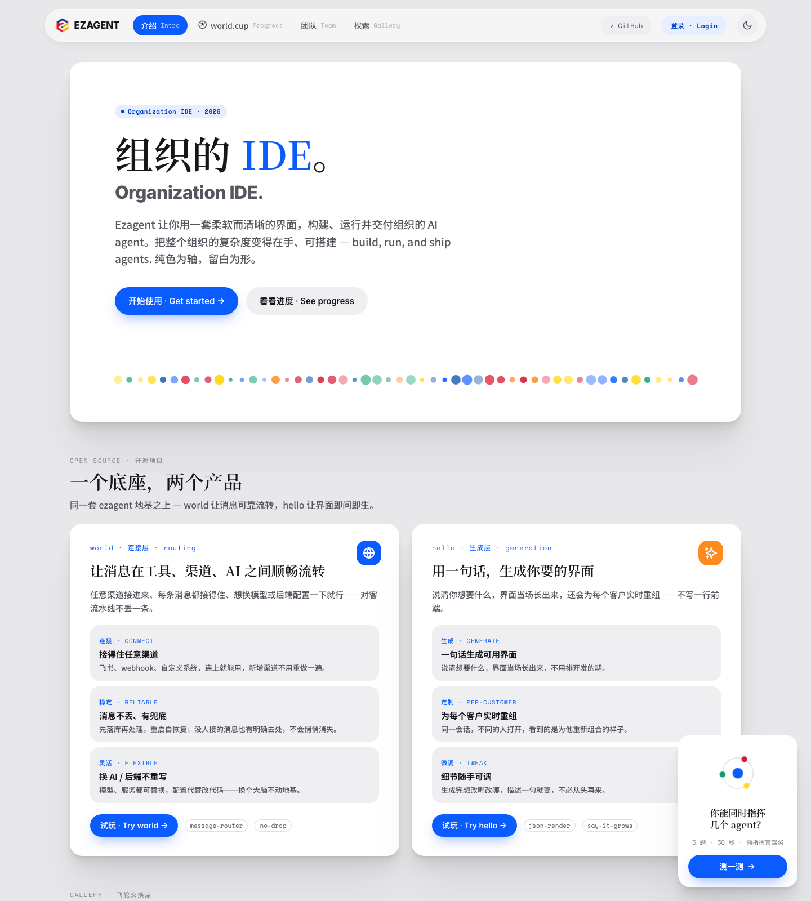
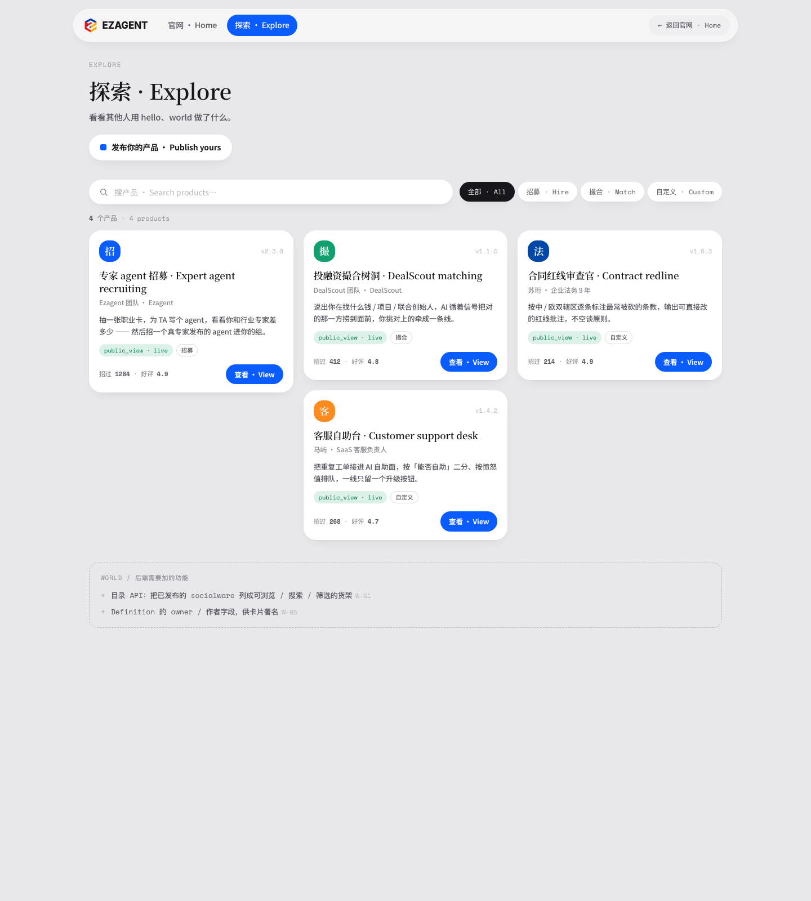
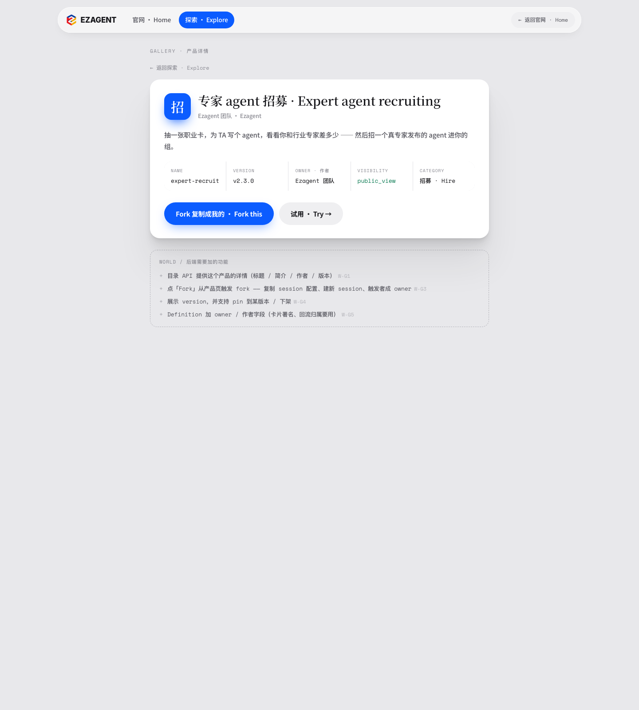

# Return — 官网飞轮 Demo (陈瑞华 / ruihua, 2026-07-13)

> **Author:** ruihua (陈瑞华, designer). PR opened on her behalf by the
> coordinator from an uploaded archive (`ezagent-flywheel-demo.zip`), unpacked
> and placed per the new "designer deliverable as PR" convention.
> **Deliverable type:** clickable product-design prototype (static HTML), not code.

## What this is

A **clickable prototype of the Ezagent 官网 (website) 双边飞轮** — the
product's growth loop presented as a walk-through you can click end-to-end,
with zero server / zero `npm install` (pure static HTML).

The 双边飞轮 (two-sided flywheel):

```
  🟦 Builder Arc（供给）                🟨 Seller Arc（需求）
  tech site → 了解产品                   Instagram → 落在 gallery 某产品
     ↓                                      ↓
  试玩 world + hello                      试用这个产品（对话拿价值）
     ↓                                      ↓
  建 builder 身份                         Fork → 改成自己的 → 认领 owner
     ↓                                      ↓
  用 world+hello 搓出 socialware          自己的产品跑起来 / 对客开放
     ↓                                      ↓
  发布进 gallery ────────┐                Fork 产物回流 gallery ──────┐
                         └──── GALLERY 交换点（活货架，可试用、可 Fork）┘
```

## Today's delta (2026-07-13)

The bulk of `docs/website-demo/` (world-demo / hello-demo / driver-license /
recruit-v2 / flywheel/*) was already in-repo from prior work. This return adds:

- **NEW `docs/website-demo/index-gallery.html`** (724 lines) — the **flywheel
  entry / landing page** ("组织的 IDE · Organization IDE") that closes the loop:
  intro → 一个底座两个产品 (world / hello) → 研发进度 → 团队 → 探索 Gallery,
  with the driver-license "你能同时指挥几个 agent?" entry card.
- **`README.md` usage guide** (+138 lines) — how to run + the full flywheel
  concept + the Builder / Seller click-paths.

## How to view (no build)

Open `docs/website-demo/index-gallery.html` in a browser (Chrome / Edge /
Safari). From there the whole loop is clickable: gallery → product-detail →
try world/hello → driver-license → publish → back to gallery.

## Screenshots

**Landing / gallery entry (`index-gallery.html`):**



**Flywheel gallery (货架):**



**Product detail:**



## Design rationale

- **Positions Ezagent as "组织的 IDE"** — one substrate (ezagent), two products
  (world = 连接/routing, hello = 生成/generation) — the demo makes that legible
  at a glance.
- **Makes the flywheel a felt experience, not a diagram** — the value loop
  (build → publish → gallery → try → fork → publish) is walkable, so reviewers
  and prospects experience the exchange point (the live `public_view` gallery)
  rather than reading about it.
- **Tone:** 纯色为轴，留白为形 (flat brand color + generous whitespace), matching
  the design-system tokens under `flywheel/ds/`.

## Weekly goal served

W29 自举 demo — **官网体验 / product-design surface**. This is the ruihua track
(用户体验设计输入, 官网体验). Feeds the "登录官网 → hello → …" demo narrative's
front door.

## Next / open

- Wire the prototype's IA/visual direction into the real world/hello LiveView
  surfaces (hand-off to zyli/zhaomato as UI work).
- Confirm the gallery `public_view` shelf maps to the real socialware
  registry surface.
