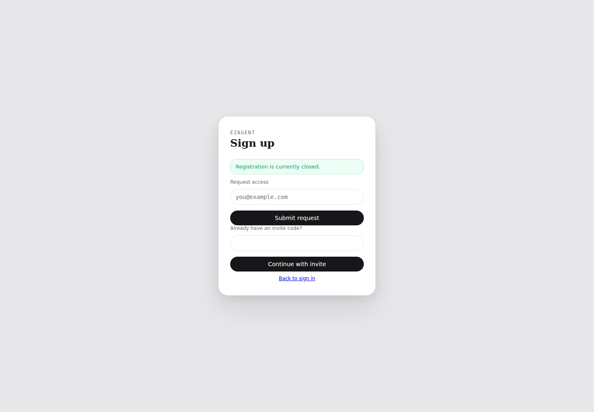
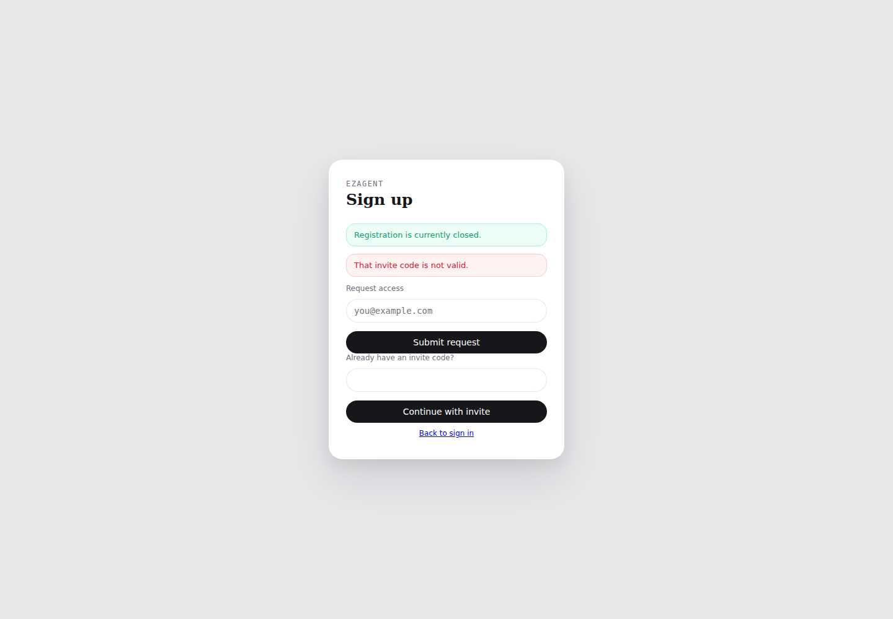
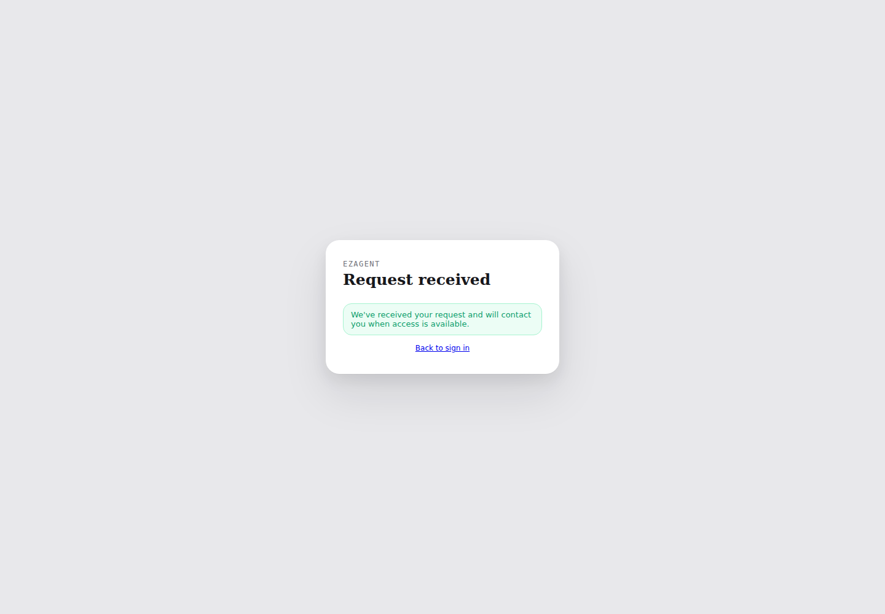

# Workspace self-service product gaps ? return

> **Task:** implement the workspace self-service gaps described in PR #1436
> **Branch:** `codex/workspace-self-service-gaps`
> **PR:** https://github.com/ezagent42/ezagent/pull/1440
> **Dev:** zyli-developer + Codex
> **returned_at:** 2026-07-16 21:06 +0800
> **deadline:** 2026-07-16 23:59 +0800
> **deadline_status:** deferred

## Source and scope

The acceptance source is
[PR #1436](https://github.com/ezagent42/ezagent/pull/1436), specifically
`docs/plans/2026-07-16-workspace-self-service-product-plan.md` on that PR.
This return treats G1-G10 as a closed set and applies the lead decisions in its
?0, including:

- beta remains admin-created/invite-led; self-service workspace creation is not
  a beta P0 requirement;
- one user may own at most one workspace and may join multiple workspaces;
- no `:stub_grant`; founder authority must use the formal signed capability path;
- G5 should become a general actionable user-facing failure surface.

This branch is a broad implementation slice, not completion of every G1-G10
acceptance criterion. Deferred and not-met lines below must not be interpreted
as ready-to-merge completion of #1436.

## contributing_read_through

- `ezagent-developer` skill and architecture/CapBAC invariants
- `.claude/skills/dev-together/commands/return.md`
- `.claude/skills/dev-together/references/handoff-standard.md`
- PR #1436 product plan and Allen decision override
- `docs/user-guides/enterprise-first-day.md`
- `docs/user-guides/enterprise-first-day.zh_cn.md`

## Completed implementation slice

1. Closed registration now exposes access-request and invite paths. Access
   requests are normalized, rate-limited, stored as pending, and return a
   uniform response.
2. Valid invites can open registration while public registration is closed;
   invalid invite deep links fail closed with an actionable message.
3. Open self-service registration creates one founder-owned workspace and issues
   the initial workspace/invite/API-key capabilities through the formal
   `Cap.issue` + self-store + exact-absorb path.
4. Workspace owners can mint, copy, list, and revoke invites through a
   capability-gated dispatch facade and World UI.
5. Admin Settings can control public registration/invite requirements and list
   pending access requests.
6. Password and Magic Link login establish a `SessionPrincipal` and enter the
   product directly instead of forcing the PAT interstitial.
7. World has a dedicated Knowledge Base surface for agent selection,
   `resource://.../kb-source/...` ingestion, and provenance-aware queries.
8. English and Simplified Chinese enterprise first-day guides are indexed.
9. Registration boundary coverage is wired into the PR gate with two Playwright
   cases.
10. After rebasing onto the new World Tier-1 gate, new actions are registered in
    the backend-owned `Ezagent.World.DispatchContract`; generated fixtures are
    in sync.

## DoD reconciliation summary

| Gap | status | result |
|---|---|---|
| G1 registration controls and closed page | deferred | Core UI/API path is implemented; cold-start admin browser proof is still missing. |
| G2 workspace invite UI | deferred | Mint/copy/list/revoke and invite registration are implemented; the full browser invite-to-membership journey is not automated. |
| G3 workspace identity/create UX | deferred | One owned workspace is created and login enters World, but there is no explicit named-workspace success page; multi-create remains backlog per lead decision. |
| G4 founder Agent Key authority | deferred | Formal API-key capabilities are issued and absorbed; key validation/readiness/live reply proof is incomplete. |
| G5 actionable missing-key failure | not-met | No general user-facing structured failure surface was added. |
| G6 UI readability | deferred | PAT interstitial was removed from password/Magic Link login; the remaining readability lines were not completed here. |
| G7 onboarding/gallery | not-met | No onboarding wizard or gallery was added. |
| G8 KB import UI | deferred | URI-source ingestion and query UI exist; paste/file/batch import is not implemented. |
| G9 enterprise help | deferred | Bilingual first-day/FAQ/troubleshooting docs exist; embedded searchable help does not. |
| G10 browser E2E | deferred | Two registration boundary cases run in the PR gate; the full registration?key?reply chain is not covered. |

## Detailed DoD reconciliation

### G1 ? registration controls and closed page

| # | DoD line | status | proof / open decision |
|---|---|---|---|
| G1-AC1 | Admin Settings exposes `registration_open`. | met | `Admin.tsx`, `admin_actions.ex`, and `admin_data.ex`; save dispatch is admitted by `DispatchContract`. |
| G1-AC2 | Admin Settings exposes `registration_require_invite`. | met | Same settings card and dispatch path as G1-AC1. |
| G1-AC3 | Open registration shows a registration entry point. | met | Registration controller tests cover the open form. |
| G1-AC4 | Closed registration shows access-request and invite exits. | met | `registration-closed.png`; Playwright asserts both forms. |
| G1-AC5 | Access request submission gives visible feedback. | met | `registration-request-received.png`; request persistence was verified as `pending` in PostgreSQL. |
| G1-AC6 | Cold-start admin can find and operate the toggles without engineering help. | deferred | Backend/controller coverage exists, but no admin Settings browser transcript/screenshot was captured. Lead decision: accept focused slice or require this proof before close. |

### G2 ? workspace invite UI

| # | DoD line | status | proof / open decision |
|---|---|---|---|
| G2-AC1 | Workspace settings has an invite area and create action. | met | `WorkspacePlugin.tsx` and `workspace_plugin_actions.ex`. |
| G2-AC2 | Generated invite/link is copyable. | met | Invite card exposes the full registration link and copy control. |
| G2-AC3 | Invite deep link opens registration with the invite supplied. | met | Registration controller tests cover valid/invalid invite deep links; invalid proof is `registration-invalid-invite.png`. |
| G2-AC4 | Invite registration joins the issuing workspace. | met | Identity registration tests assert workspace membership. |
| G2-AC5 | Invite list exposes pending/used/expired status. | met | Lifecycle list projection and World invite table expose status. |
| G2-AC6 | Founder can revoke an unused invite. | met | Capability-gated revoke action plus focused workspace invite tests. |
| G2-AC7 | Cold-start founder completes invite?colleague membership without CLI. | deferred | Focused controller/domain tests pass, but no two-user browser E2E transcript was captured. |

### G3 ? workspace identity and creation UX

| # | DoD line | status | proof / open decision |
|---|---|---|---|
| G3-AC1 | Registration success explicitly names the created workspace. | not-met | Login enters World directly; no dedicated success page naming the workspace was added. |
| G3-AC2 | World shows the current workspace identity. | met | Existing World shell/caller state renders the current workspace and is exercised by the Tier-1 fixtures. |
| G3-AC3 | UI explains that the workspace is the user's independent space. | deferred | The bilingual guide explains the model, but the registration success surface does not. |
| G3-AC4 | Optional multi-workspace create/switch UI. | deferred | Lead ?0 explicitly moved multi-create to backlog and fixed own?1; no create UI was added. |
| G3-AC5 | Cold-start user understands the workspace entered after registration. | deferred | Automatic creation/membership is tested, but the explicit user-understanding browser proof is absent. |

### G4 ? founder Agent Key authority

| # | DoD line | status | proof / open decision |
|---|---|---|---|
| G4-AC1 | Founder can access own-workspace Agent Keys without unauthorized. | met | Registration issues formal `Ezagent.ActionSet.ApiKeys` caps and waits for exact absorption. |
| G4-AC2 | Founder can save an API key. | met | `:put_api_key` cap is included; the existing World key action stays behind dispatch/CapBAC. |
| G4-AC3 | Key save gives immediate valid/invalid reason. | not-met | No provider validation round-trip was added in this slice. |
| G4-AC4 | Successful key configuration changes agent state to ready. | deferred | No live agent readiness transcript was captured. |
| G4-AC5 | `:stub_grant` telemetry proves temporary founder access. | deferred | Superseded by lead ?0: stub grant is forbidden. The implemented formal cap path is the replacement proof. |
| G4-AC6 | Non-founder member remains denied. | deferred | Dispatch remains capability-gated, but this branch lacks a focused new non-founder Agent Key regression case. |
| G4-AC7 | Cold-start registration?key?agent reply has no unauthorized stop. | not-met | No real-provider/live-agent end-to-end proof. |

### G5 ? actionable missing-key failure

| # | DoD line | status | proof / open decision |
|---|---|---|---|
| G5-AC1 | Missing key response names the missing API key. | not-met | No runtime failure-surface change in this branch. |
| G5-AC2 | Failure response links to Agent Keys. | not-met | Documentation mentions the path; runtime response was not changed. |
| G5-AC3 | Unauthorized member is told which founder to contact and can notify them. | not-met | No general actionable failure mechanism or notify-founder action. |
| G5-AC4 | Agent state updates after key configuration without refresh. | not-met | Not implemented/verified here. |
| G5-AC5 | Key validation distinguishes validity/network/format failures. | not-met | Not implemented. |
| G5-AC6 | Cold-start user follows failure guidance through to a reply. | not-met | No browser/live-agent proof. |

### G6 ? UI readability

| # | DoD line | status | proof / open decision |
|---|---|---|---|
| G6-AC1 | Agent list uses recognizable names instead of UUIDs. | deferred | Outside this slice; no new invariant proof. |
| G6-AC2 | First login does not force the PAT interstitial. | met | Password and Magic Link controller tests assert direct authenticated redirect. |
| G6-AC3 | Continue returns to the original page or safe home. | deferred | Direct entry is fixed; original-page return semantics were not fully implemented. |
| G6-AC4 | Session-name help and validation agree, including Chinese names. | not-met | Outside this slice. |
| G6-AC5 | User errors are readable and actionable rather than raw atoms. | not-met | No general error translation layer was added. |
| G6-AC6 | Agent list shows ready/missing-key/offline state. | deferred | Existing surface was not changed or re-proven here. |

### G7 ? onboarding and gallery

| # | DoD line | status | proof / open decision |
|---|---|---|---|
| G7-AC1 | Registration enters a 3?4-step onboarding wizard. | not-met | No wizard. |
| G7-AC2 | Wizard shows at least 2?3 templates. | not-met | No wizard gallery. |
| G7-AC3 | Wizard displays step progress. | not-met | No wizard. |
| G7-AC4 | Every step can be skipped. | not-met | No wizard. |
| G7-AC5 | Onboarding can be restarted from Settings. | not-met | No restart entry. |
| G7-AC6 | World sidebar exposes an app gallery. | not-met | No new gallery entry. |
| G7-AC7 | Gallery cards show name, description, and flavor. | not-met | No new gallery cards. |
| G7-AC8 | Cold-start user reaches an agent reply within five minutes. | not-met | No full browser/live-agent proof. |

### G8 ? enterprise knowledge import

| # | DoD line | status | proof / open decision |
|---|---|---|---|
| G8-AC1 | Workspace has a Knowledge Base management page. | met | Dedicated `/plugins/kb` route/component. |
| G8-AC2 | User can paste titled text. | not-met | Current surface accepts a canonical `resource://.../kb-source/...` source URI. |
| G8-AC3 | User can upload `.txt`/`.md` files. | not-met | No upload or batch drag-and-drop. |
| G8-AC4 | Import exposes processing/success/failure state. | deferred | Ingest success/error is surfaced, but there is no asynchronous file-processing state. |
| G8-AC5 | Import failure gives a specific reason. | met | Dispatch error is retained in KB state and rendered. |
| G8-AC6 | Agent can use the KB in a query/reply with provenance. | met | Agent selection, capability-carrying query dispatch, and provenance rendering are implemented. |

### G9 ? enterprise user help

| # | DoD line | status | proof / open decision |
|---|---|---|---|
| G9-AC1 | World has an embedded help entry. | not-met | No in-product help panel/button. |
| G9-AC2 | Help covers first day, FAQ, and troubleshooting. | met | Bilingual enterprise-first-day guides include onboarding steps, FAQ, and troubleshooting. |
| G9-AC3 | Help is searchable in-product. | not-met | Static docs only. |
| G9-AC4 | Chinese help targets non-technical users without IEx/mix instructions. | met | `enterprise-first-day.zh_cn.md` explicitly uses browser-only steps. |
| G9-AC5 | First registration points users to help. | not-met | No registration toast/help affordance. |

### G10 ? browser-level E2E gate

| # | DoD line | status | proof / open decision |
|---|---|---|---|
| G10-AC1 | Browser E2E covers registration?key?message?reply. | not-met | Current spec covers only closed registration/access request and invalid invite. |
| G10-AC2 | Browser E2E runs in the PR gate. | met | `.github/workflows/ci.yml` starts Phoenix and runs `registration.spec.ts`. |
| G10-AC3 | Failures identify the broken step. | met | Two named Playwright tests use step-specific assertions/selectors. |
| G10-AC4 | Test data uses an isolated workspace/database. | met | CI creates/migrates its test database; request emails are unique. |
| G10-AC5 | Every G1-G9 UI happy path has at least one E2E. | deferred | Only the G1 registration boundary is covered; invite/admin/keys/KB/onboarding/help remain open. |

**Method friction:** The request referenced a product-plan PR rather than an
implementation handoff with an approved build slice. The source has both an
older priority table and a lead override that moves self-service out of beta,
forbids the proposed stub grant, and introduces a new hosted-agent architecture
line. CapBAC and cross-layer scope should therefore have gone through the
clarify/research front-phase before implementation. The branch also crossed a
same-day main change that introduced the backend-owned World dispatch contract
and Tier-1 Playwright harness; rebase required integrating the new actions into
that single source of truth and separating live-registration E2E from the static
harness.

## Evidence

### Browser screenshots

Closed registration exposes both exits:

Invalid invite fails closed with an actionable message:

Access request gives a uniform confirmation:

### Focused validation before rebase

- PostgreSQL 17 on port 5432: database creation and all migrations passed,
  including both registration-request migration paths.
- Architecture/capability/documentation focused suites: 26 tests, 0 failures.
- Identity registration/workspace invite suites: 24 tests, 0 failures.
- Registration/Magic Link/password controller suites: 26 tests, 0 failures.
- Live registration Playwright: 2 passed.
- Access request row verified in PostgreSQL with status `pending`.
- World TypeScript, ESLint, and Vite production build passed.

### Post-rebase validation

- `mix world.e2e.fixtures --check`: PASS.
- `mix ezagent.arch.scan`: PASS, all counters within baseline.
- `mix ezagent.doc.scan`: PASS, 404/404 public-def baseline.
- `mix ezagent.check_invariants`: PASS.
- `mix ezagent.uri_query.scan`: **FAIL**, one baseline violation in unchanged
  `apps/ezagent_domain_agent/lib/ezagent/home/skill_reconcile.ex:142`
  (raw `entity://` prefix check).
- World `typecheck`: PASS after frozen-lockfile dependency restore.
- World Vite build: PASS (existing ineffective dynamic-import warning only).
- World Tier-1 harness ran successfully once after the rebase integration:
  13 passed, 2 live-registration-only cases skipped. After restoring the
  main-locked Playwright 1.55 dependency, the matching Chromium download timed
  out locally; that later run failed before test execution because the browser
  executable was absent. CI installs the locked Chromium explicitly.
- `git diff --check`: PASS.

### Full precommit status

A prior full `mix precommit` run found two failures reproduced in files
unchanged from `origin/main`:

1. `Ezagent.SkillRegistryTest` seed bundle refs differ from the derived refs.
2. `skill_reconcile.ex:142` violates `uri_query.scan` via raw URI
   construction.

Branch-specific documentation coverage and founder capability self-store
failures found during development were fixed and their focused suites pass.
This return does **not** claim full precommit green.

## Branch and machine return gate

- `rebase_base_sha`: `6bfe3d1b3288c93c128449a1183922140db66217`
- `implementation_head_before_return`:
  `0779e908583326e27400a79d075d4ad8c16dd4e3`
- `git merge-base HEAD origin/main` equaled `origin/main` at rebase time.
- PR-head CI run:
  https://github.com/ezagent42/ezagent/actions/runs/29500962775
  ? **in progress when this return was written**.
- Return advisory run:
  https://github.com/ezagent42/ezagent/actions/runs/29500960501
  ? PASS on the implementation head.
- Machine return gate: **not satisfied**. PR-head CI is not yet green, one
  required local static gate has a known main-baseline violation, and the
  closed G1-G10 DoD contains deferred/not-met lines.

## Deferred follow-ups / open decisions for lead

1. Decide whether PR #1440 should be reviewed as a smaller G1/G2 + founder-cap +
   KB/docs/browser-foundation slice, instead of being treated as completion of
   #1436.
2. Require or explicitly defer the missing admin Settings and two-user invite
   browser proofs.
3. Assign G4 key validation/readiness/live-reply completion after cap-signing
   lands; keep the implemented formal-cap path and do not reintroduce
   `:stub_grant`.
4. Create a separate G5 actionable-failure-surface design/build task.
5. Schedule G7 onboarding/gallery and the remaining G6/G8/G9 UX lines.
6. Expand G10 to the real registration?key?message?reply chain and per-gap UI
   coverage.
7. Decide whether the existing main URI violation and SkillRegistry mismatch
   should be fixed in separate baseline PRs before this branch can satisfy the
   machine return gate.

## Merge request

Do **not** treat this return as a request to close #1436. Please review PR #1440
as a candidate implementation slice. It is rebased onto the recorded main
base and contains no known merge-order dependency, but remains deferred until
the lead adjudicates the open DoD lines and the PR-head CI result.
