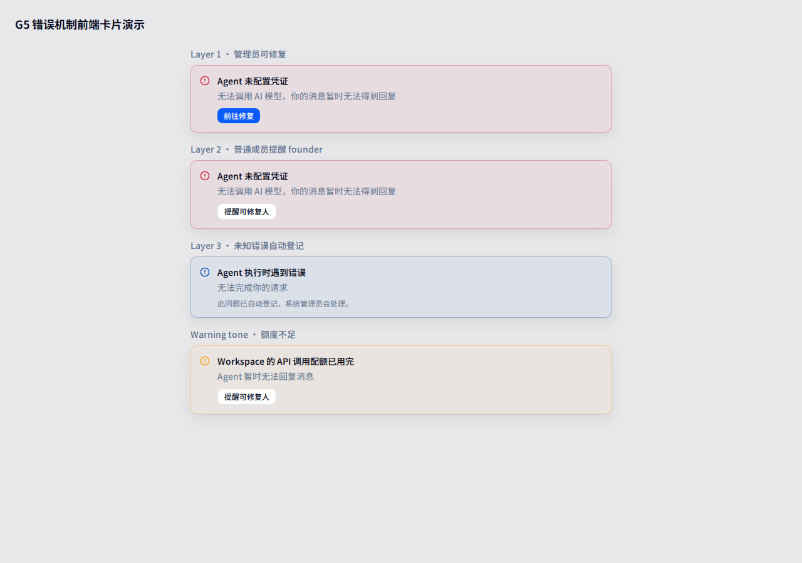

# G5 错误机制前端切片 · return

> **Task:** 实现 G5 通用可配置错误机制的前端部分
> **Branch:** `feat/g5-error-mechanism-frontend`
> **Base:** `origin/main`
> **PR:** https://github.com/ezagent42/ezagent/pull/1450
> **returned_at:** 2026-07-17 +0800(2026-07-18 更新)

> ⚠️ **评审提示**:下方"本轮完成/浏览器证据"是 7-17 首轮交付的原始描述,
> 其中卡片渲染位置(消息列表顶部内嵌)与 Layer 3 兜底文案已被后续迭代
> **取代**——当前形态是**右上角浮动 toast**(不透明、5s 自动消失、横向滑动、
> 三色语义、具体错误详情),以文末"修复轮"各节为准。

## 验收来源与边界

验收来源是 SOP `docs/plans/2026-07-17-error-mechanism-sop.md`。本分支从 `origin/main` 新建，
仅包含 `apps/ezagent_plugin_world/assets` 下的前端改动，不触碰 backend dispatch / action /
数据库迁移。

后端 G5 实现见 PR #1447；本 PR 作为独立前端切片，保证后端后续切换到结构化错误码时，
前端接口无需改动。

## 本轮完成

1. **错误码注册表** (`src/lib/errorCodes.ts`)
   - 定义 7 个 beta 错误码：`agent_credential_missing`、`action_unauthorized`、
     `cross_workspace_denied`、`agent_not_ready`、`invalid_args`、
     `member_not_registered`、`quota_exhausted`。
   - 每个错误码包含 `category`、`what`、`impact`、`fixPath`、`fixOwner`。
   - 保留 `UNKNOWN_ERROR` 作为 Layer 3 兜底。

2. **错误匹配器** (`src/lib/errorMatcher.ts`)
   - 解析 `last_dispatch_status` 的 `"error:<reason>"` 格式。
   - 提供临时 backend atom 到注册码的映射（如 `no_api_key` → `agent_credential_missing`），
     使前端在后端尚未输出结构化 code 时即可工作。
   - 未识别原因回落到 `unknown`。

3. **分层渲染器** (`src/lib/errorRenderer.ts`)
   - Layer 1：当前用户可修复时给出 `primaryAction`（前往修复链接）。
   - Layer 2：用户不可修复但存在 `fixOwner` 时给出 `secondaryAction`
     （`error.notify_admin`）。
   - Layer 3：无修复路径/负责人时的兜底卡片(初版含自动登记说明,2026-07-18 产品决定移除)。
   - 按 `category` 输出视觉 tone：`danger` / `warning` / `info`
     (2026-07-18 起 `unknown` 归入 danger,见修复轮)。

4. **错误卡片组件** (`src/components/ErrorMessageCard.tsx`)
   - 使用 Tailwind 设计 token，支持暗色模式。
   - 暴露 `data-error-code` 与 `data-error-layer` 便于 E2E 断言。
   - 支持 dismiss、navigate、action 回调。

5. **接入 World 主入口** (`src/main.tsx`)
   - 从 `initialState.last_dispatch_status` 初始化错误卡片状态。
   - 渲染 `ErrorMessageCard`(初版为消息列表顶部内嵌;现已是右上角浮动 toast,见修复轮)。

6. **单元测试**
   - `errorMatcher.test.ts`：覆盖 null/undefined、直接匹配、backend atom 映射、未知原因。
   - `errorRenderer.test.ts`：覆盖 Layer 1/2/3 分支、`categoryTone`、
     `errorCardForStatus` 与 `errorDetail`(现为 24 tests)。

## 暂缓项

| 项 | 说明 |
|---|---|
| 后端结构化错误码 | 等待 backend 将 `last_dispatch_status` 升级为带 `code` 的 structured payload；前端接口已预留。 |
| `error.notify_admin` 真实 dispatch | 当前卡片触发 action 回调；具体 pushEvent 与 backend persistence 不在本切片。 |
| Playwright 用例 | 本机 Playwright Chromium 下载环境阻塞,未新增;实机验证已用 agent-browser 在 10043 端口完成(见修复轮),Tier-1 现有 harness 不受影响。 |
| 多语言 | 中文文案写死；后续如需 i18n 再从注册表抽离。 |

## 浏览器证据(首轮静态演示,形态已被修复轮取代)

本地 Vite dev server 渲染的四层错误卡片演示（初版内嵌形态与文案,仅供看分层/色调结构）：

从左到右依次展示：

1. **Layer 1 · 管理员可修复**：danger tone，主按钮「前往修复」跳转到 `/identities/agents`。
2. **Layer 2 · 普通成员提醒 founder**：同一条错误，非管理员不暴露修复链接，仅显示「提醒可修复人」。
3. **Layer 3 · 未知错误自动登记**：（初版文案，2026-07-18 已移除自动登记说明）。
4. **Warning tone · 额度不足**：amber tone，用于 `quota_exhausted` 等资源类错误。

## 验证结果

在 worktree `/home/lenovo/workspace/ezagent/ezagent-wt-g5` 中完成验证。

| 验证项 | 命令 | 结果 |
|---|---|---|
| TypeScript | `npx tsc --noEmit` | PASS |
| ESLint | `npx eslint src --max-warnings 0` | PASS，0 warnings |
| Vitest | `npx vitest run src` | PASS，24 tests(首轮 23,修复轮新增用例) |
| diff 检查 | `git diff --check` | PASS |

## 交付说明

请在 PR #1450 审阅前端切片。本 PR 可与后端 G5 并行 review，也可等 #1447 合并后再合，
没有 merge-order 依赖。

---

## 修复轮(2026-07-17 晚,实机验证后)

### 发现的阻断缺口

实机验证发现 ErrorMessageCard 在真实 world app 里**永远无法渲染**(修复前):
初始 mount 的 `data-world-state` 不含 `last_dispatch_status`(mount 永远 assign `"idle"`),
且全 plugin 没有任何一处 `world:state` 推送携带该 key;岛是 `phx-update="ignore"`,
后端 assign 只更新 `data-last-dispatch` 属性(debug surface),React mount 后不再重读。

实机复现:同名重复建 agent 触发真实后端 `error:{:already_exists,...}` →
dataset 有 error,DOM 无 `[data-error-code]` 卡片
(证据 `../evidence/g5-live-verification-no-card.png`)。

### 修复内容(保持纯前端 scope)

- `world_renderer.js`:新增 `updated()`——data 属性会穿过 `phx-update="ignore"` 被 patch
  (repo 内 `uri_picker.js` 同款先例),把最新 `data-last-dispatch` 经
  `WorldHandle.setDispatchStatus` 推进 React;带去重。
- `main.tsx`:`mountWorld` 返回值从 unmount 函数改为 `WorldHandle {unmount, setDispatchStatus}`;
  `WorldApp` 新增 `registerDispatchStatusListener` 桥。
- `errorRenderer.ts`:新增 `errorCardForStatus(status, user)`——初始 mount、`world:state`
  推送、dataset 同步三条路径共用同一规则:`"error:"` 前缀才出卡,`ok`/`idle`/null 清卡。
- `errorMatcher.ts`:导出 `DISPATCH_ERROR_PREFIX` 常量供统一判断。
- 测试:`errorRenderer.test.ts` 新增 4 个 `errorCardForStatus` 用例
  (ok/idle 清卡、mapped Layer 1/2、unmapped Layer 3)。

### 修复后实机验证

同一触发路径(同名重复建 agent → `error:{:already_exists,...}`):卡片实时渲染,
`data-error-code="unknown"`、`data-error-layer="3"`,dismiss 按钮可用。

### 第二轮:改为浮动 toast(2026-07-17 晚,产品反馈后)

反馈:文档流内嵌卡片会顶动页面 DOM,不可接受。改为仿 LiveView flash
(`core_components.ex` 的 `fixed right-4 z-50 w-80 sm:w-96` 惯例)的浮动 toast:

- `main.tsx`:卡片容器改为 `fixed right-4 top-4 z-50`(`data-world-error-toast`),
  **不占文档流、不影响现有 DOM**;
- 新增 `ERROR_TOAST_AUTO_DISMISS_MS = 5000` 自动消失(新错误重置计时,手动 dismiss 清定时器);
- 顺带修复一个边界:连续两次**完全相同**的失败,后端 assign 字符串不变 →
  LV 不重复 patch data 属性 → 第二次 toast 弹不出。引入 `pendingDispatch`:
  岛内发起 `world:dispatch` 时置位,跟随的 `world:state` 事件到达时主动经
  `getDispatchStatus()` 重读 dataset 重建卡片;全部 ~30 个岛内 dispatch 调用点
  统一走 `sendEvent` 包装。

实机验证(10043 端口,同名重复建 agent):

| 验证项 | 结果 |
|---|---|
| toast 浮动渲染(fixed,DOM 不被顶动) | PASS,证据 `../evidence/g5-live-error-toast.png` |
| toast 背景不透明(实心 `bg-card`,tone 只体现在边框/图标;原 5% 透明色调会透出底下内容) | PASS(2026-07-18 复测) |
| toast 显示具体错误内容(`errorDetail` 清理 raw reason 后作为 mono 详情行,如 `script_immutable` / `already_exists, entity://…`) | PASS(2026-07-18) |
| toast 详情与界面横幅一致(payload 带后端人性化文本 `create_error` 时优先采用,如「同名 agent 已存在:entity://…」与表单横幅逐字相同) | PASS(2026-07-18,证据 `../evidence/g5-live-error-toast.png`) |
| 移除 Layer 3「此问题已自动登记…」描述(产品决定) | PASS(2026-07-18) |
| 三色区分(红 danger=凭据/权限/未识别失败含创建失败、黄 warning=未就绪/额度、蓝 info=输入校验;`unknown` 从 info 改入 danger,标题同步着色) | PASS(2026-07-18,创建失败 toast 实测红色:边框/图标 `rgb(216,24,48)`/标题全红,证据 `../evidence/g5-live-error-toast.png`) |
| 出现/消失横向滑动动画(`world-toast-in/out`,translateX 100%↔0;进入 200ms、退出 180ms;`prefers-reduced-motion` 降级;`key=toastSeq` 保证重复错误重播) | PASS(2026-07-18 实测:0.3s 滑入、5s 后滑出移除;× dismiss 走退出动画) |
| 连续相同错误可重复提交(`AgentNewForm` 的 `creating` 重置依赖从 `state.create_error` 改为整个 `state`——相同错误文案时旧逻辑卡死后续提交) | PASS(2026-07-18) |
| 5s 后自动消失 | PASS |
| 相同错误再次触发 → toast 再次弹出 | PASS |

| 验证项 | 命令 | 结果 |
|---|---|---|
| TypeScript | `npx tsc --noEmit` | PASS |
| ESLint | `npx eslint src --max-warnings 0` | PASS,0 warnings |
| Vitest | `npx vitest run src` | PASS,24 tests |
| CI(frontend regression gate / gitleaks / advisory) | GitHub Actions | PASS,每轮推送均 5/5 绿 |

验证环境备注:worktree server 需 `EZAGENT_PAT_PEPPER_V1` + `EZAGENT_SIGNING_SEED_V1`
(旧分支登录铸 PAT / plugin boot 所需);g5 worktree 的 world UI 走
`http://world.localhost:10043`(`PORT=10043`;10042 是主仓 server,不要混);
admin 密码 `worlddev`;headless 浏览器截图中文需用户级字体
`~/.local/share/fonts/NotoSansSC.ttf`(本机无系统 CJK 字体,否则全是豆腐块)。

## 提交历史(按轮次)

| commit | 轮次 | 内容 |
|---|---|---|
| `930badf50` | 首轮 | G5 错误机制前端切片(注册表/匹配器/渲染器/卡片/main 接入/单测) |
| `dc9bb2f88` | 首轮 | 本 return 文档 |
| `7fbb3a221` | 修复轮 | 接线修复:WorldRenderer.updated() + WorldHandle 桥 + errorCardForStatus |
| `9a153a660` | 修复轮 | 证据图换中文渲染版 |
| `8e9b8e624` | 第二轮 | 内嵌卡片改浮动 toast(fixed、5s 自动消失、pendingDispatch 重复触发) |
| `1c13371bf` | 第二轮 | toast 背景改不透明 bg-card |
| `712e3d49a` | 第三轮 | 具体错误详情 errorDetail + 横向滑动动画 + AgentNewForm creating 卡死修复 |
| `837f67f84` | 第四轮 | 详情优先用后端人性化 create_error(与横幅一致);移除 Layer 3 自动登记文案 |
| `de1368a72` | 第五轮 | 三色语义:unknown 归入 danger(创建失败显示红色),标题按 tone 着色 |
