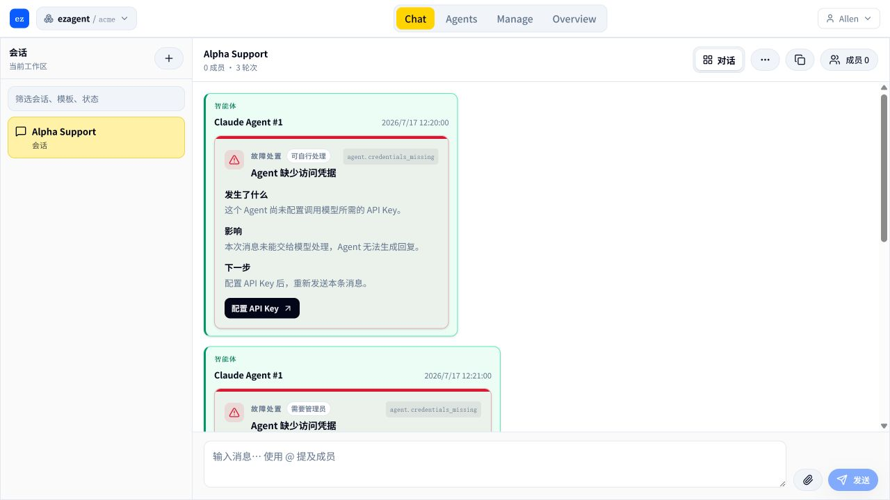
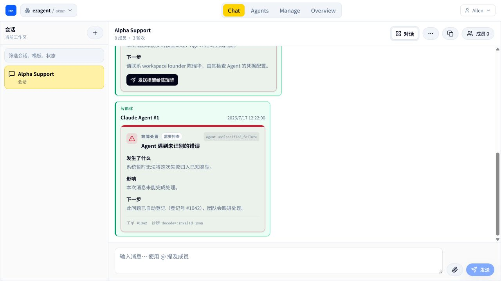
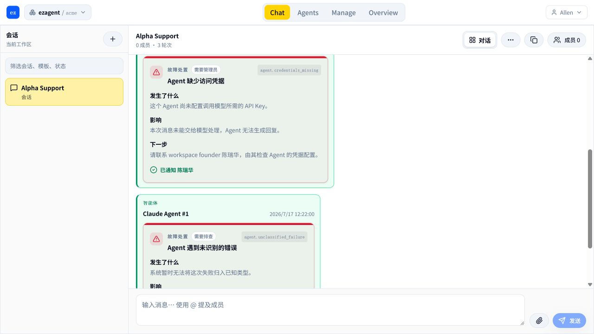
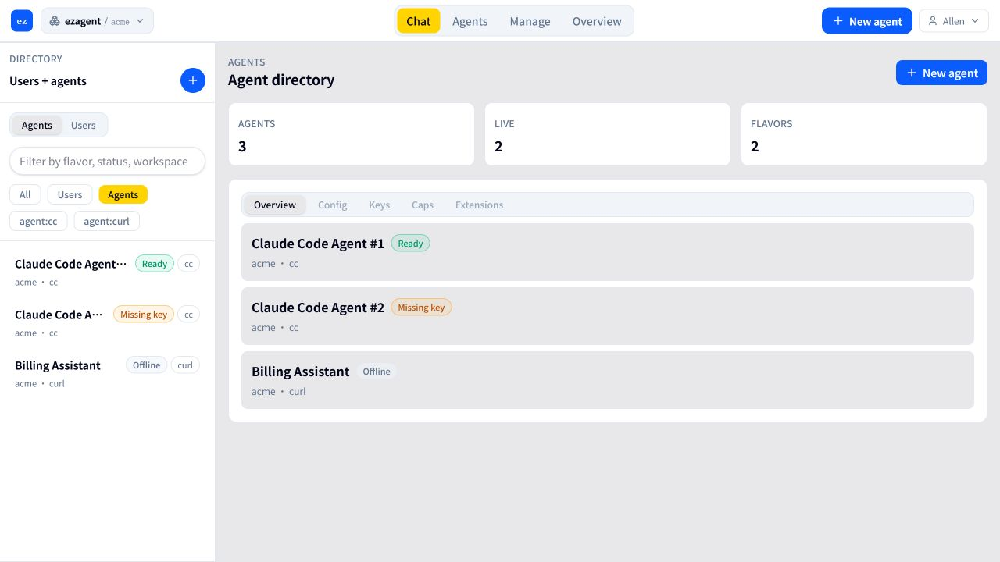

# Workspace self-service ordered fixes · return

> **Task:** 按 PR #1436 的冷启动阻塞顺序修复 workspace self-service 缺口
> **Branch:** `codex/workspace-self-service-ordered-fixes`
> **Base:** `origin/main`
> **PR:** https://github.com/ezagent42/ezagent/pull/1447
> **returned_at:** 2026-07-17 +0800

## 验收来源与边界

验收来源是 [PR #1436](https://github.com/ezagent42/ezagent/pull/1436) 中的
`docs/plans/2026-07-16-workspace-self-service-product-plan.md`。本分支从远程
`main` 新建，不以 #1440 为基础；实现遵守 CapBAC、World dispatch contract 和
per-tenant storage invariants。

## 本轮完成

### G1 · 注册开关与开放注册页面

- 注册开关位于 Manage → System/Settings，与 SMTP 设置同页。
- 仅 canonical administrator 能看见并保存开关；普通成员在同一路由看不到注册卡片。
- 开启公开注册后，匿名用户能看到完整的注册账号表单。
- 关闭注册时保留申请访问和邀请码入口。

### G5 · 可行动的 Agent 失败态

- 统一结构化错误：缺少凭据、无权限、额度不足、超时、未知错误。
- 管理员看到 Layer 1 直接修复入口；普通成员看到 Layer 2 workspace founder 姓名与提醒按钮，不泄露修复链接。
- `chat.error.notify_admin` 持久化修复请求并通知 founder；修复完成后请求人收到回执。
- 未识别错误按 Layer 3 自动登记持久化工单，按消息幂等，页面显示工单号和中文说明。
- API Key 保存成功会完成同 Agent 的开放修复请求并通知请求人。
- SQLite/PostgreSQL 双迁移均包含 `workspace_uri NOT NULL`，并已纳入 per-tenant invariant。
- 新增 World Tier-1 fixture 和交互用例，覆盖三层卡片、提醒 dispatch 与“已通知 陈瑞华”回执。

## 暂缓项

### G4 · Founder Agent Key authority

没有引入产品计划明确禁止的 `:stub_grant`。该项仍等待正式 capability-signing 以及
hosted agent clone/provisioning contract；在依赖明确前不伪造临时授权或虚假的 ready 状态。

### G6 · UI readability（进行中）

已完成第一项：

- Agent 列表把裸 UUID 主名称转换为稳定的 flavor 标签（例如 Claude Code Agent #1）。
- 保留真实 profile display name，不覆盖 Billing Assistant 等已有名称。
- 列表统一显示 Ready / Missing key / Offline，缺失或过期凭据优先显示 Missing key。
- 完整 URI 不再作为列表主视觉，只保留在悬停信息中。

剩余顺序：

1. 复核首登 PAT 中间页和 Continue 安全返回。
2. 统一 session 名称提示与中文校验。
3. 清理剩余 raw atom 用户错误；通用 Agent 失败已由 G5 覆盖。

## 验证结果

验证数据库为 PostgreSQL，端口 **5432**。

| 验证项 | 结果 |
|---|---|
| Core actionable workflow + architecture subset | PASS，4 tests / 0 failures |
| World G5 data/action tests | PASS，4 / 0 |
| deterministic gate core/invariants subset | PASS，94 / 0 + World 4 / 0 |
| exact deterministic core gate | PASS，534 / 0 |
| identity / external mirror / session | PASS，4 / 0、39 / 0、7 / 0 |
| World fixture drift | PASS |
| World TypeScript（含 E2E tsconfig） | PASS |
| World ESLint | PASS，0 warnings |
| World Vitest | PASS，9 / 9 |
| 应用内浏览器交互验收 | PASS：三层卡片、founder 提醒、成功回执 |
| 本机 Playwright CLI | 环境阻塞：缺少其专用 Chromium executable；不是产品断言失败，GitHub frontend gate 继续执行 |

## 浏览器证据

管理员可直接修复，同时能看到普通成员场景的下一张卡片：

普通成员只能提醒具名 founder；未知错误自动登记工单：

提醒完成后页面就地显示成功回执：

G6 Agent 列表使用可读名称并同时展示三种可操作状态：

## 交付说明

请在 PR #1447 按 G1、G5、G6 的顺序审阅。G4 的依赖阻塞已显式保留，不应把“没有
`:stub_grant`”误判为遗漏；这是 #1436 的架构决定。
