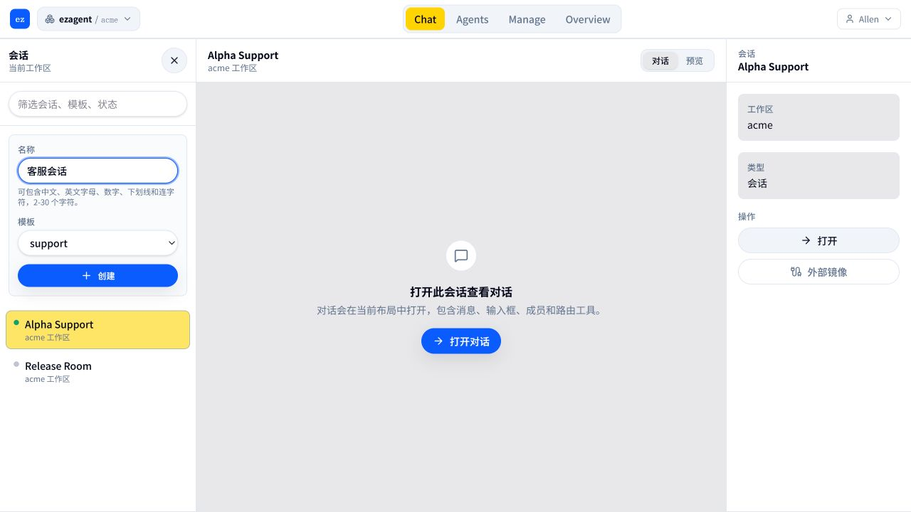
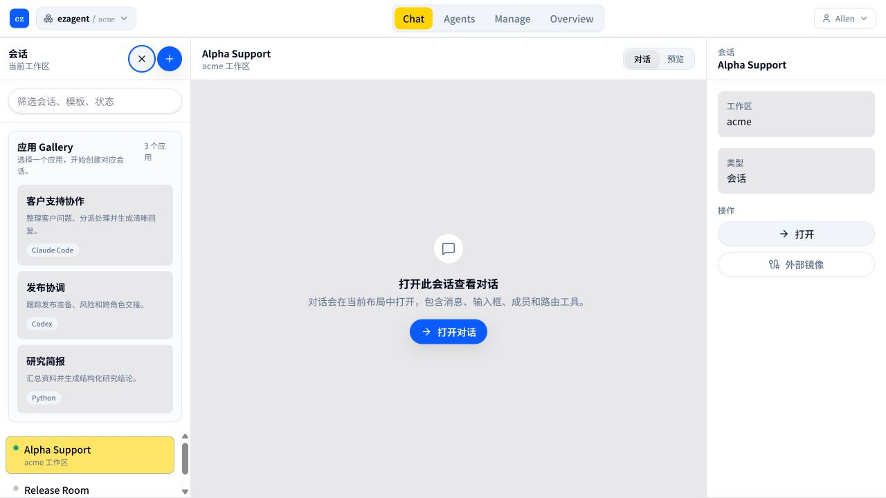

# Workspace self-service ordered fixes · return

> **Task:** 按 PR #1436 的冷启动阻塞顺序修复 workspace self-service 缺口
> **Branch:** `codex/workspace-self-service-ordered-fixes`
> **Base:** `origin/main`
> **PR:** https://github.com/ezagent42/ezagent/pull/1447
> **returned_at:** 2026-07-17 +0800

## 验收来源与边界

验收来源是 [PR #1436](https://github.com/ezagent42/ezagent/pull/1436) 中的
`docs/plans/2026-07-16-workspace-self-service-product-plan.md`。本分支从远程
`main` 新建，不以 #1440 为基础；实现遵守 CapBAC、World dispatch contract 和
per-tenant storage invariants。

## 本轮完成

### G1 · 注册开关与开放注册页面

- 注册开关位于 Manage → System/Settings，与 SMTP 设置同页。
- 仅 canonical administrator 能看见并保存开关；普通成员在同一路由看不到注册卡片。
- 开启公开注册后，匿名用户能看到完整的注册账号表单。
- 关闭注册时保留申请访问和邀请码入口。

### G5 · 可行动的 Agent 失败态

- 统一结构化错误：缺少凭据、无权限、额度不足、超时、未知错误。
- 管理员看到 Layer 1 直接修复入口；普通成员看到 Layer 2 workspace founder 姓名与提醒按钮，不泄露修复链接。
- `chat.error.notify_admin` 持久化修复请求并通知 founder；修复完成后请求人收到回执。
- 未识别错误按 Layer 3 自动登记持久化工单，按消息幂等，页面显示工单号和中文说明。
- API Key 保存成功会完成同 Agent 的开放修复请求并通知请求人。
- SQLite/PostgreSQL 双迁移均包含 `workspace_uri NOT NULL`，并已纳入 per-tenant invariant。
- 新增 World Tier-1 fixture 和交互用例，覆盖三层卡片、提醒 dispatch 与“已通知 陈瑞华”回执。

## 后续完成与依赖项

### G4 · Founder Agent Key authority

没有引入产品计划明确禁止的 `:stub_grant`。该项仍等待正式 capability-signing 以及
hosted agent clone/provisioning contract；在依赖明确前不伪造临时授权或虚假的 ready 状态。

### G6 · UI readability（完成）

已完成第一项：

- Agent 列表把裸 UUID 主名称转换为稳定的 flavor 标签（例如 Claude Code Agent #1）。
- 保留真实 profile display name，不覆盖 Billing Assistant 等已有名称。
- 列表统一显示 Ready / Missing key / Offline，缺失或过期凭据优先显示 Missing key。
- 完整 URI 不再作为列表主视觉，只保留在悬停信息中。

本轮继续完成：

- 密码登录直接返回安全的本地 `return_to`，不创建 PAT、不进入 token Continue 页面。
- 外部或 protocol-relative `return_to` 一律回退到 `/sessions`。
- session 展示名支持中文、英文字母、数字、下划线和连字符，限制 2–30 个字符；两个创建入口提供实时行内校验。
- 中文展示名在 dispatch boundary 转为 percent-encoded canonical URI segment，Session 列表安全解码显示，保持 strict URI 不变量。

最后一项已完成：

- Session 创建/发布未知错误统一为中文重试与联系 founder 建议，不再显示 raw reason。
- Identity/User 创建、授权、配置、API Key、扩展读取失败不再把 atom/tuple/exception 送入 UI。
- Manage/SMTP 使用稳定结果码，前端映射为中文可行动消息；技术原因只写服务端日志。
- 会话角色槽位、授权降级和 Workspace 模板/详情页不再直接渲染 backend reason。

### G7 · onboarding + 应用 Gallery（部分完成，依赖阻塞）

已完成不依赖 G4 的 AC6 / AC7：

- 会话侧栏增加“应用 Gallery”入口，普通用户无需进入模板管理页。
- Gallery 卡片展示应用名称、一句话描述和去重后的可读 flavor 标签。
- 选择卡片后直接打开新建会话表单，并预选对应 socialware。
- Tier-1 E2E 覆盖“打开 Gallery → 看到 3 张卡片 → 选择应用 → 表单预选”。

AC1–AC5 onboarding 向导仍依赖 G4：当前 capability-signing 与 hosted agent clone/provisioning
尚未就绪，不能伪造“配置凭证 → Agent ready → 首条回复”的完成步骤。依赖落地后再实现首次进入自动向导、
步骤进度、跳过和 Settings 重开入口。

### G8 · 企业资料 / KB 导入 UI（代码完成）

本阶段提交：`a695b9a86 feat(world): add workspace KB imports`。

- Manage → Knowledge Base 提供“粘贴文本”“上传文件”“已注册来源”三个入口。
- 粘贴文本要求标题和正文；上传支持单个或批量 `.txt` / `.md`，每次最多 10 个，单文件最大 256 KB。
- 前端显示读取、解析和写入状态；服务端返回逐文档 indexed / failed 结果、chunk 数和稳定错误码。
- 新来源使用 `resource://<workspace>/kb-source/<unique-name>`，经 `Ezagent.Resource.FsResolver`
  解析后独占创建；不接受客户端路径，不覆盖已有来源。
- 写入前按目标 Agent、workspace 和 `kb.ingest` concrete cap shape 做权限预检；KB Behavior dispatch
  在索引前再次执行 CapBAC。无权限请求不创建文件，索引失败会清理本次新建来源。
- 服务端再次校验标题、UTF-8、空内容、文件类型、字节大小和批量上限，不把浏览器校验当作安全边界。

当前 G8 代码与聚焦测试已推送；浏览器交互截图将在下一阶段验证后追加到同一 PR。

## 十项清单当前状态

| Gap | 状态 | 说明 |
|---|---|---|
| G1 | 完成 | 管理员注册设置、开放注册、关闭时申请/邀请入口均已实现 |
| G2 | 部分完成 | 邀请 UI 与注册链接已实现；仍需 AC7 冷启动浏览器全流程证据 |
| G3 | 部分完成 | 已显示当前 workspace 并文档化单-own；仍需显示 Founder / Member 角色 |
| G4 | 依赖阻塞 | 等待 capability-signing 与 hosted agent provisioning contract |
| G5 | 完成 | 三层可行动错误、founder 提醒、修复回执和未知错误工单已完成 |
| G6 | 完成 | 可读 Agent、登录返回、中文 Session 名和用户可见错误均已完成 |
| G7 | 部分完成 | Gallery AC6 / AC7 完成；onboarding AC1–AC5 依赖 G4 |
| G8 | 代码完成 | 文本 / 文件导入、受控存储、逐文档反馈和测试完成；待补浏览器证据 |
| G9 | 部分完成 | 中英文第一天文档已有；产品内帮助入口、搜索和首次提示未完成 |
| G10 | 部分完成 | PR 浏览器 gate 及 G5/G6 场景已有；完整 ready / reply 链依赖 G4 |

## 验证结果

验证数据库为 PostgreSQL，端口 **5432**。

| 验证项 | 结果 |
|---|---|
| Core actionable workflow + architecture subset | PASS，4 tests / 0 failures |
| World G5 data/action tests | PASS，4 / 0 |
| deterministic gate core/invariants subset | PASS，94 / 0 + World 4 / 0 |
| exact deterministic core gate | PASS，534 / 0 |
| identity / external mirror / session | PASS，4 / 0、39 / 0、7 / 0 |
| World fixture drift | PASS |
| World TypeScript（含 E2E tsconfig） | PASS |
| World ESLint | PASS，0 warnings |
| World Vitest | PASS，20 / 20 |
| 登录 Continue / 安全返回控制器测试 | PASS，11 / 0 |
| session 名称规则 World 测试 | PASS，14 / 0 |
| G6 用户可见错误映射聚焦测试 | PASS，24 / 0 |
| G8 KB 受控来源、校验、清理与未授权无落盘 | PASS，5 / 0（PostgreSQL 5432） |
| G8 TypeScript + 聚焦 Vitest | PASS，2 / 0 |
| G8 World 前端完整 lint / Vitest / production build | PASS，0 warnings / 20 tests / build success |
| 应用内浏览器交互验收 | PASS：三层卡片、founder 提醒、成功回执、Agent 三态、中文 session 名称可提交 |
| 本机 Playwright CLI | 环境阻塞：缺少其专用 Chromium executable；不是产品断言失败，GitHub frontend gate 继续执行 |
| `mix precommit` | 本阶段未运行；按用户要求在代码完成后统一由 PR 执行 |

## 浏览器证据

管理员可直接修复，同时能看到普通成员场景的下一张卡片：

普通成员只能提醒具名 founder；未知错误自动登记工单：

提醒完成后页面就地显示成功回执：

G6 Agent 列表使用可读名称并同时展示三种可操作状态：

新建会话输入“客服会话”后没有校验错误，创建按钮可用；内部仍使用 canonical URI：

G7 普通用户可从会话侧栏浏览应用名称、描述与 flavor 标签：

## 交付说明

请在 PR #1447 按 G1、G5、G6、G7 Gallery、G8 KB 导入的顺序审阅。G4 的依赖阻塞已显式保留，
不应把“没有 `:stub_grant`”误判为遗漏；这是 #1436 的架构决定。G8 实现提交为 `a695b9a86`；
下一阶段补浏览器证据后，再继续处理不依赖 G4 的 G2 / G3 / G9 收尾项。
