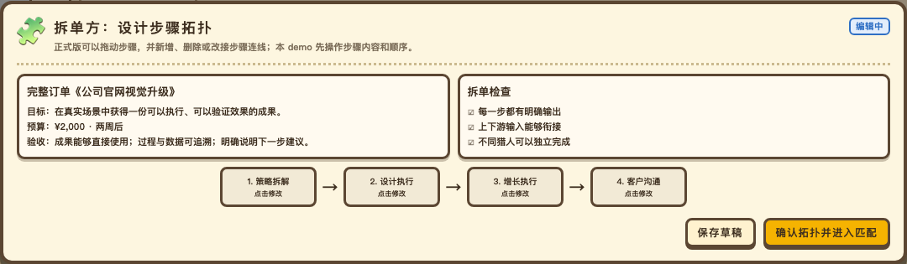
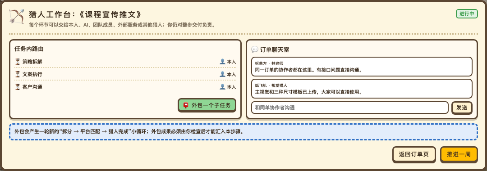

# MFU：从订单到组织（2026-07-28）

**分支 / PR:** `mfu-demo-tree` → [draft PR #1586](https://github.com/ezagent42/ezagent/pull/1586) · base `main`

## 今天完成

- 在平台概念模型中补充五个市场角色：发单方、拆单方、平台、猎人、组织。
- 明确学校与真实社会两种场景使用同一套三步机制：
  1. 完整订单被拆成有上下游关系的步骤；
  2. 平台把每个步骤匹配给一名猎人；
  3. 猎人完成步骤、认识上下游，并由人发起组建组织。
- 将机制信息图的三个部分全部改成“总览 + 局部页面”结构。
- 为新市场机制增加完整泳道总览，以及订单拆解、猎人匹配、步骤交付、组织形成页面。
- 新建 MFU v0.15 可试玩原型，提供在校期间与真实社会两种场景，以及不同角色使用的工作页面。
- 为机制信息图的 21 个页面各加入一张来自 v0.15 demo 的界面证据卡。

## 本轮关键边界

- 猎人可以是学生、自由职业者，也可以是他们的 Agent。
- Agent 可以承接和执行步骤，但不能主动联系他人或发起组建组织。
- 在组织形成前，平台匹配的是“步骤与猎人”；组织形成后，组织才可以承接更完整的订单。
- 猎人在交付阶段只能看到自己位于步骤拓扑中的大概位置，看不到其他猎人的真实身份。
- 完成后才开放直接上下游联系，并由人决定是否发出组队邀请。

## 交付物

- `mfu-demo/doc/platform-concept-model.md`
- `mfu-demo/doc/infographics/MFU-v0.15-机制信息图.html`
- `mfu-demo/MFU-v0.15-可试玩原型.html`
- `mfu-demo/doc/infographics/assets/demo-v0.15-crops/`

## 怎么看

- 先打开 `mfu-demo/doc/infographics/MFU-v0.15-机制信息图.html` 理解三段叙事；
- 再打开 `mfu-demo/MFU-v0.15-可试玩原型.html`，从订单板进入“查看匹配步骤”；
- `mfu-demo/role-pages/` 保留各角色操作的独立设计基准。

## 验证

- 两个 HTML 的脚本均通过 `node --check`。
- 信息图共 21 页，顶部导航入口共 21 个。
- 21 张 demo 截图均已生成并与信息图页面一一对应。
- `git diff --check` 通过。

## 尚未执行

- 本轮修改尚未 commit 或 push，等待 ruihua 查看后确认。

## 补充交付：角色操作页

根据泳道图，新增 `mfu-demo/role-pages/`：

- 将八步主流程拆成九个可独立打开、也可连续试玩的角色页面；
- 所有页面共享浏览器内的局部游戏状态；
- 真人可以填写、选择、检查、提交、退回、评价、邀请和创建组织；
- 平台自动操作只展示结果，不伪装成真人页面；
- 人类猎人与 Agent 的操作边界已经写入页面；
- 当前尚未决定这些页面从 v0.15 主游戏的哪些入口进入。

### 猎人工作台补充

- 同单协作者身份公开，并共享订单聊天室；
- 猎人收到步骤后，可以继续拆成五项具体工作；
- 每一项都可以安排给本人、自己的 AI 伙伴或外包猎人；
- 外包包含发布子任务、平台匹配、确认猎人、群聊协作和收回成果；
- 外包不会转移上一级责任，原猎人必须检查并汇总全部结果后再提交。

### 接入正式 demo

- 放弃此前错误方向的 v0.15 流程演示器；
- 重新从 v0.14 可试玩经营游戏复制并建立 v0.15；
- 订单板从“直接接单”改为先查看平台匹配步骤与完整拓扑；
- 原有路由增加“外包猎人”，并计入奖金成本；
- 进行中项目增加协作工作台和订单聊天室；
- 发布命题后进入拆单工作台，“我发布的命题”可继续拆单；
- 发单流程增加目标、截止时间和完整验收标准；
- 玩家发布的订单先经过汇总初验，再进入最终评价；
- 交付结算后可以查看上下游、邀请真实成员并把一人公司升级为多人组织；
- 顶部增加孵化器视角，依据真实交付与协作证据进行真人筛选。

### 信息图截图更新

- 旧的“每页一张整页截图”已停用；
- 总叙事、章节总览和教育理论页不再放截图；
- 15 个涉及具体功能的页面改用新版 v0.15 的局部界面截图；
- 人才实践页的 16 个行动分别配有局部截图；
- 所有截图均可点击放大，并显示对应的游戏操作说明；
- 新增自动截图脚本 `mfu-demo/doc/infographics/capture-v015-crops.js`，后续 demo 更新时可以重新生成。
