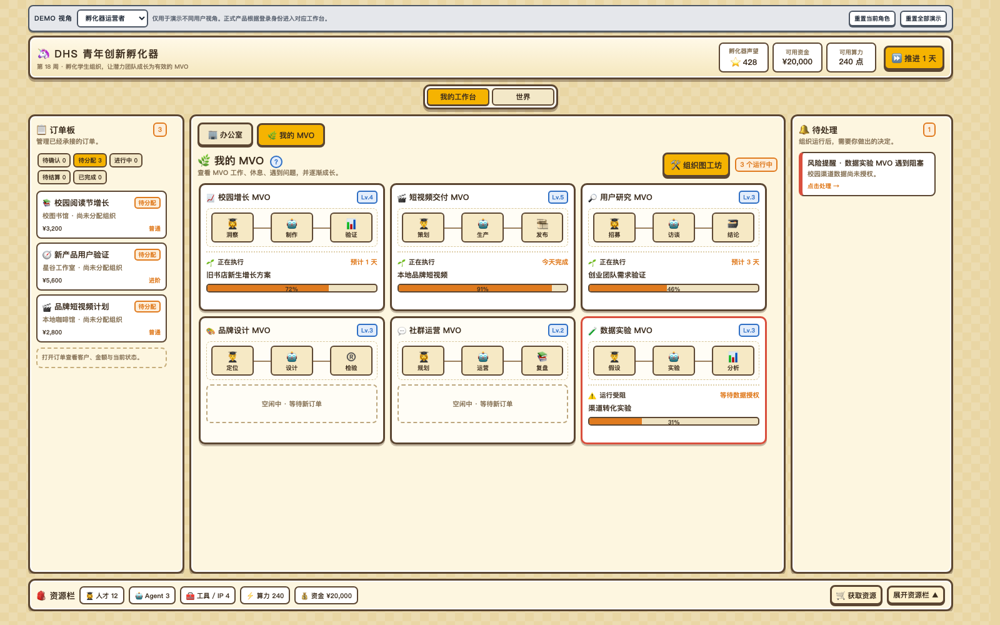

# MFU 多角色组织世界 · ruihua · 2026-07-31

**分支 / PR:** `mfu-card-array-demo` → [PR #1618](https://github.com/ezagent42/ezagent/pull/1618) · base `main`

**returned_at:** 2026-07-31 11:52 +08:00

**deadline:** off-plan

**deadline_status:** out_of_scope

## 演示了什么

- 将 MFU 从单一的 Card Array 教学关卡，演进为面向孵化器、学校、企业和学生的多角色组织世界。
- 当前完整 Demo 以 MVO 为核心：玩家在订单板承接和分配任务，在 MVO 区观察组织运行，在资源栏管理人才、Agent、工具、资金和算力，并可进入组织图工坊创建新的 MVO。
- 新增共享“世界”：订单市场、行业筛选、订单发布、世界动态和系统公告；不同角色使用同一套游戏架构，但拥有独立的角色档案、资源和任务。
- 整理 `mfu-demo/`：按完整版本、Concept Demo、Living Docs 和待决策事项归档，并提供统一入口。

## 怎么看

- MFU 总入口：`mfu-demo/index.html`
- 当前完整 Demo：`mfu-demo/versions/v0.3/demo/MFU-多角色组织世界-v0.3.html`
- Tailscale 内网入口：<http://100.108.131.15:8899/>

## 设计理由

- 平台的核心爽点从“完成一项具体操作”收敛为“看见自己拥有的资源不断形成、运行和升级为有效组织（MVO）”。
- 一套界面架构服务多个角色，避免为学校、企业、孵化器和学生各造一套互不相通的产品；角色差异由档案中的任务、资源和组织内容表达。
- 具体玩法仍保留在 Concept Demo 中，但不再抢占完整 Demo 的第一视觉重点。

## 验证

- 4 套静态契约测试通过：Card Array、MVO 孵化总览、组织牧场、多角色组织世界。
- 4 套 Playwright 浏览器流程通过。
- v0.3 四份角色档案均通过 `node --check`。
- `git diff --check` 通过。
- 将测试文案变量改为 `expectedText`，并将浏览器本地存档常量由 `KEY` / `STORAGE_KEY` 改为 `STORAGE_ID`，避免 gitleaks 将普通页面存档名称误识别为密钥。

## 对应本周目标

- 本项是 off-plan 的 MFU 产品 Demo 交付，不占用 `2026-W31` 的开发自举与企业自助主线。

## 下一步计划

- PR #1618 合并后，另开 PR 处理新的 MFU 产品想法。
- 后续更新 Concept Demo，使其与当前 MVO 多角色架构保持一致。

## 待办 / 阻塞

- 等待 PR #1618 最新 CI 完成；由 lead 翻转并合并。

## 关联

- handoff: off-plan 设计工作
